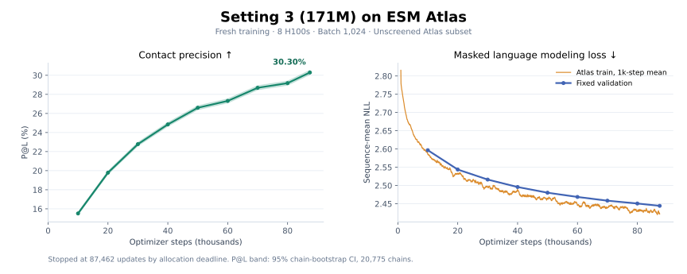

# Setting 3 on ESM Atlas, batch 1,024, September 14, 2026

The user requested fresh Setting 3 training on ESM Atlas with a 100k-step upper limit, using the remaining time in the retained Nibi allocation 12162637 on g27. The user explicitly requested skipping contamination screening. This experiment records `allow_unscreened_training_data: true`, `homology_exclusion: false` and `evaluation_contamination_checked: false`; the default training gate remains unchanged for other experiments.

The requested time-capped run completed at **87,462 updates** with **validation loss 2.44432** and **P@L 30.296% (95% CI 30.070–30.530%)**. It trained for **5h 09m 13s** plus **29m 24s of periodic evaluation**, consuming **89,561,088 unique proteins with zero repeats**. The final checkpoint contains the complete model, optimizer and global sampler state; exact restoration from project storage passed. The [final verification receipt](final/FINAL_RUN_VERIFIED.json) records the completed budget and results.

## Dataset

Sequence-only projection from `s3://esm-protein-atlas/v1/folds/folds_1B.lance`, pinned Lance version 3, contains 1,095,530,880 upstream rows. To use the short allocation efficiently, preparation selects 12,000 fragments with a seeded permutation (seed 20260914), totaling 120,000,000 records. This is a subset, not a download of all 1.1B records. There is no pLDDT or pTM confidence filter.

Preparation retains lengths 60–16,384, rejects more than 20% noncanonical residues, normalizes residues, and removes exact sequence duplicates. The resulting corpus contains **119,969,818 unique training records and 24,866,202,705 residues**. The finalized manifest SHA256 is `25bdbe338f3c71f8cc8ce3b67ed81ab6654bda184105b6ef2166faa9d8028262`. The global sampler shuffles without replacement and refuses to wrap; 100k updates consume 102,400,000 records. The historical validation stores are copied byte for byte.

## Recipe and execution

The [frozen preset](../../configs/nibi/setting3-atlas-b1024-100k.yaml) retains Setting 3's 170,559,856 parameters, Muon plus AdamW parameter groups, RMSNorm, learned residual routing, depth-scaled initialization, RoPE 10k, FFN 2048, untied embeddings, rank batch balancing and `sqrt_mask_count` loss. Peak base LR is 5e-4, weight decay 0.01, warmup 1,000 steps, seed 20260824, BF16 and FlashAttention 3. Stage 1 keeps a constant post-warmup LR. Training uses Atlas as the sole source instead of the original UniRef90/MGnify/OMG mixture.

Eight H100s use microbatch 64 per GPU and two accumulation steps, preserving global batch 1,024. The configured upper limit was 100,000 optimizer updates. An absolute deadline stopped training at 07:04:03 America/Toronto on September 14, leaving 20 minutes before allocation expiry for final checkpoint preservation and evaluation. Evaluation time is excluded from the reported training clock but included in the absolute allocation deadline.

The 2M-record qualification corpus is separate from production. The successful pilot trained 100 updates in 25.34 seconds including one intermediate checkpoint; steady updates took approximately 0.206 seconds. FA3 was active, the loss was finite, and peak allocated memory was 18.49 GB per GPU. The initial deployment attempt failed before training because the new source snapshot omitted `uv.lock`; the lockfile was deployed before the successful retry. Pilot metrics are not production results.

The pilot subsequently passed the complete fixed MLM/contact evaluation and exact model/optimizer restoration. The contact sweep took 248 seconds on four GPUs. Production launched from clean commit `5e381a257a902f629442ac76ac9d489372eafbd6` in the same retained allocation, with the full Atlas corpus and fresh model/optimizer state. Its startup contract confirms eight GPUs, global batch 1,024, FA3, sufficient data and zero repeated draws. Production reached 87,462 updates before its allocation deadline. Final evaluation and optimizer restoration completed around 07:08 America/Toronto. The two-hour monitor is no longer needed; the user-owned allocation was left retained.

## Evaluation and continuation

Production evaluated every 10,000 updates through 80k and at the final 87,462-update endpoint. MLM validation retains 4,096 sequences, 139,963 masked residues and context 512. P@L uses all 20,775 contact chains, the fixed probe split and 5,000 chain-bootstrap replicates. These metrics are labeled as measurements of an unscreened training experiment.

| Production step | Validation loss ↓ | P@L ↑ | P@L 95% chain-bootstrap CI |
| --- | --- | --- | --- |
| 10,000 | 2.59672 | 15.513% | 15.382–15.650% |
| 20,000 | 2.54373 | 19.788% | 19.622–19.956% |
| 30,000 | 2.51627 | 22.781% | 22.591–22.975% |
| 40,000 | 2.49584 | 24.849% | 24.651–25.053% |
| 50,000 | 2.48025 | 26.597% | 26.388–26.810% |
| 60,000 | 2.46864 | 27.314% | 27.100–27.530% |
| 70,000 | 2.45841 | 28.690% | 28.471–28.915% |
| 80,000 | 2.45069 | 29.178% | 28.957–29.399% |
| **87,462 (final)** | **2.44432** | **30.296%** | **30.070–30.530%** |

All eight [periodic evaluation receipts](evaluations/) and the [final evaluation](final/RESULT_VERIFIED.json) passed the fixed evaluation protocol and checkpoint-identity checks. All nine complete model/optimizer checkpoints were hash-verified in project storage. The final checkpoint SHA256 is `4e10b6e6e556b4a062fc540a7d5baaceca87296c54cb876b3264dfa818e1398b`. The final contact sweep completed at 07:07:40 America/Toronto and the complete final audit was present by 07:08.

[Evaluation curve CSV](PERFORMANCE_CURVE.csv) · [Training curve CSV](TRAINING_CURVE.csv) · [PNG figure](performance_curve.png). The training curve shows a 1,000-update moving mean of sequence-mean training NLL, sampled every 100 updates; fixed validation retains the original evaluation distribution. The shaded P@L band represents the chain-bootstrap CI. Raw training metrics are preserved remotely in `full-training/metrics.jsonl` and locally in ignored `.exps/nibi-atlas-setting3-b1024-20260914/metrics.jsonl`; the final verification receipt pins their SHA256. Regenerate the figure with `plot_curve.py --metrics PATH_TO_METRICS_JSONL` in a Python environment containing Matplotlib and NumPy.

Rolling full model/optimizer checkpoints were written every 1,000 updates on shared scratch. Each evaluation checkpoint and the final checkpoint were hash-verified and copied to project storage. The full optimizer is replicated, not split into unrecoverable GPU-specific pieces. For later four-GPU continuation, use microbatch 128 per GPU and accumulation 2 to preserve both the global microbatch and global batch; the compact global sampler state preserves the next records. A new runtime allocation deadline is permitted during resume. The final stream has 30,408,730 unused proteins, sufficient to continue to the original 100k endpoint without resampling. The checkpoint receipt retains `full_training_complete: false` because the 100k step upper limit was not reached; the requested allocation-time budget is complete with `stop_reason: allocation_deadline`.

| Artifact | Remote location |
| --- | --- |
| Run root | `/scratch/muchenli/Nano-Protein-LM-nibi-atlas-setting3-b1024-20260914` |
| Production output | Run root `/full-training` |
| Shared training data | Run root `/data` |
| Frozen scientific checkout | Run root `/training-source` at `5e381a257a902f629442ac76ac9d489372eafbd6` |
| Durable checkpoints | `/project/def-lsigal/muchenli/Nano-Protein-LM/checkpoints/nibi-atlas-setting3-b1024-20260914/full` |
| Final resumable checkpoint | Durable checkpoint directory `/final/checkpoint-087462.pt` |
| Durable source bundle and recipe | `/project/def-lsigal/muchenli/Nano-Protein-LM/checkpoints/nibi-atlas-setting3-b1024-20260914/source` |

`bootstrap.sh`, `prepare.sh`, `run.sh`, `evaluate-checkpoint.sh`, `preserve-data.sh` and `status.py` record the workflow. Data preparation and heavy verification run inside overlapping Slurm steps in the retained allocation. No allocation is cancelled or released.

## Verification

The relevant local regression suites passed: Atlas preparation/explicit opt-in/deadline (3), data capacity (6), global sampling and 4↔8 GPU continuity (8), training budget semantics (11), optimizer/sampler resume (5), and distributed periodic evaluation (2). The distributed evaluation tests required local loopback access outside the sandbox. Ruff and shell syntax checks passed. `autoresearch/program.md` was not modified.

At 01:29:46 America/Toronto, production had reached 1,220 updates with finite training loss 2.72856 and approximately 0.209 seconds per update. Its first 1,000-step checkpoint passed a separate finite model/optimizer and global sampler audit: 1,024,000 distinct proteins consumed, no repeats, full replicated optimizer state, and the correct production manifest. Checkpoint SHA256: `ca637306b960398447a7819c968728b92d90ffbee381378a2f829b6456568450`. The committed source bundle and exact runtime recipe also passed hash verification after copying to project storage. Small launch, pilot, data-preservation and checkpoint receipts are retained in [evidence](evidence/); these are launch checks, not final scientific results.

The final [project-storage restoration audit](final/FINAL_ARCHIVE_VERIFIED.json) independently loaded all model and optimizer tensors, verified finite state, and reproduced the exact saved state after restoration. The launcher also completed its own [final restoration audit](final/FINAL_CHECKPOINT_VERIFIED.json). The run processed 17,814,812,290 nonpadding model tokens, including BOS/EOS, and 17,635,690,114 amino-acid residues. Training-loop time corresponds to 41.23 H100 GPU-hours across eight GPUs, excluding evaluation. Production Slurm step `12162637.68` completed with exit code `0:0` after 5h 42m 49s including setup, evaluations and checkpoint handling, corresponding to 45.71 allocated H100 GPU-hours. The independent final archive audit step also completed with exit code `0:0`. All scientific code remained frozen at the recorded commit.
