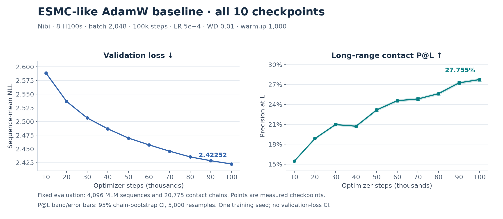

# Nibi baseline with evaluation every 10,000 steps

Status: **complete**. The baseline finished **100,000 steps / 204,800,000 sequences**
and all ten full evaluations at **16:40:32 Toronto on September 8, 2026**, in step
**12162637.11** on eight H100s (`g27`). Training took **12h 04m 47s**; elapsed time
from the production start at 03:54:43 to all checks/evaluations finishing was
**12h 45m 49s**. The final full AdamW checkpoint is preserved in project storage,
with a matching SHA independently checked on the compute node before Setting 3
launched. See [completion and preservation verification](COMPLETION_VERIFIED.json).
Frozen training commit: `caa95a15b55ff2ca2395687f71e1c4b3a294b3d4`.

Final **validation loss 2.422522**, **P@L 27.75485%**, **95% CI 27.51793–27.99261%**.
The subsequent [Setting 3 run](../nibi-setting3-b2048-100k-eval10k-20260908/README.md)
launched at **16:45:16 Toronto** after its full evaluation and four-GPU-resume
qualification passed. Two-hour monitoring continues for that run.

## Production learning curve

Download the [vector figure](learning-curve.svg). Regenerate it from the exact
[checkpoint data](learning-curve.json) with `python plot_learning_curve.py`
(Matplotlib and NumPy required).

| Optimizer step | Sequences seen | Validation MLM loss | Perplexity | Contact P@L | 95% chain-bootstrap CI | Evaluation pause |
| --- | --- | --- | --- | --- | --- | --- |
| 10,000 | 20,480,000 | 2.588700 | 13.31245 | 0.154617 | [0.153168, 0.156062] | 224.55 seconds |
| 20,000 | 40,960,000 | 2.536814 | 12.63933 | 0.188483 | [0.186730, 0.190295] | 222.76 seconds |
| 30,000 | 61,440,000 | 2.506595 | 12.26310 | 0.209679 | [0.207729, 0.211703] | 201.72 seconds |
| 40,000 | 81,920,000 | 2.486745 | 12.02208 | 0.207234 | [0.205134, 0.209381] | 197.89 seconds |
| 50,000 | 102,400,000 | 2.469885 | 11.82109 | 0.231730 | [0.229560, 0.233906] | 336.78 seconds |
| 60,000 | 122,880,000 | 2.457411 | 11.67455 | 0.245712 | [0.243524, 0.247987] | 215.67 seconds |
| 70,000 | 143,360,000 | 2.445850 | 11.54035 | 0.248257 | [0.246073, 0.250561] | 376.66 seconds |
| 80,000 | 163,840,000 | 2.435416 | 11.42057 | 0.256296 | [0.254007, 0.258595] | 239.76 seconds |
| 90,000 | 184,320,000 | 2.428474 | 11.34157 | 0.272598 | [0.270307, 0.274937] | 205.63 seconds |
| 100,000 | 204,800,000 | 2.422522 | 11.27426 | 0.277548 | [0.275179, 0.279926] | Final evaluation outside training loop |

All ten checkpoint evaluations passed independent local audits of all 16 shard
hashes, checkpoint receipt bindings, the exact 20,775-chain set and probe
protocol against the earlier AdamW baseline, and the independently recomputed
5,000-replicate bootstrap intervals. The latest audit is at
[100k](full/evaluations/step-100000/LOCAL_AUDIT.json). Training metrics through
step 100,000 are finite and demonstrate continued progress after each intermediate
evaluation. The final evaluation runs after training has completed.
See [machine-readable learning curve](learning-curve.json) and
[checkpoint receipts](full/evaluations). The CI measures uncertainty
across evaluation chains, not variation across independent training runs.

To audit a downloaded evaluation again, run
`python reports/nibi-baseline-b2048-100k-eval10k-20260908/verify_evaluation.py 10000`
from the repository root. Raw shard JSON must be available in the corresponding
local `.exps` directory. The compressed per-chain table is published with each
audited evaluation; large checkpoints and raw shards remain outside Git.

## Comparison with the completed batch-1,024 AdamW baseline

| AdamW run | GPUs | Global batch | Steps | Sequences | Validation loss | P@L |
| --- | --- | --- | --- | --- | --- | --- |
| Fir | 4 H100 | 1,024 | 100,000 | 102.4M | 2.474360 | 26.50494% |
| Nibi | 8 H100 | 2,048 | 100,000 | 204.8M | 2.422522 | 27.75485% |

Nibi improves validation loss by **0.051838** and P@L by **1.24991 percentage
points**. The larger batch doubles sampled sequence exposure at the same step
count; this comparison does not isolate batch size at a fixed token budget.
See [exact values](BATCH_SIZE_COMPARISON.json). The pending full Setting 3 run uses
Nibi's same batch, step budget and evaluation protocol for a matched comparison.

## Run setup and qualification

At the user's request, the initial Nibi training step `12162637.7` was cancelled
after approximately 500 steps. Allocation `12162637` remains running on `g27`.
The [initial run](../nibi-baseline-b2048-100k-20260908/README.md) and its successful
eight-to-four-GPU resume qualification remain archived.

The fresh run keeps the ESMC-like AdamW baseline: 170,671,168 parameters,
batch 2,048 on eight H100s (64/GPU × four accumulation steps), 100,000 steps,
context 512, LR 5e-4, WD 0.01, warmup 1,000, original LayerNorm/RoPE10k/FFN2048,
BF16 and the pinned FA3 kernel. Only checkpoint evaluation scheduling changes.

Every 10,000 steps, including step 100,000, evaluation uses the same **4,096 MLM
sequences** and **20,775 contact chains** as prior comparisons. Contact P@L uses
16 shards and a 5,000-replicate chain-bootstrap 95% CI. Each result is bound to
the evaluated checkpoint's SHA-256 and optimizer step.

For intermediate evaluations, all training ranks pause while a separate evaluator
runs. Frequent status broadcasts keep the process group alive during evaluation.
Training then continues in the same processes, retaining model/optimizer state,
sampler position and RNG. Evaluation time is recorded separately and excluded
from the training clock. Results live under `full/evaluations/step-NNNNNN/`.
The rolling checkpoint is retained until the next interval; the final full-state
checkpoint is copied to persistent project storage before its final evaluation.

The qualification **passed** using the full model/batch: it evaluated all 4,096
MLM sequences (139,963 masked residues) and all 20,775 contact chains at step 10,
then continued to step 20 in the same training processes. The evaluation pause
took **329.51 seconds**; ten such evaluations add roughly 55 minutes. All 16
contact-shard hashes, chain coverage, the mean P@L, and the exact 5,000-replicate
bootstrap interval were independently rechecked locally. These short-run scores
are technical checks, not production quality results.

The distributed unit tests also proved that evaluations can exceed the collective
timeout without deadlock and that evaluator failures reach every rank. Twelve
focused periodic-evaluation/resume/budget tests passed. The earlier full-model
eight-to-four-GPU continuation and exact AdamW-state restoration checks remain
applicable; this change does not alter checkpoint-state layout.

See [`LAUNCH_VERIFIED.json`](LAUNCH_VERIFIED.json),
[`PERIODIC_EVALUATION_TRIAL_PASSED.json`](PERIODIC_EVALUATION_TRIAL_PASSED.json),
[`trial/`](trial) and [`full/`](full) for receipts and the exact executed configs.
Large checkpoints and raw contact-shard dumps are retained outside Git.

Artifact root: `/scratch/muchenli/Nano-Protein-LM-nibi-b2048-100k-eval10k-20260908`.
Source checkout: the artifact root with `-run` appended.
Persistent final checkpoint directory:
`/project/def-lsigal/muchenli/Nano-Protein-LM/checkpoints/nibi-baseline-b2048-100k-eval10k-20260908`.
