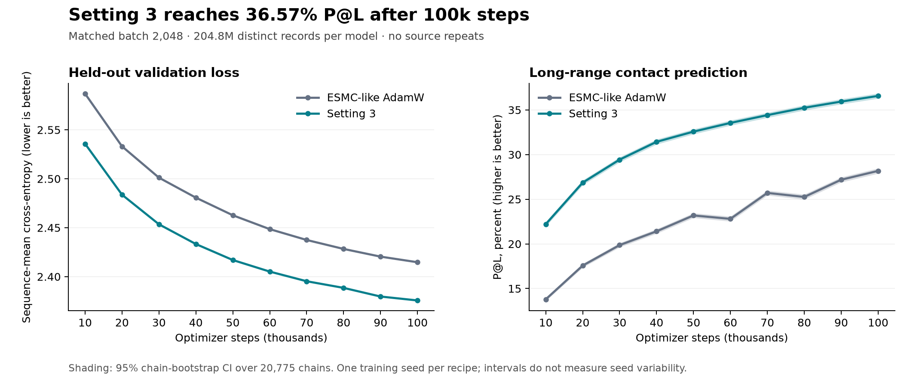

# Setting 3: continuation from 100k to 400k Stage-1 steps

Status: **planning only; no training-data download, production code change, or
continuation launch performed.** The user selected **Setting 3 only on all eight
Nibi GPUs**. This is a continuation of the completed 100k model, adding 300k
optimizer updates with the same global batch of 2,048.

## Completed runs

Both current paired runs finished successfully. AdamW completed final evaluation
and preservation at **9:34:09 p.m. Toronto on September 9, 2026**; Setting 3
completed at **10:30:16 p.m.** Both full checkpoints and all ten evaluations are
verified. All eight H100 80GB GPUs on Nibi g27 were idle at the inspection around
11 p.m. Toronto; allocation 12162637 had about 104 hours remaining. The allocation
and its owning processes remain intact.

| Current run | Batch | Steps | Validation loss ↓ | P@L ↑ | 95% chain-bootstrap CI | Training time |
|---|---:|---:|---:|---:|---:|---:|
| ESMC-like AdamW | 2,048 | 100,000 | 2.414734 | 28.173% | 27.932–28.421% | 21h 55m 13s |
| **Setting 3** | **2,048** | **100,000** | **2.375701** | **36.567%** | **36.328–36.815%** | **22h 39m 36s** |

Setting 3's matched gain is **8.394 percentage points P@L**, with paired
95% chain-bootstrap CI **8.297–8.492 points**; validation loss is **0.039033 lower**.
Each model used 204.8M distinct records and 48,391,423,362 non-padding model tokens,
with matching source counts and zero sampler repeats. The intervals measure
variation across the same 20,775 contact chains, not variation across training
seeds. Training time excludes evaluation pauses. Launch through final evaluation
and preservation took 22h 32m 41s for AdamW and 23h 28m 48s for Setting 3.

The [complete paired report](../nibi-paired-unique-b2048-100k-20260909/README.md)
contains every 10k evaluation, confidence interval, training time, checkpoint hash,
and independent audit. The [machine-readable curves](../nibi-paired-unique-b2048-100k-20260909/learning-curve.json)
include exact values and all ten paired comparisons.

## Earlier production results

These are separate experiments with different batch/data budgets. Changes between
the historical and current runs should not be attributed solely to dataset size.

| Fir recipe, batch 1,024 and 100k steps | Validation loss ↓ | P@L ↑ | 95% chain-bootstrap CI | Training time |
|---|---:|---:|---:|---:|
| ESMC-like AdamW | 2.474360 | 26.505% | 26.295–26.719% | 12h 00m 42s |
| Previous R02, RoPE20k | 2.436983 | 30.310% | 30.079–30.547% | 12h 56m 30s |
| Setting 1: R02 RoPE10k | 2.437807 | 30.165% | 29.936–30.394% | 12h 57m 54s |
| Setting 2: add batch balance | 2.438719 | 30.715% | 30.487–30.948% | 12h 33m 42s |
| Setting 3: add sqrt loss | 2.418720 | 32.682% | 32.447–32.920% | 12h 34m 40s |
| Setting 4: add tied embeddings | 2.423043 | 31.884% | 31.651–32.123% | 12h 33m 14s |

Source: [audited six-recipe comparison](../fir-r02-rope10k-100k-20260906/README.md).
All six processed 102.4M sequence presentations and 24,200,224,761 model tokens.

| Earlier Nibi runs using the small repeated dataset | Evaluated step | Validation loss ↓ | P@L ↑ | 95% chain-bootstrap CI |
|---|---:|---:|---:|---:|
| AdamW, batch 2,048, completed | 100,000 | 2.422522 | 27.755% | 27.518–27.993% |
| Setting 3, batch 2,048, stopped at 43,250 | 40,000 | 2.437614 | 30.815% | 30.587–31.046% |

These used 7,109,469 records; the old baseline averaged 28.8 presentations per
record. Setting 3's 40k row is its last audited evaluation, not a 100k result.
Full earlier curves: [AdamW](../nibi-baseline-b2048-100k-eval10k-20260908/README.md)
and [Setting 3](../nibi-setting3-b2048-100k-eval10k-20260908/README.md).
The earlier short-budget AutoResearch search is separately documented in
[AutoResearch scale-up](../../../docs/PROGRAM2_SCALEUP.md) and
[all Program 2 search records](../program2/README.md); those are not 100k runs.

## Feasibility and required data

**Feasible with deliberate source reuse.** At the unchanged normalized 36:11:54
mixture, 400k steps means 819.2M sequence presentations in total; the continuation
adds 614.4M. Even the entire processed release has only 665,970,495 distinct
training records, and UniRef90/OMG capacity limits are tighter under this mixture.
A no-repeat 400k run is therefore impossible with this release and mixture.

The pinned public release is `LuminScience/LuminBench-Nano-ESMC` at
`bd38448d50d8f426d7b9bd4410b53159ea001259`. Its independently checked manifest SHA
is `fe1ac0657085ab19fe6f56786006e9eb004ca66bc6c5b81dfd8e6bc3dcfda6ff`.
Use the processed, deduplicated, evaluation-decontaminated release; preserve the
existing held-out validation and contact protocols.

| Source | Expected draws through 400k | Planned unique records | Planned training shards | Additional shards | Expected passes through planned records |
|---|---:|---:|---:|---:|---:|
| UniRef90 | 291,992,079 | 74,175,974 (all available) | 92 | 0 | 3.936 |
| MGnify | 89,219,802 | 90,495,061 | 63 | 47 | 0.986 |
| OMG/IMG | 437,988,119 | 262,845,186 (all available) | 244 | 141 | 1.666 |
| Total | 819,200,000 | 427,516,221 | 399 | 188 | Source-specific; see above |

The MGnify selection includes the configured 1% planning headroom and whole-shard
rounding. It needs only 63 of the full release's 229 MGnify shards. All OMG/IMG
shards are useful; all UniRef90 shards are already present. Counts are expected
because source choice is stochastic. The [exact data plan](DATA_PLAN.json)
records all planned shard paths and storage calculations.

Additional compressed downloads: **36.32 GB**, consisting of **26.71 GB OMG/IMG**
and **9.61 GB MGnify**. The expanded selection needs approximately **75.71 GB
Parquet cache + 125.57 GB prepared stores = 201.27 GB**, including MLM validation.
Keep the existing data/checkpoints intact and prepare the extension separately;
reserve around 250 GB for the new selection with overhead, plus old artifacts,
runtime and checkpoints. Node-local free space was approximately 11.9 TB at the
inspection. Check user/project quotas during implementation; filesystem-wide
free space alone does not establish quota availability. Preparation throughput
has not been benchmarked for this expansion.

## Proposed implementation and launch sequence

1. **Preserve the 100k starting point.** Resume the verified Setting 3 checkpoint
   from project storage, SHA
   `d0f891cfd46e5517e1ce90a29f02bc88646a80023b7cf8e86fc3008311b66412`.
   It includes full model weights, Muon momentum, AdamW moments and optimizer
   steps, training counters, and four ranks' RNG/sampler states. Keep the
   original file immutable and write the continuation to a new output root.

2. **Download and verify the extension.** Reuse checksum-verified existing shards;
   obtain the additional 188 shards from the same pinned release. Verify hashes,
   sequence identities and ordering, deduplication/decontamination provenance,
   and exact validation identity. Check the new stores are an append-only
   extension of each old source's record identities before accepting migration.

3. **Implement explicit data-stream migration.** Current resume validation rejects
   a different prepared-manifest hash, changed resampling policy, and strict
   no-repeat continuation on a changed GPU layout. Preserve these ordinary
   guards; add an explicit, audited migration path. Reconstruct consumed records
   from the saved four-rank permutations/cursors and stable sequence identities.
   Combine remaining old records with newly added records, exclude all previously
   consumed records from the remainder of each first pass, and repartition that
   remainder for eight GPUs. Make subsequent source epochs globally coordinated,
   so a fast rank cannot start reusing records before other ranks finish the
   source's current pass. Permit new epochs for UniRef90 and OMG/IMG explicitly;
   retain an exhaustion error for MGnify within this budget. Record cumulative
   unique/repeated draws, source epoch counts, old/new manifests, parent checkpoint
   and migration seed. Checkpoints should support future GPU-count changes
   without discarding consumed-record history. This is deterministic continuation,
   but cannot promise bitwise identity to staying on four GPUs.

4. **Keep the scientific recipe and loss grouping.** Use **64 sequences/GPU ×
   8 GPUs × 4 accumulation = global batch 2,048**. This preserves 512 sequences
   per distributed microstep and the sqrt-loss normalization group. Set total
   `max_steps` and `schedule_steps` to **400000**, resume at **100000**, and stop
   after **300000 additional** optimizer steps. Keep context 512, FA3/BF16,
   architecture, batch balance and sqrt loss. Base LR remains 5e-4 and base WD
   0.01; Muon attention/FFN LRs remain 4.5e-4/3.75e-4 and WD 0.0075. Continue
   the constant Stage-1 LR; do not restart the 1,000-step warmup or add decay.

5. **Qualify before production.** Test migration on small fixtures with unequal
   old rank cursors, added shards, source exhaustion and 4→8→4 repartitioning.
   Prove consumed identities are conserved, no source repeats prematurely,
   MGnify remains within its first pass, and uninterrupted versus resumed
   consumption agrees. Check model/optimizer state restoration and unchanged
   distributed sqrt-loss scaling. On the allocated node, run a separate short
   eight-GPU qualification from the 100k checkpoint, exercise save/reload and
   evaluation, then measure approximately 200 steady-state steps. Discard its
   updated model state; production starts from the untouched 100k checkpoint.

6. **Continue and monitor.** After the reviewed plan is accepted and qualification
   passes, launch Setting 3 on GPUs 0–7. Evaluate at **110k, 120k, …, 400k** using
   the existing full protocol (30 additional evaluations). Preserve a rolling
   full resume checkpoint and durable 200k/300k/400k checkpoints with checksums,
   including optimizer and migrated sampler state. Resume two-hour monitoring
   for progress, evaluations, data reuse, failures and finish estimates. Verify
   the final checkpoint and evaluation before calling the continuation complete.

## Time and comparison budget

The earlier eight-H100 Setting 3 run used the same 64×8×4 layout and measured
approximately **0.451 seconds/update**. At that speed, 300k additional updates
take **37.6 hours of training**. Thirty evaluations at the earlier roughly
210 seconds each add about **1.75 hours**, before setup, checkpointing and
possible changes in data throughput. A reasonable planning allowance is
**40–45 hours after production launch**, to be replaced by the expanded-data
qualification measurement. This is a projection, not a scheduled finish time.

The current allocation had approximately 104 hours left, so the projected
continuation fits if implementation/preparation and launch happen sufficiently
soon. The total 400k × 2,048 budget is **10% of the released ESMC family Stage-1
sequence presentations**, compared with 2.5% for our completed 100k run. It does
not mean 10% of ESMC GPU time/FLOPs. Repeated source passes will be reported
explicitly; the 100k parent remains a completed no-repeat experiment.

This plan and final results are stored locally. Publication to GitHub remains
separate from preparing or launching training and has not been retried.
