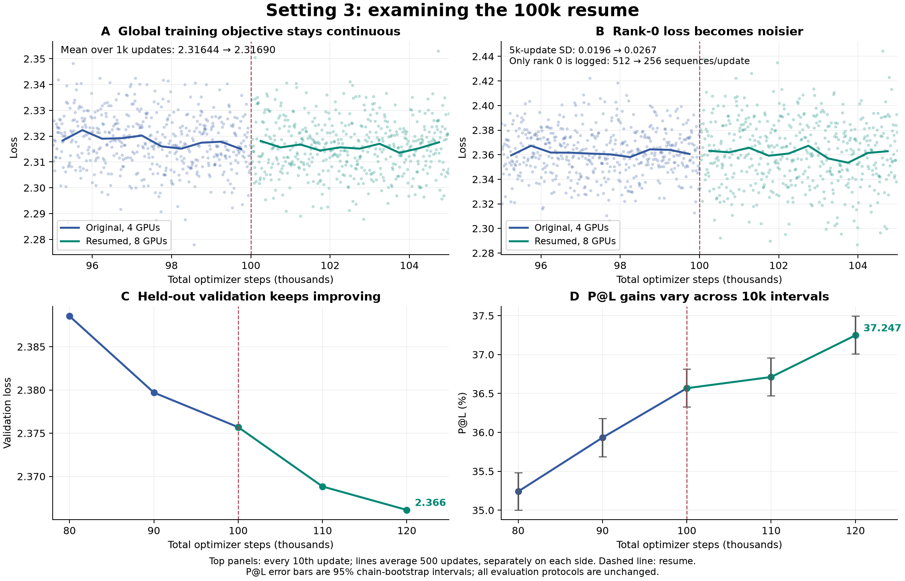

# Resume diagnosis at 100k

The logs and saved states do not show a substantial loss discontinuity, gradient-scale change, learning-rate restart, or optimizer-state reset at the four-to-eight-GPU resume. There is a logging limitation: `loss` is the unweighted diagnostic from rank 0 only. Its local sample count falls from 512 to 256 sequences per optimizer update when per-rank microbatch changes from 128 to 64. The globally reduced `objective_loss` still covers all 2,048 sequences, using the same 512-sequence global microbatch and four accumulation steps. The larger noise in `loss` is consistent with its smaller local sample; it does not imply a smaller global training batch.

## The pace differs between validation loss and P@L

| Interval | Validation loss reduction, larger is better | P@L gain, percentage points |
|---|---:|---:|
| 90k → 100k | 0.003996 | 0.635 |
| 100k → 110k | 0.006868 | 0.144 |
| 110k → 120k | 0.002712 | 0.536 |

P@L improved more slowly in the first resumed 10k steps. Its next 10k gain is closer to the pre-resume gain. Validation loss improved faster in the first resumed 10k steps than in 90k–100k; over 100k–120k its average improvement per 10k is 0.004790, versus 0.003996 in 90k–100k. These metrics provide no evidence of a broad optimization failure. They do not establish that the P@L slowdown is inevitable or caused solely by ordinary learning-curve variation.

All evaluations use the same held-out MLM samples, contact chains, probe split and fit protocol. The selected probe regularization remains C=1.0 at 90k, 100k, 110k and 120k, so the slower first P@L gain does not coincide with a change of selected C.

## What happens immediately around the boundary

Each window below contains 100 logged optimizer updates spanning 1,000 training steps. These are different training batches, not a fixed-batch before/after experiment.

| Window | Global objective mean | Rank-0 loss mean | Gradient norm mean | Tokens per update mean |
|---|---:|---:|---:|---:|
| 99k–100k | 2.316436 | 2.362268 | 0.090945 | 483,366 |
| 100k–101k | 2.316896 | 2.362518 | 0.089908 | 482,962 |

The global objective changes by about +0.000459 across these windows, compared with per-logged-update standard deviations of 0.00940 and 0.01162. Over the wider adjacent 5k windows, rank-0 diagnostic SD increases from 0.01961 to 0.02674, while global-objective SD is nearly unchanged at 0.01069 versus 0.01042. The raw rank-0 curve is therefore a poor way to judge a resume discontinuity across GPU layouts. Logging occurs every ten updates; updates 100001–100009 are not individually recorded, so the evidence cannot exclude an extremely short transient confined to those updates.

## Optimizer, schedule and implementation checks

A read-only check on allocated CPUs inspected the immutable 100k parent and the 100200 qualification checkpoint. Model configuration and parameter order match. Both contain 96 Muon state entries and nine AdamW state entries, with finite, nonzero state tensors. Optimizer parameter indices, slot keys, tensor shapes and all parameter-group values match. All AdamW step counters advance from 100000 to 100200. The earlier qualification additionally restored the complete model and optimizer exactly and trained successfully after reloading the new checkpoint. These saved-state checks concern the qualification checkpoints; the production run binds the same original parent and uses the same frozen implementation.

The attention and FFN Muon LRs remain 4.5e-4 and 3.75e-4; AdamW LR remains 5e-4. Muon WD remains 0.0075 and decayed AdamW groups remain at 0.01. The 1,000-step warmup is already complete. Stage-1 cooldown is zero, so changing total schedule progress from nearly 1.0 to 0.25 does not change the LR multiplier. All logged continuation LRs match the established attention-group value.

The original and continuation source revisions have identical model, tokenizer, batch-balancing, FA3 and schedule code. The training loss function, optimizer construction, parameter grouping and optimizer bundle are also identical. Sqrt-loss normalization multiplies each local differentiable numerator by world size and uses a denominator reduced across all ranks, cancelling DDP's gradient averaging. The global microbatch remains 512 sequences and the optimizer batch remains 2,048; there is no intended factor-of-two reduction in gradient scale.

## Changes that can still affect the trajectory

This migration also expands the data and changes the sample stream. It preserves which records were already consumed, but starts a new global source RNG and new crop/mask streams across eight ranks. MGnify and OMG/IMG gain substantial new data. UniRef90 completes its first pass shortly after resume and then enters its explicitly allowed second pass. These changes make the run a continuation with a different data stream, rather than a bitwise replay of the old four-GPU trajectory. Source weights and held-out evaluation remain fixed; logged token counts do not show a large length-distribution jump at the boundary.

A controlled replay with the same examples, corruption masks and checkpoint on four versus eight GPUs would be needed to measure the isolated layout effect. These observational results cannot identify how much the expanded corpus contributes to the P@L slope. The present evidence supports continuing the authorized run and watching the global objective and the next held-out evaluations. No production recipe, process or allocation was changed by this investigation.

Evidence: [statistics and source comparisons](ANALYSIS.json), [saved optimizer inspection](RESUME_STATE_INSPECTION.json), [analysis/plot script](analyze.py), [checkpoint inspection script](inspect_saved_state.py), and [standalone figure PDF](resume-dynamics.pdf). The figure averages logged observations in separate 500-step bins on each side of the boundary; it does not smooth across the resume.
