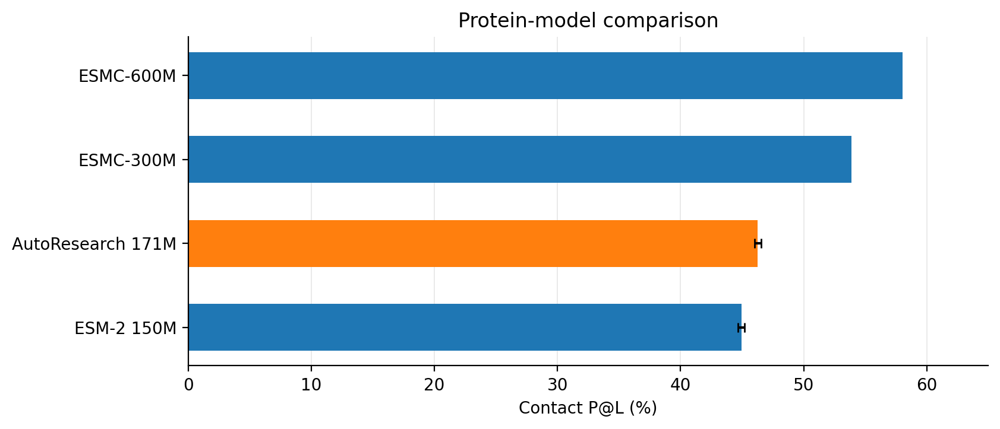

# NanoProteinLM
> [!NOTE]
> We are actively looking for contributor & collaborator for this project.

Inspired by [nanochat](https://github.com/karpathy/nanochat), NanoProteinLM makes protein language-model training accessible, inspectable and easy to experiment with.
Our goal is to help researchers train better protein embeddings for downstream biology tasks, through a small, open implementation and reproducible experiments.

**For protein researchers**, this repository provides a minimal reproduction of ESMC-style model training: public data, readable PyTorch code, training recipes and evaluations in one place. We aim to contribute an open-source foundation that researchers can understand, reproduce and extend in support of open science.

**For agentic researchers**, it provides a controlled environment for iterative autoresearch on the same scientific objective. Deterministic data selection, fixed seeds, explicit compute budgets and frozen evaluation protocols make recipe changes measurable. An agent can modify the training recipe, train, evaluate and improve it; the choice of agent and search strategy remains yours.

[AutoResearch setup](#auto-research-protocols) · [AutoResearch](#benchmarking-agentic-autoresearch-systems) · [Protein models](#training-and-evaluating) · [Dataset](#data-preparation)


## Discovering better protein-model training recipes


GPT-6 found this improved 171M training recipe using our [AutoResearch setup](#karpathy-style-sequential-search) and [protocols](#auto-research-protocols). Against our ESMC-like AdamW baseline, it improves contact prediction (**36.567% versus 28.173% P@L**) and lowers MLM validation loss (**2.376 versus 2.415**), with faster learning early in training. Both recipes use the same data, batch size of 2,048 and 100k updates on four H100s, with one training seed each. [Recipe details](docs/BEST_RECIPE_VS_BASELINE.md) · [Figure data and methods](.dev/reports/readme-figures-20260914/README.md).


## Setting up data & environments

Prepare the environment and data once, then reuse them for training and evaluation.
The same setup supports ordinary research and the fixed autoresearch task.

**Scaling the training budget also requires scaling the prepared data.** Training checks each source against global batch × steps and prevents source resampling by default. See [data coverage and no-repeat training](docs/data-coverage.md) for sample-budget preparation, exposure accounting and checkpoint continuation.

### Requirements

- **Environment:** Linux, a compatible NVIDIA driver and
  `uv >=0.11.31,<0.12`. Setup installs Python and dependencies from the repository lock.
- **Training:** You would ideadly need GPU with memory > 40GB. There is no restriction to types of GPUs, but you might need to adjust the receipe accordingly. Our default speedrun uses scripts **four H100 GPUs with FA3**. The one-hour autoresearch profile uses **four L40S GPUs with FA2**.
  See [USAGE.md](docs/USAGE.md#training) for other configurations.
- **Data preparation:** Allow space for both downloaded Parquet
  files and their prepared token stores—**allow 20 GB for the default 30-shard
  data setup**, plus separate space for the environment and training checkpoints.

### Data preparation
> [!NOTE]
> **Data may change:** we could not find a public version of the July 2023 JGI snapshot, so we substitute OMG/IMG; our corpus has [about 30% of ESMC’s reported 70%-identity clusters](docs/DATA.md#main-corpus-gap-relative-to-esmc), supports our current training budgets, and may expand as more data becomes available.

We curate a public protein corpus following the ESMC data recipe, with filtering and evaluation decontamination before training.


<table align="center">
  <tr>
    <th align="center">Source</th>
    <th align="center"><a href="https://doi.org/10.1093/bioinformatics/btu739">UniRef90</a></th>
    <th align="center"><a href="https://doi.org/10.1093/nar/gkac1080">MGnify</a></th>
    <th align="center"><a href="https://doi.org/10.1101/2024.08.14.607850">OMG/IMG</a></th>
    <th align="center">Total</th>
  </tr>
  <tr>
    <td align="center">Training proteins</td>
    <td align="center">74.2M</td>
    <td align="center">328.9M</td>
    <td align="center">262.8M</td>
    <td align="center"><strong>666.0M</strong></td>
  </tr>
</table>

Following the [ESMC data recipe](https://doi.org/10.64898/2026.06.03.729735),
we combine pinned UniRef90 and MGnify releases with public OMG/IMG proteins.
Sequences are normalized to uppercase, stripped of whitespace and terminal stop
characters, and filtered to remove proteins shorter than 60 amino acids or with
more than 20% non-canonical residues. MGnify-derived records in OMG are excluded
from the IMG arm to avoid sampling the same source twice.

We remove exact duplicates, cluster each source at **70% sequence identity**, and exclude matches and homologs of **317,000 protected evaluation proteins**. After cross-source deduplication and length filtering, we reserve **12,288 validation proteins** and release **666.0M training proteins** in **565 training shards plus 3 validation shards**, with independent checks of hashes, duplicates and evaluation exclusions. [Filtering and verification details](docs/DATA.md).

We open-sourced both the [🤗 Processed data](https://huggingface.co/datasets/LuminScience/LuminBench-Nano-ESMC/tree/bd38448d50d8f426d7b9bd4410b53159ea001259) and the [🤗 Raw dataset](https://huggingface.co/datasets/LuminScience/LuminBench-Nano-ESMC-RAW) with all the cluster information. For more detailed information about data colnstruction please refer to [DATA.md](docs/DATA.md).

### Install the environment and data

```bash
git clone https://github.com/Lumin-Science/Nano-ProteinLM.git
cd Nano-ProteinLM
bash runs/setup.sh
```
The default downloads **30/565 training shards (29.98M proteins; 5.62 GB compressed, including MLM validation)**: 13 UniRef90, 3 MGnify and 14 OMG/IMG shards. For a larger training set:

```bash
bash runs/setup.sh --training-shards $number_of_shards
# Use 30 for one-hour research trials, 209 for larger-data scale-up tests.
```
The frozen benchmark's data selection is defined in [171m-validation-loss.md](tasks/171m-validation-loss.md).

Data and outputs default to `data/` and `outputs/`. To use another path, copy
[.env.example](.env.example) to `.env` and set `DATA_ROOT` and `OUTPUT_ROOT`:

```text
$DATA_ROOT/                     # Default: data/
  cache/                       # Downloaded Parquet shards and contact archive
  training/                    # Prepared token stores, MLM validation and receipts
  evaluation/contact/          # Frozen P@L chains and probe splits
  evaluation/source/           # Frozen contact evaluator
$OUTPUT_ROOT/<run-name>/        # Default: outputs/<run-name>/
  checkpoint-final.pt          # Final model and optimizer state for resuming
  config.yaml, metrics.jsonl   # Resolved recipe and training log
  evaluation/                  # MLM loss, P@L and evaluation records
```

## Training and evaluating

Start with a short training trial, scale up a recipe, then measure both language
modeling and structural information in its checkpoint. The scripts call standard
Python APIs so you can adapt the commands to your own research.

### Train the ESMC-Style Protein Language Model

> [!NOTE]
> **Our default setting is a 171M variant, designed for small-budget training experiments.** Its baseline backbone follows the paper's 170M scaling model: 24 layers, width 768, and approximately 170.7M parameters ([ESMC Appendix A.1.4.1](https://www.biorxiv.org/content/10.64898/2026.06.03.729735v1.full.pdf#page=29)).
> For the original ESMC **300M** and **600M** architectures, see the [esmc-300m.yaml](configs/esmc/esmc-300m.yaml) and [esmc-600m.yaml](configs/esmc/esmc-600m.yaml)

```bash
bash runs/speedrun.sh
```
This launches **100,000 Stage-1 steps on four GPUs**, global batch **1,024**,
context **512**, **BF16/FA3**, base learning rate **5e-4**, weight decay **0.01**
and **1,000 warmup steps**. A 16-hour training guard stops an overlong run.
Checkpoints, the resolved recipe and training records are saved under
`$OUTPUT_ROOT/default-100k/`, including the full final optimizer state. See
[checkpoint-resume.md](docs/checkpoint-resume.md) for continuation. Repeats require a fresh run name.

For 171M training, choose [default.yaml](configs/default.yaml) or
[esmc-171m.yaml](configs/esmc/esmc-171m.yaml). The scripts call the standard
training API; see [USAGE.md](docs/USAGE.md#training) for other budgets, hardware
and recipe changes.

### Evaluate a checkpoint

- **MLM validation loss ↓:** mean per-protein masked-token loss on held-out data; the reward for the [validation-loss task](tasks/171m-validation-loss.md).
- **Contact P@L ↑:** precision among the top L predicted long-range contacts, where L is chain length, averaged over 20,775 chains; the reward for the [P@L task](tasks/171m-p-at-l.md).

After training finishes, evaluate a completed run with:

```bash
bash runs/speedrun.sh --evaluate default-100k
```

This loads your paths, reports MLM loss on **4,096 held-out sequences**, and scores P@L over **all 20,775 chains** using the accelerated parallel evaluator. Replace `default-100k` with your run name; additional [evaluation options](docs/EVALUATION.md#evaluation-execution) can follow it. Evaluation is separate from training and keeps the same sample counts for short training trials.


## Auto Research Protocols

Use NanoProteinLM to improve protein-model training under a fixed compute budget. Each task defines the objective, permitted changes, search-time evaluation and scale-up test. These protocols apply independently of the agent or search strategy.


- **Objective:** the scientific outcome the research aims to improve.
- **Design space:** what may change during research and what must remain fixed.
- **Per-round budget:** the resources allowed to evaluate one candidate, including hardware, training time and number of seeds.
- **Hill-climbing reward:** the score used to compare candidates during search, its direction and how results are combined across seeds.
- **Scale-up test:** a comparison against the baseline under a larger training budget or model size to check whether the discovered improvements transfer.

| Protocol item | Requirement |
|---|---|
| Objective | Finding better training receipe for training Protein Embedding Model. |
| Design space | **Fixed:** the task’s 7-shard corpus, source mixture, tokenizer, Stage-1 context and learning-rate schedule, evaluation, dependencies and input receipts. Keep trainable parameter count within **±5% of the original 171M model**; no pretrained weights, held-out training or changes to task scripts. **Mutable:** Anything else including training recipe, model architecture and training implementation. |
| Per-round budget | Fixed GPU walltime. Our default is N x **one hour on four L40S GPUs**, where N is number of seeds. Final checkpoint saving and evaluation are excluded from this buget. For an alternative such as 15 minutes on four H100s, rebenchmark the baseline and use that same hardware and time budget for every candidate. |
| Hill-climbing reward | The selected metric, averaged across training seeds, measures progress; report its sample SD and use the other metric as a diagnostic. Per seed, evaluate MLM loss on **32 validation sequences** and P@L on **all 20,775 chains**, report a 95% confidence interval for P@L. |
| Scale-up test| Scaled up training under a fixed budget of **about 24B model tokens per seed** (24.20B target), taking roughly **12 hours on four H100s**. Evaluated **4,096 MLM validation sequences** and **all 20,775 contact chains**, following the [scale-up test settings](docs/EVALUATION.md#manual-test-of-progress). |


Full task definitions and commands: [171M validation loss](tasks/171m-validation-loss.md) · [171M contact P@L](tasks/171m-p-at-l.md).


## Benchmarking Agentic AutoResearch Systems

Compare agents using the same starting recipe, task and **fixed number of research rounds**. Rank agents by their best valid mean reward: lowest validation loss or highest P@L. Report agent model, search settings and agent-side compute costs alongside the result.

<div class="ai">

Then compare each agent’s selected recipe under the same **scale-up test** to measure which discoveries transfer to a larger training budget. To test transfer to larger models, define a separate shared model size and training budget before evaluation; the 171M search itself retains its ±5% parameter bound.

</div>

### Karpathy-style sequential search

[autoresearch/program.md](autoresearch/program.md) provides a small Karpathy-style hill-climbing baseline: propose one change, train and evaluate it, keep or discard it, then repeat. Candidates are explored sequentially; training and evaluation can use multiple GPUs.


Each candidate uses the selected task's measurements and seed aggregation. The current example program compares seed-level 95% confidence intervals: for a reward oriented so higher is better, keep a candidate only when `candidate.ci95_low > incumbent.mean` and `candidate.mean > incumbent.ci95_high`. Use negative validation loss for the loss task's reward comparison and retain the raw loss in reports; P@L already has the higher-is-better direction. Every trial and decision is recorded. This acceptance policy belongs to the example agent, not the task protocol.


> [!NOTE]
> This hill-climbing loop is a simple AutoResearch baseline. You are welcome to bring your own agent or search strategy, provided it follows the selected task's protocol. Discoveries are evaluated under the same scale-up test settings.

To use the included loop, tell your coding agent:

> Read `autoresearch/program.md` and start autoresearch for `tasks/171m-validation-loss.md`.

For contact P@L as the objective:

> Read `autoresearch/program.md` and start autoresearch for `tasks/171m-p-at-l.md`.

The completed 38-round search below used an earlier acceptance rule: keep a candidate when its mean validation-loss reduction exceeds its own two-seed sample SD. The plot preserves those recorded decisions; the blue line follows the retained recipe, and orange points show trial means with sample-SD error bars. Numbers 1–5 identify the [accepted changes](.dev/reports/program2/README.md#numbered-improvements).


Two-seed mean ± sample SD; one hour on four L40S GPUs per seed. [Full experiment record](.dev/reports/program2/README.md) · [Auto Research methods](docs/AUTORESEARCH.md).

*Changes 4–5 use approximately 142M parameters and predate the ±5% size rule. The 171M scale-up test below skips change 4 and applies tied embeddings directly to Setting 3.


### Scale-up test


The results below are the historical 100k-step, single-seed scale-up test. New discoveries use the two-seed, 24.20B-token test specified in the [protocol above](#auto-research-protocols); the token target determines the budget, while the roughly 12-hour runtime is an estimate.


| Recipe | Validation loss ↓ | P@L ↑ | P@L 95% CI | Training time |
|---|---:|---:|---:|---:|
| Baseline: ESMC-like AdamW | 2.47436 | 26.505% | 26.295–26.719% | 12h 01m |
| 1: + Muon recipe | 2.43781 | 30.165% | 29.936–30.394% | 12h 58m |
| 2: + batch balance | 2.43872 | 30.715% | 30.487–30.948% | 12h 34m |
| **3: + sqrt loss (default)** | **2.41872** | **32.682%** | **32.447–32.920%** | **12h 35m** |
| 5: + tied embeddings | 2.42304 | 31.884% | 31.651–32.123% | 12h 33m |

Each recipe trains for **100k Stage 1 steps on four H100s**, batch **1,024**, LR **5e-4**, weight decay **0.01** and **1,000 warmup steps**. The Muon recipe includes RMSNorm, residual routing, depth-scaled initialization and RoPE 10k; later rows add changes cumulatively. One seed per recipe; CIs bootstrap 20,775 contact chains, and training times exclude evaluation. [Recipe details](docs/BEST_RECIPE_VS_BASELINE.md) · [Run records](.dev/reports/fir-r02-rope10k-100k-20260906/README.md).


### Longer training of the best candidate


<!-- <div class="ai">



</div> -->

| Model | P@L ↑ | Estimated training FLOPs |
|---|---:|---:|
| ESMC-600M | 58.031% | 2.491 × 10²² |
| ESMC-300M | 53.867% | 1.480 × 10²² |
| **AutoResearch 171M** | **46.264%** | **2.334 × 10²¹** |

Our 171M recipe reaches **46.264% P@L** with 2.3e21 flops training buget(.dev/reports/nibi-setting3-stage2-b2048-300k-20260911/README.md). All models use the same frozen 20,775-chain contact evaluation, but their training corpora and compute budgets differ, so this is a reference comparison rather than a controlled recipe comparison. FLOPs are [estimates with stated token and context assumptions](.dev/reports/readme-figures-20260914/README.md#training-compute-estimates).


## Citation

If you use NanoProteinLM, please cite this repository and the original
[ESMC paper](https://doi.org/10.64898/2026.06.03.729735):

```bibtex
@software{lumin_science_nano_esmc_2026,
  author = {Muchen Li},
  title = {NanoProteinLM: Minimal ESMC-Style Protein Language-Model Training},
  year = {2026},
  url = {https://github.com/Lumin-Science/Nano-ProteinLM}
}

@article{candido2026language,
  author = {Candido, Salvatore and Hayes, Thomas and Rao, Roshan and others},
  title = {Language Modeling Materializes a World Model of Protein Biology},
  journal = {bioRxiv},
  year = {2026},
  doi = {10.64898/2026.06.03.729735}
}
```
