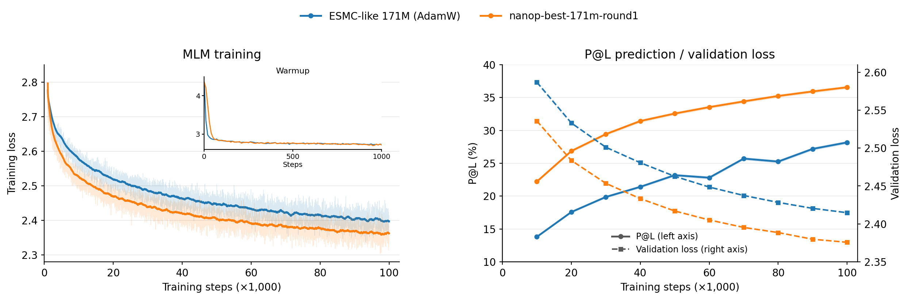
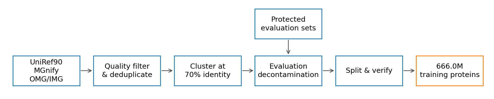

# NanoProteinLM
> [!NOTE]
> We are actively looking for contributors and collaborators for this project.

Inspired by [nanochat](https://github.com/karpathy/nanochat), NanoProteinLM makes protein language-model training accessible, inspectable and easy to experiment with.
Our goal is to help researchers train better protein embeddings for downstream biology tasks, through a small, open implementation and reproducible experiments.

**For protein researchers**, this repository provides a minimal reproduction of ESMC-style model training: public data, readable PyTorch code, training recipes and evaluations in one place. We aim to contribute an open-source foundation that researchers can understand, reproduce and extend in support of open science.

**For agentic researchers**, it provides a controlled environment for iterative autoresearch on the same scientific objective. Deterministic data selection, fixed seeds, explicit compute budgets and frozen evaluation protocols make recipe changes measurable. An agent can modify the training recipe, train, evaluate and improve it; the choice of agent and search strategy remains yours.

[Leaderboard](#final-evaluation-leaderboard) · [AutoResearch protocol](#autoresearch-protocol) · [Sequential search](docs/AUTORESEARCH_BASELINE.md) · [Protein models](#training-and-evaluating) · [Dataset](#data-preparation)

## Discovering better protein-model training recipes



GPT-6 and human effort produced our current best recipe over two rounds of [sequential AutoResearch](docs/AUTORESEARCH_BASELINE.md): round 1 found the Muon, batch-balancing and sqrt-loss changes, and round 2 added separate Q/K/V Muon updates. The curves compare the round-1 recipe with our ESMC-like AdamW baseline under the previous protocol: the same data, batch size 2,048 and 100k updates on four H100s, with one training seed each. The round-1 recipe improves contact prediction (**36.567% versus 28.173% P@L**) and lowers MLM validation loss (**2.376 versus 2.415**), with faster learning early in training. [Round-1 recipe](docs/leaderboard/nanop-best-171m-round1.md).

### Final-evaluation leaderboard

Final evaluation trains each recipe from scratch to 24.2B non-padding tokens at global batch 1,024 with seed 42, then scores MLM validation loss on all 12,288 validation proteins and contact P@L on 20,775 chains ([protocol](docs/AUTORESEARCH.md#final-evaluation)). Results under this protocol are pending.

| Recipe | MLM validation loss ↓ | P@L ↑ |
|---|---:|---:|
| [ESMC 171M reference](configs/test-100k/esmc-171m.yaml) | — | — |
| [nanop-best-171m-round1](docs/leaderboard/nanop-best-171m-round1.md) | — | — |
| [nanop-best-171m-round2](docs/leaderboard/nanop-best-171m-round2.md) | — | — |

[Full leaderboard, including search-budget results](docs/LEADERBOARD.md)

## Setting up data & environments

Prepare the environment and data once, then reuse them for training and evaluation.
The same setup supports ordinary research and the fixed autoresearch task.

**Scaling the training budget also requires scaling the prepared data.** Training checks each source against global batch × steps and prevents source resampling by default. See [data sizing](docs/DATA.md#sizing-a-training-download) for sample-budget preparation and [training commands](docs/USAGE.md#training) for checkpoint continuation.

### Requirements

- **Environment:** Linux, a compatible NVIDIA driver and
  `uv >=0.11.31,<0.12`. Setup installs Python and dependencies from the repository lock.
- **Training:** Use GPUs with more than 40 GB of memory and adjust the recipe for your hardware. The default speedrun uses **four H100 GPUs with FA3**. An AutoResearch round provides **20 minutes on four H100 GPUs with FA3** or **one hour on four L40S GPUs with FA2**. See [USAGE.md](docs/USAGE.md#training) for other configurations.
- **Data preparation:** Allow space for both downloaded Parquet
  files and their prepared token stores—**allow 20 GB for the default 30-shard
  data setup**, plus separate space for the environment and training checkpoints.

### Data preparation
> [!NOTE]
> **Data may change:** we could not find a public version of the July 2023 JGI snapshot, so we substitute OMG/IMG; our corpus has [about 30% of ESMC’s reported 70%-identity clusters](docs/DATA.md#main-corpus-gap-relative-to-esmc), supports our current training budgets, and may expand as more data becomes available.

We curate a public protein corpus following the ESMC data recipe, with filtering and evaluation decontamination before training.



<table align="center">
  <tr>
    <th align="center">Source</th>
    <th align="center"><a href="https://doi.org/10.1093/bioinformatics/btu739">UniRef90</a></th>
    <th align="center"><a href="https://doi.org/10.1093/nar/gkac1080">MGnify</a></th>
    <th align="center"><a href="https://doi.org/10.1101/2024.08.14.607850">OMG/IMG</a></th>
    <th align="center">Total</th>
  </tr>
  <tr>
    <td align="center">Training proteins</td>
    <td align="center">74.2M</td>
    <td align="center">328.9M</td>
    <td align="center">262.8M</td>
    <td align="center"><strong>666.0M</strong></td>
  </tr>
</table>

Following the [ESMC data recipe](https://doi.org/10.64898/2026.06.03.729735),
we combine pinned UniRef90 and MGnify releases with public OMG/IMG proteins.
Sequences are normalized to uppercase, stripped of whitespace and terminal stop
characters, and filtered to remove proteins shorter than 60 amino acids or with
more than 20% non-canonical residues. MGnify-derived records in OMG are excluded
from the IMG arm to avoid sampling the same source twice.

We remove exact duplicates, cluster each source at **70% sequence identity**, and exclude matches and homologs of **317,000 protected evaluation proteins**. After cross-source deduplication and length filtering, we reserve **12,288 validation proteins** and release **666.0M training proteins** in **565 training shards plus 3 validation shards**, with independent checks of hashes, duplicates and evaluation exclusions. [Filtering and verification details](docs/DATA.md).

We open-sourced both the [🤗 Processed data](https://huggingface.co/datasets/LuminScience/LuminBench-Nano-ESMC/tree/bd38448d50d8f426d7b9bd4410b53159ea001259) and the [🤗 Raw dataset](https://huggingface.co/datasets/LuminScience/LuminBench-Nano-ESMC-RAW) with all the cluster information. For more detailed information about data construction please refer to [DATA.md](docs/DATA.md).

### Install the environment and data

```bash
git clone https://github.com/Lumin-Science/Nano-ProteinLM.git
cd Nano-ProteinLM
bash scripts/setup.sh
```

The default downloads **30/565 training shards (29.98M proteins; 5.62 GB compressed, including MLM validation)**: 13 UniRef90, 3 MGnify and 14 OMG/IMG shards. For a larger training set:

```bash
# In a fresh DATA_ROOT: 100k steps × batch 1,024, with 1% sampling headroom.
bash scripts/setup.sh --training-samples 103424000
```

The [earlier search rounds](docs/AUTORESEARCH_BASELINE.md#two-rounds-under-the-previous-search-setting) used a seven-shard selection. The current [AutoResearch protocol](docs/AUTORESEARCH.md#design-space) permits data selection and source-mixture changes within the provided training corpus. Size the download for the run before training; [DATA.md](docs/DATA.md#sizing-a-training-download) explains source coverage and the default no-resampling policy.

Data and outputs default to `data/` and `outputs/`. To use another path, copy
[.env.example](.env.example) to `.env` and set `DATA_ROOT` and `OUTPUT_ROOT`:

```text
$DATA_ROOT/                     # Default: data/
  cache/                       # Downloaded Parquet shards and contact archive
  training/                    # Prepared token stores, MLM validation and receipts
  evaluation/contact/          # Frozen P@L chains and probe splits
  evaluation/source/           # Frozen contact evaluator
$OUTPUT_ROOT/<run-name>/        # Default: outputs/<run-name>/
  checkpoint-final.pt          # Final model and optimizer state for resuming
  config.yaml, metrics.jsonl   # Resolved recipe and training log
  evaluation/                  # MLM loss, P@L and evaluation records
```

## Training and evaluating

Start with a short training trial, scale up a recipe, then measure both language
modeling and structural information in its checkpoint. The scripts call standard
Python APIs so you can adapt the commands to your own research.

### Train the ESMC-Style Protein Language Model

> [!NOTE]
> **Our default setting is a 171M variant, designed for small-budget training experiments.** Its baseline backbone follows the paper's 170M scaling model: 24 layers, width 768, and approximately 170.7M parameters ([ESMC Appendix A.1.4.1](https://www.biorxiv.org/content/10.64898/2026.06.03.729735v1.full.pdf#page=29)).

```bash
bash scripts/speedrun.sh
```

This trains [nanop-best-171m-round2](configs/test-100k/nanop-best-171m-round2.yaml) for **100,000 Stage-1 steps on four GPUs**, global batch **1,024**, context **512**, **BF16/FA3**, base learning rate **5e-4**, weight decay **0.01** and **1,000 warmup steps**. A 16-hour training guard stops an overlong run. Checkpoints, the resolved recipe and training records are saved under `$OUTPUT_ROOT/default-100k/`, including the full final optimizer state. See [training and continuation](docs/USAGE.md#training) for the resume option. Repeats require a fresh run name.

Recipes live in two folders: [configs/autoresearch/](configs/autoresearch/) for the search setting (global batch 256) and [configs/test-100k/](configs/test-100k/) for final evaluation (global batch 1,024). Each holds the plain `esmc-171m` reference and `nanop-best-171m-round1` and `round2`; see [configs/README.md](configs/README.md). The scripts call the standard training API; see [USAGE.md](docs/USAGE.md#training) for other budgets, hardware and recipe changes.

### Evaluate a checkpoint

- **MLM validation loss ↓:** mean per-protein masked-token loss on held-out data; the reward for the [validation-loss task](tasks/171m-validation-loss.md).
- **Contact P@L ↑:** precision among the top L predicted long-range contacts, where L is chain length, averaged over 20,775 chains; the reward for the [P@L task](tasks/171m-p-at-l.md).

After training finishes, evaluate a completed run with:

```bash
bash scripts/speedrun.sh --evaluate default-100k
```

This loads your paths, reports MLM loss on **all 12,288 held-out validation proteins**, and scores P@L over **all 20,775 chains** using the accelerated parallel evaluator. Replace `default-100k` with your run name; additional [evaluation options](docs/EVALUATION.md#evaluation-execution) can follow it. Evaluation is separate from training and keeps the same sample counts for short training trials.

## AutoResearch protocol

Use NanoProteinLM to compare AutoResearch methods under a fixed number of search rounds and a fixed compute budget per round. The protocol specifies the objective, permitted changes, search measurements and final evaluation budget. Each method chooses its own proposal strategy and improvement criteria within those limits.

| Protocol item | Requirement |
|---|---|
| Objective | Find better training recipes for protein embedding models. Declare the primary comparison metric before search. |
| Design space | **Fixed:** use only the provided training corpus; keep the tokenizer, context 512, global batch 256, 500-step linear warmup followed by constant LR, evaluation and compute settings unchanged. Keep trainable parameters within **±5% of the original 171M model**, with no pretrained weights or training on held-out data. **Mutable:** data selection and source mixture within that corpus, architecture, training loss, optimizer, learning rate, weight decay and training implementation. |
| Search budget | **72 rounds**, each providing **20 minutes on 4×H100** or **1 hour on 4×L40S** for one training run. These are roughly equivalent search budgets: **24 node-hours / 96 H100 GPU-hours**, or **72 node-hours / 288 L40S GPU-hours**, in total. Fix one hardware profile across methods in a comparison. Two baseline runs of the starting recipe (seeds 42 and 43) are free; repeated seeds consume additional rounds. Setup, final checkpoint saving and evaluation are timed separately. |
| Hill-climbing evaluation | Default reward: **MLM validation loss ↓** on **all 12,288 validation proteins** at context 512. Report P@L over **all 20,775 contact chains** as a diagnostic, with a chain-bootstrap 95% interval. Each method decides how to use this feedback. |
| Final evaluation | Train the selected recipe and the [reference](configs/test-100k/esmc-171m.yaml) to **24,200,224,761 non-padding tokens each** at **global batch 1,024**, with 1,000 warmup steps, constant LR afterwards, the recipe's own LR and WD, and **one common training seed**. Hardware is not fixed; the reference takes about **12 hours on 4×H100**. Report loss on **all 12,288 validation proteins** and P@L over **all 20,775 contact chains**. |

### Prepare an AutoResearch workspace

Benchmark agents start from the `autoresearch-v0` release tag, a single root commit with the plain ESMC implementation and no research history. On Linux with four matching H100 or four matching L40S GPUs, clone only that commit, remove the remote, then install the locked environment and verified data. [Preparation and information-access rules](docs/AUTORESEARCH.md#preparation) explain the release tag and the prohibition on looking up prior findings.

```bash
git clone --depth 1 --single-branch --no-tags --branch autoresearch-v0 \
  https://github.com/Lumin-Science/Nano-ProteinLM.git nano-protein-autoresearch
cd nano-protein-autoresearch
git remote remove origin
bash scripts/setup.sh
```

[Full AutoResearch protocol](docs/AUTORESEARCH.md)

## AutoResearch baseline: sequential agentic search

Here we provide a baseline of autoresearch, see [AUTORESEARCH_BASELINE.md](docs/AUTORESEARCH_BASELINE.md) for more details, including its pipeline, two acceptance programs, acceptance decisions and commands.


### Launch AutoResearch

On your GPU compute node, go to the folder you want to work in, start any coding agent (for example Codex or Claude Code) and give it this prompt:

```text
Read https://raw.githubusercontent.com/Lumin-Science/Nano-ProteinLM/autoresearch-v0/autoresearch/setup_karpathy_ar.txt and set up sequential AutoResearch for NanoProteinLM on tasks/171m-validation-loss.md using autoresearch/karpathy_ar_reward_gate.md.
```

Name `tasks/171m-p-at-l.md` to optimize contact P@L, or `autoresearch/karpathy_ar_agent_gate.md` to let the agent decide what to keep; without them, the agent uses the validation-loss task and the reward gate. Everything else uses the defaults in [setup_karpathy_ar.txt](autoresearch/setup_karpathy_ar.txt): the uv environment from `scripts/setup.sh`, data and outputs in the workspace's `data/` and `outputs/`, all 72 rounds, and a tmux session named `nanoprotein-ar`. The agent sets everything up without asking questions and leaves the search agent in that session with its prompt typed. Run `tmux attach -t nanoprotein-ar` and press Enter to start.

The node needs tmux, git and Node.js; the agent installs uv if it is missing. This flow runs our baseline method; a benchmark comparison between methods should use an organizer-prepared workspace and a fresh agent session, as the [protocol](docs/AUTORESEARCH.md#preparation) requires.

We ran two rounds of this method under an earlier search setting: round 1 optimized validation loss over 38 candidates, and round 2 optimized P@L and contributed separate Q/K/V Muon updates. The figure above shows round 1; each point is a two-seed mean ± sample SD, with one hour on four L40S GPUs per seed. See [the protocol](docs/AUTORESEARCH.md) for the design space, search budget and final evaluation, [the leaderboard](docs/LEADERBOARD.md) for results, and [the sequential-search page](docs/AUTORESEARCH_BASELINE.md) for both rounds and their records.

## Citation

If you use NanoProteinLM, please cite this repository and the original
[ESMC paper](https://doi.org/10.64898/2026.06.03.729735):

```bibtex
@software{lumin_science_nano_esmc_2026,
  author = {Muchen Li},
  title = {NanoProteinLM: Minimal ESMC-Style Protein Language-Model Training},
  year = {2026},
  url = {https://github.com/Lumin-Science/Nano-ProteinLM}
}

@article{candido2026language,
  author = {Candido, Salvatore and Hayes, Thomas and Rao, Roshan and others},
  title = {Language Modeling Materializes a World Model of Protein Biology},
  journal = {bioRxiv},
  year = {2026},
  doi = {10.64898/2026.06.03.729735}
}
```
