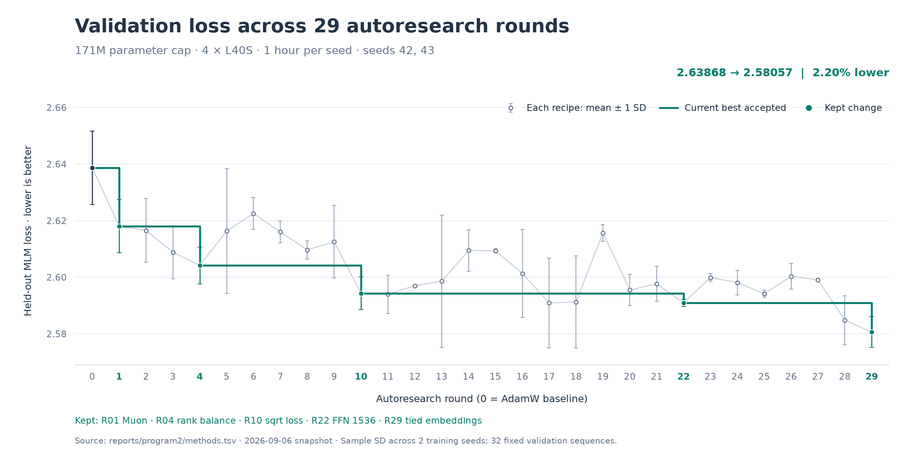

# LuminBench Nano-ESMC

Nano-ESMC implements ESMC-style protein language-model training on four GPUs,
with public, decontaminated sequences, pinned dependencies, saved run records,
and fixed evaluations.

The repository supports two uses:

1. **Reproduce and modify protein LM pretraining.** Train from scratch and
   inspect the data pipeline, model, optimizer, and evaluation code.
2. **Benchmark agentic autoresearch.** Let an agent test training recipes under
   a fixed budget, select improvements across repeated seeds, and check whether
   they carry over to longer training runs.

The evaluation suite is still growing. Contributions of evaluation tasks,
training recipes, and reproductions on other hardware are welcome through
issues and pull requests.

## Data

We reconstructed the training-data recipe described in the
[ESMC paper](https://doi.org/10.64898/2026.06.03.729735), using the same three
source roles and a similar quality-filtering, deduplication, and 70%-identity
clustering pipeline. After evaluation decontamination, this produces a public
training dataset of 665,970,495 proteins.

The release is screened against all protected evaluation datasets,
including every RCSB Protein Data Bank chain used for contact P@L. Exact
matches and homologs at 30% or greater sequence identity with at least 80%
bidirectional coverage are removed before validation and training records are
selected.

| Source | Processed training records | Source reference |
|---|---:|---|
| UniRef90 | 74,175,974 | [UniRef clusters](https://doi.org/10.1093/bioinformatics/btu739) |
| MGnify | 328,949,335 | [MGnify in 2023](https://doi.org/10.1093/nar/gkac1080) |
| OMG/IMG (JGI-role surrogate) | 262,845,186 | [The OMG dataset](https://doi.org/10.1101/2024.08.14.607850) |
| **Total** | **665,970,495** | |

The main gap relative to ESMC is the JGI arm. The paper's exact July 2023 JGI
snapshot is not available as a reproducible public download, so this release
uses public OMG/IMG data as its surrogate and remains roughly 1.68 billion
70%-identity representatives below ESMC in that source role. Closing that gap
with a public, redistributable JGI-scale source is future work.

Construction is documented in full in [`docs/DATA.md`](docs/DATA.md).

Download the pinned release from
[Hugging Face](https://huggingface.co/datasets/LuminScience/LuminBench-Nano-ESMC/tree/bd38448d50d8f426d7b9bd4410b53159ea001259).

## Evaluation

We measure held-out masked language-model (MLM) loss and the structural
information available from a frozen encoder. **Validation loss is the default
autoresearch reward; lower is better.** Training loss and contact precision are
reported alongside it.

For structure, we follow the ESMC paper's long-range contact precision at L
(P@L) over a fixed 20,775-chain population. A small probe predicts which
residues are in physical contact despite being far apart in sequence. This
checks a property of the learned representation that MLM loss alone does not
establish.

Our evaluation and the paper's both start from the RCSB Protein Data Bank at
the 2024-02-28 snapshot date, contain 20,775 chains, and follow the same
published construction rules. Biohub does not publish its ordered chain
manifest or raw-file digests, so item-for-item identity cannot be verified; the
two columns below are protocol-matched measurements, not a claim of an
identical evaluation set. All structural labels for our P@L evaluation come
from that frozen RCSB source, and those chains are in the protected union used
to decontaminate the training corpus.
[RCSB PDB](https://www.rcsb.org/); [ESMC](https://doi.org/10.64898/2026.06.03.729735).

| Released model | ESMC paper P@L-LR (95% CI) | Our full 20,775-chain P@L |
|---|---:|---:|
| ESMC-300M | 0.552 ± 0.002 | 0.5387 |
| ESMC-600M | 0.589 ± 0.002 | 0.5803 |
| ESMC-6B | 0.725 ± 0.002 | 0.7126 |

We are also building P-CORE, a suite of frozen-representation evaluations for
remote homology, secondary structure, subcellular localization, and mutational
fitness. These results do not affect autoresearch selection.

See [docs/EVALUATION.md](docs/EVALUATION.md) for dataset lineage, splits, probe
definitions, P-CORE results, confidence intervals, and execution.

## Baselines

Run these from the repository root after cloning it as described in
[Usage](#usage). Both settings start from the 24-layer, width-768 ESMC-171M
AdamW baseline.

Research setting: one hour on four L40S GPUs per seed, global batch 256.

```bash
for seed in 42 43; do
  CONFIG="$PWD/configs/program2/baseline_seed${seed}.yaml" \
  NUM_GPUS=4 \
  CUDA_VISIBLE_DEVICES=0,1,2,3 \
  WALLTIME_SECONDS=3600 \
  RUN_NAME="baseline-171m-1h-seed${seed}" \
    bash runs/speedrun.sh
done
```

Scale-up setting: 100,000 steps on four H100 GPUs, global batch 1,024.
The 16-hour wall-time guard leaves room to finish the step budget.

```bash
CONFIG="$PWD/configs/esmc-171m-default-h100-fa3-b1024-stage1-100k.yaml" \
NUM_GPUS=4 \
CUDA_VISIBLE_DEVICES=0,1,2,3 \
WALLTIME_SECONDS=57600 \
RUN_NAME=baseline-171m-100k \
  bash runs/speedrun.sh
```

These commands train and save checkpoints. Use a fresh run name for repeats;
evaluation requires the prepared datasets and commands in
[docs/EVALUATION.md](docs/EVALUATION.md). The exact research evaluation is
specified in [program.md](program.md).

## AutoResearch

An agent proposes a training change, trains from scratch, evaluates it, and
keeps it only if it passes the rule below. **ESMC-171M with validation-loss
selection is the default**, using the protocol from
[`autoresearch-171m-val-loss`](https://github.com/Lumin-Science/LuminBench-Nano-ESMC/tree/autoresearch-171m-val-loss),
now the default [program.md](program.md) on main.

The benchmark has two settings:

1. **Research:** a small budget for testing ideas. Each seed gets one hour of
   synchronized training on four L40S GPUs, with at most 171M trainable
   parameters. The starting model has 24 layers, width 768, and 12 heads.
   Validation uses 32 fixed held-out sequences at context length 512.
2. **Scale-up:** longer runs to test whether each kept improvement still helps.
   The current setting trains the 171M model family for 100,000 steps on four
   H100 GPUs at batch 1,024, then evaluates 4,096 held-out MLM sequences and
   all 20,775 contact chains. Each recipe starts from scratch and is compared
   with the baseline and preceding recipe under the same scale-up settings.

Every kept research change needs a scale-up check before we claim it transfers
to longer training. Completed results and remaining checks are listed in the
[scale-up leaderboard](#scale-up-leaderboard). Raw losses from the two settings
are reported separately because training budgets and validation sample sizes
differ.

**Reward and acceptance.** Minimize the frozen evaluator's `sequence_mean_nll`
in `eval-validation/VALIDATION_MLM.json`. Run each method, including the baseline,
on at least **N independent training seeds (default N = 2)**. Choose the seeds
before running and use the same seed set for candidates and the current best
accepted recipe. Compute the mean and sample standard deviation across all
repeats (`ddof=1`). Keep a candidate only when:

```text
candidate_mean_val_loss < current_best_mean_val_loss - candidate_val_loss_std
```

The standard deviation is the candidate's variation across training seeds.
A tie or a single run cannot qualify. This is a selection rule, not a formal
significance test. Training loss and contact P@L are required diagnostics and
do not affect this decision.

**What can change.** Model architecture, optimizer, training loss, batching,
and training implementation. The corpus and mixture, tokenizer, dependency
lock, hardware, training budget, and evaluators stay fixed within each setting.
Research runs use a 554-step linear warmup followed by constant learning rates,
with no cooldown. See [program.md](program.md) for the full contract.

**29-round history.** The September 6, 2026 snapshot contains the AdamW baseline
and 29 candidate rounds: 60 one-hour runs across seeds 42 and 43, with five kept
changes. The accepted sequence is Muon → balanced ranks → square-root
target-count loss weights → FFN width 1536 → tied embeddings. Mean validation
loss falls from **2.63868 to 2.58057 (2.20%)**. R29's accepted configs are
available for [seed 42](configs/program2/r29_tied_seed42.yaml) and
[seed 43](configs/program2/r29_tied_seed43.yaml).

Each point below is a method's mean validation loss with thin **±1 sample SD**
error bars. The green line follows the current best accepted recipe; lower
means that fail the acceptance rule do not advance it. Full history:
[methods.tsv](reports/program2/methods.tsv) and
[run records and audit](reports/program2/README.md).
Regenerate the [SVG](reports/program2/validation-loss.svg) and PNG with
[the plotting script](scripts/plot_autoresearch_history.py).



## Scale-up leaderboard

Completed 100,000-step runs on four H100s, ordered by validation loss:

| Recipe | Validation loss ↓ | Full contact P@L ↑ | Training time |
|---|---:|---:|---:|
| R02 (Muon + retained architecture) | **2.43698** | **30.31%** | 12h 57m |
| AdamW baseline | 2.47436 | 26.50% | 12h 01m |

Both use batch 1,024, base LR 5e-4, base WD 0.01, and a 1,000-step warmup.
Evaluation uses 4,096 held-out MLM sequences and 20,775 contact chains.
There is one training seed per recipe, so these results do not yet measure
variation across training seeds. See the
[full results and run records](reports/fir-171m-100k-20260906/README.md).

R02 comes from the earlier contact-selected campaign. Scale-up results for the
validation-loss search are pending in the published
[launch record](reports/fir-r02-rope10k-100k-20260906/README.md). That comparison
starts from R02 with RoPE reset to 10k, then adds rank balancing, square-root
loss weights, and tied embeddings cumulatively. It retains FFN width 2048;
the kept FFN-narrowing change still needs its scale-up check and is tracked in
[TODO](TODO.md). See the [matched recipes](docs/PROGRAM2_SCALEUP.md) for the
differences from the one-hour search.

## Usage

From a fresh clone with `uv >=0.11.31,<0.12`, a supported NVIDIA driver, and
four visible BF16-capable GPUs:

```bash
git clone https://github.com/Lumin-Science/LuminBench-Nano-ESMC.git
cd LuminBench-Nano-ESMC
```

Then run one of the [baseline commands](#baselines) above. The speedrun creates
the locked environment, downloads and verifies the required processed-data
shards, qualifies CUDA, trains the selected model, and checks the saved
artifacts. Configuration, smoke-run, and evaluation commands are in
[docs/USAGE.md](docs/USAGE.md).

Source and issues:
[Lumin-Science/LuminBench-Nano-ESMC](https://github.com/Lumin-Science/LuminBench-Nano-ESMC).

## Citation

If you use Nano-ESMC, please cite this repository and the original
[ESMC paper](https://doi.org/10.64898/2026.06.03.729735):

```bibtex
@software{lumin_science_nano_esmc_2026,
  author = {Muchen Li},
  title = {Nano-Protein-LM: A Minimal Reproduction of ESMC Language-Model Training},
  year = {2026},
  url = {https://github.com/Lumin-Science/LuminBench-Nano-ESMC}
}

@article{candido2026language,
  author = {Candido, Salvatore and Hayes, Thomas and Rao, Roshan and others},
  title = {Language Modeling Materializes a World Model of Protein Biology},
  journal = {bioRxiv},
  year = {2026},
  doi = {10.64898/2026.06.03.729735}
}
```
