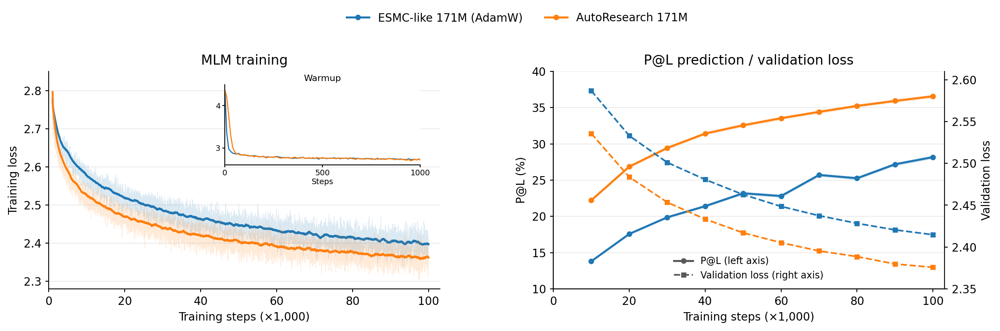

# NanoProteinLM
> [!NOTE]
> We are actively looking for contributor & collaborator for this project.

Inspired by [nanochat](https://github.com/karpathy/nanochat), NanoProteinLM makes protein language-model training accessible, inspectable and easy to experiment with.
Our goal is to help researchers train better protein embeddings for downstream biology tasks, through a small, open implementation and reproducible experiments.

**For protein researchers**, this repository provides a minimal reproduction of ESMC-style model training: public data, readable PyTorch code, training recipes and evaluations in one place. We aim to contribute an open-source foundation that researchers can understand, reproduce and extend in support of open science.

**For agentic researchers**, it provides a controlled environment for iterative autoresearch on the same scientific objective. Deterministic data selection, fixed seeds, explicit compute budgets and frozen evaluation protocols make recipe changes measurable. An agent can modify the training recipe, train, evaluate and improve it; the choice of agent and search strategy remains yours.

<div class="ai">

[AutoResearch protocol](#auto-research-protocols) · [Sequential search](docs/AUTORESEARCH_BASELINE.md) · [Protein models](#training-and-evaluating) · [Dataset](#data-preparation)

</div>


## Discovering better protein-model training recipes




<div class="ai">

GPT-6 found this improved 171M training recipe using our [sequential-search setup](docs/AUTORESEARCH_BASELINE.md) and its [historical protocol](docs/AUTORESEARCH_BASELINE.md#historical-38-round-example). Against our ESMC-like AdamW baseline, it improves contact prediction (**36.567% versus 28.173% P@L**) and lowers MLM validation loss (**2.376 versus 2.415**), with faster learning early in training. Both recipes use the same data, batch size of 2,048 and 100k updates on four H100s, with one training seed each. [Recipe details](docs/leaderboard/BEST_RECIPE_22_09_26.md) · [Figure data and methods](.dev/reports/readme-figures-20260914/README.md).

</div>


## Setting up data & environments

Prepare the environment and data once, then reuse them for training and evaluation.
The same setup supports ordinary research and the fixed autoresearch task.

<div class="ai">

**Scaling the training budget also requires scaling the prepared data.** Training checks each source against global batch × steps and prevents source resampling by default. See [data sizing](docs/DATA.md#sizing-a-training-download) for sample-budget preparation and [training commands](docs/USAGE.md#training) for checkpoint continuation.

</div>

### Requirements

- **Environment:** Linux, a compatible NVIDIA driver and
  `uv >=0.11.31,<0.12`. Setup installs Python and dependencies from the repository lock.
- <span class="ai">**Training:** You would ideadly need GPU with memory > 40GB. There is no restriction to types of GPUs, but you might need to adjust the receipe accordingly. The default speedrun and current AutoResearch benchmark use **four H100 GPUs with FA3**. The historical one-hour sequential-search profile uses **four L40S GPUs with FA2**. See [USAGE.md](docs/USAGE.md#training) for other configurations.</span>
- **Data preparation:** Allow space for both downloaded Parquet
  files and their prepared token stores—**allow 20 GB for the default 30-shard
  data setup**, plus separate space for the environment and training checkpoints.

### Data preparation
> [!NOTE]
> **Data may change:** we could not find a public version of the July 2023 JGI snapshot, so we substitute OMG/IMG; our corpus has [about 30% of ESMC’s reported 70%-identity clusters](docs/DATA.md#main-corpus-gap-relative-to-esmc), supports our current training budgets, and may expand as more data becomes available.

We curate a public protein corpus following the ESMC data recipe, with filtering and evaluation decontamination before training.


<table align="center">
  <tr>
    <th align="center">Source</th>
    <th align="center"><a href="https://doi.org/10.1093/bioinformatics/btu739">UniRef90</a></th>
    <th align="center"><a href="https://doi.org/10.1093/nar/gkac1080">MGnify</a></th>
    <th align="center"><a href="https://doi.org/10.1101/2024.08.14.607850">OMG/IMG</a></th>
    <th align="center">Total</th>
  </tr>
  <tr>
    <td align="center">Training proteins</td>
    <td align="center">74.2M</td>
    <td align="center">328.9M</td>
    <td align="center">262.8M</td>
    <td align="center"><strong>666.0M</strong></td>
  </tr>
</table>

Following the [ESMC data recipe](https://doi.org/10.64898/2026.06.03.729735),
we combine pinned UniRef90 and MGnify releases with public OMG/IMG proteins.
Sequences are normalized to uppercase, stripped of whitespace and terminal stop
characters, and filtered to remove proteins shorter than 60 amino acids or with
more than 20% non-canonical residues. MGnify-derived records in OMG are excluded
from the IMG arm to avoid sampling the same source twice.

We remove exact duplicates, cluster each source at **70% sequence identity**, and exclude matches and homologs of **317,000 protected evaluation proteins**. After cross-source deduplication and length filtering, we reserve **12,288 validation proteins** and release **666.0M training proteins** in **565 training shards plus 3 validation shards**, with independent checks of hashes, duplicates and evaluation exclusions. [Filtering and verification details](docs/DATA.md).

We open-sourced both the [🤗 Processed data](https://huggingface.co/datasets/LuminScience/LuminBench-Nano-ESMC/tree/bd38448d50d8f426d7b9bd4410b53159ea001259) and the [🤗 Raw dataset](https://huggingface.co/datasets/LuminScience/LuminBench-Nano-ESMC-RAW) with all the cluster information. For more detailed information about data colnstruction please refer to [DATA.md](docs/DATA.md).

### Install the environment and data

```bash
git clone https://github.com/Lumin-Science/Nano-ProteinLM.git
cd Nano-ProteinLM
bash runs/setup.sh
```
The default downloads **30/565 training shards (29.98M proteins; 5.62 GB compressed, including MLM validation)**: 13 UniRef90, 3 MGnify and 14 OMG/IMG shards. For a larger training set:

```bash
bash runs/setup.sh --training-shards $number_of_shards
# Use 30 for one-hour research trials, 209 for larger-data scale-up tests.
```
<div class="ai">

The [historical sequential-search task](tasks/171m-validation-loss.md) fixes a seven-shard selection. The current [AutoResearch protocol](docs/autoresearch.md#design-space) permits data selection and source-mixture changes within the provided training corpus.

</div>

Data and outputs default to `data/` and `outputs/`. To use another path, copy
[.env.example](.env.example) to `.env` and set `DATA_ROOT` and `OUTPUT_ROOT`:

```text
$DATA_ROOT/                     # Default: data/
  cache/                       # Downloaded Parquet shards and contact archive
  training/                    # Prepared token stores, MLM validation and receipts
  evaluation/contact/          # Frozen P@L chains and probe splits
  evaluation/source/           # Frozen contact evaluator
$OUTPUT_ROOT/<run-name>/        # Default: outputs/<run-name>/
  checkpoint-final.pt          # Final model and optimizer state for resuming
  config.yaml, metrics.jsonl   # Resolved recipe and training log
  evaluation/                  # MLM loss, P@L and evaluation records
```

## Training and evaluating

Start with a short training trial, scale up a recipe, then measure both language
modeling and structural information in its checkpoint. The scripts call standard
Python APIs so you can adapt the commands to your own research.

### Train the ESMC-Style Protein Language Model

> [!NOTE]
> **Our default setting is a 171M variant, designed for small-budget training experiments.** Its baseline backbone follows the paper's 170M scaling model: 24 layers, width 768, and approximately 170.7M parameters ([ESMC Appendix A.1.4.1](https://www.biorxiv.org/content/10.64898/2026.06.03.729735v1.full.pdf#page=29)).
> For the original ESMC **300M** and **600M** architectures, see the [esmc-300m.yaml](configs/esmc/esmc-300m.yaml) and [esmc-600m.yaml](configs/esmc/esmc-600m.yaml)

```bash
bash runs/speedrun.sh
```
<div class="ai">

This launches **100,000 Stage-1 steps on four GPUs**, global batch **1,024**, context **512**, **BF16/FA3**, base learning rate **5e-4**, weight decay **0.01** and **1,000 warmup steps**. A 16-hour training guard stops an overlong run. Checkpoints, the resolved recipe and training records are saved under `$OUTPUT_ROOT/default-100k/`, including the full final optimizer state. See [training and continuation](docs/USAGE.md#training) for the resume option. Repeats require a fresh run name.

</div>

For 171M training, choose [default.yaml](configs/default.yaml) or
[esmc-171m.yaml](configs/esmc/esmc-171m.yaml). The scripts call the standard
training API; see [USAGE.md](docs/USAGE.md#training) for other budgets, hardware
and recipe changes.

### Evaluate a checkpoint

- **MLM validation loss ↓:** mean per-protein masked-token loss on held-out data; the reward for the [validation-loss task](tasks/171m-validation-loss.md).
- **Contact P@L ↑:** precision among the top L predicted long-range contacts, where L is chain length, averaged over 20,775 chains; the reward for the [P@L task](tasks/171m-p-at-l.md).

After training finishes, evaluate a completed run with:

```bash
bash runs/speedrun.sh --evaluate default-100k
```

This loads your paths, reports MLM loss on **4,096 held-out sequences**, and scores P@L over **all 20,775 chains** using the accelerated parallel evaluator. Replace `default-100k` with your run name; additional [evaluation options](docs/EVALUATION.md#evaluation-execution) can follow it. Evaluation is separate from training and keeps the same sample counts for short training trials.


<div class="ai">

## Auto Research Protocols

</div>

<div class="ai">

Use NanoProteinLM to compare AutoResearch methods under a fixed number of search rounds and a fixed compute budget per round. The protocol specifies the objective, permitted changes, search measurements and final evaluation budget. Each method chooses its own proposal strategy and improvement criteria within those limits.

</div>

- <span class="ai">**Objective:** the scientific outcome the research aims to improve.</span>
- <span class="ai">**Design space:** what may change during research and what must remain fixed.</span>
- <span class="ai">**Search budget:** the fixed number of rounds and the hardware and training time available per round.</span>
- <span class="ai">**Evaluation:** the common metrics, evaluation data and final training budget used to compare the recipes found by different methods.</span>
- <span class="ai">**Scale-up test:** a comparison against the baseline under a larger training budget or model size to check whether the discovered improvements transfer.</span>

<div class="ai">

| Protocol item | Requirement |
|---|---|
| Objective | Find better training recipes for protein embedding models. Declare the primary comparison metric before search. |
| Design space | **Fixed:** use only the provided training corpus; keep the tokenizer, context 512, linear-warmup/constant-LR schedule, evaluation and compute settings unchanged. Keep trainable parameters within **±5% of the original 171M model**, with no pretrained weights or held-out training. **Mutable:** data selection and source mixture within that corpus, architecture, training loss, optimizer and training implementation. |
| Search budget | **72 rounds**, each providing **20 minutes on four H100 GPUs** for one training run: **24 node-hours, or 96 H100 GPU-hours**, in total. Repeated seeds consume additional rounds. Setup, final checkpoint saving and evaluation are timed separately. |
| Hill-climbing evaluation | Default reward: **MLM validation loss ↓** on **32 fixed sequences**. Report P@L over **all 20,775 contact chains** as a diagnostic, with a chain-bootstrap 95% interval. Each method decides how to use this feedback. |
| Final evaluation budget | Train the selected recipe and reference for **24B model tokens each** on four H100s, using **one common training seed**. The reference takes roughly **12 hours per recipe**. Report loss on **4,096 MLM validation sequences** and P@L over **all 20,775 contact chains**. |

</div>

<div class="ai">

[Full AutoResearch protocol](docs/autoresearch.md) · [Our Karpathy-style sequential method](docs/AUTORESEARCH_BASELINE.md), including its pipeline, two-seed settings, improvement criteria and commands.

</div>

## Benchmarking Agentic AutoResearch Systems


<div class="ai">

A historical sequential search improved validation loss over 38 rounds; each point is a two-seed mean ± sample SD, with one hour on four L40S GPUs per seed. See [the illustrated protocol](docs/autoresearch.md) for the design space, fixed search budget and scale-up evaluation, [the recorded results](docs/LEADERBOARD.md) for measurements, and [the sequential-search example](docs/AUTORESEARCH_BASELINE.md) for the loop, accepted changes and experiment records.

</div>

## Citation

If you use NanoProteinLM, please cite this repository and the original
[ESMC paper](https://doi.org/10.64898/2026.06.03.729735):

```bibtex
@software{lumin_science_nano_esmc_2026,
  author = {Muchen Li},
  title = {NanoProteinLM: Minimal ESMC-Style Protein Language-Model Training},
  year = {2026},
  url = {https://github.com/Lumin-Science/Nano-ProteinLM}
}

@article{candido2026language,
  author = {Candido, Salvatore and Hayes, Thomas and Rao, Roshan and others},
  title = {Language Modeling Materializes a World Model of Protein Biology},
  journal = {bioRxiv},
  year = {2026},
  doi = {10.64898/2026.06.03.729735}
}
```
