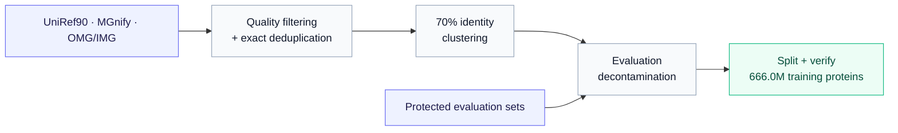

# NanoProteinLM

Inspired by [nanoGPT](https://github.com/karpathy/nanoGPT) and
[nanochat](https://github.com/karpathy/nanochat), NanoProteinLM makes protein
language-model training accessible, inspectable and easy to experiment with.
Our goal is to help researchers train better protein embeddings for downstream
biology tasks, through a small, open implementation and reproducible experiments.

**For protein researchers**, this repository provides a minimal reproduction of
ESMC-style model training: public data, readable PyTorch code, training recipes
and evaluations in one place. We aim to contribute an open-source foundation
that researchers can understand, reproduce and extend in support of open science.

**For agentic researchers**, it provides a controlled environment for iterative
autoresearch on the same scientific objective. Deterministic data selection, fixed seeds, explicit
compute budgets and frozen evaluation protocols make recipe changes measurable.
An agent can modify the training recipe, train, evaluate and improve it; the
choice of agent and search strategy remains yours.

<p align="center">
  <a href="#setting-up-data--environments">Setup</a> ·
  <a href="#training-and-evaluating">Training &amp; Evaluation</a> ·
  <a href="#autoresearch">AutoResearch</a> ·
  <a href="#test-leaderboard">Test Leaderboard</a> ·
  <a href="#citation">Citation</a>
</p>

## Setting up data & environments

Prepare the environment and data once, then reuse them for training and evaluation.
The same setup supports ordinary research and the fixed autoresearch task.

### Requirements

- **Environment:** Linux, a compatible NVIDIA driver and
  `uv >=0.11.31,<0.12`. Setup installs Python and dependencies from the repository lock.
- **Training:** the default speedrun uses **four H100 GPUs with FA3**.
  The one-hour autoresearch profile uses **four L40S GPUs with FA2**.
  See [USAGE.md](docs/USAGE.md#training) for other configurations.
- **Data preparation:** no GPU required; allow space for both downloaded Parquet
  files and their prepared token stores—**allow 20 GB for the default 30-shard
  data setup**, plus separate space for the environment and training checkpoints.

### Data preparation

We curate a public protein corpus following the ESMC data recipe, with explicit
filtering and evaluation decontamination before training.



<table align="center">
  <tr>
    <th align="center">Source</th>
    <th align="center"><a href="https://doi.org/10.1093/bioinformatics/btu739">UniRef90</a></th>
    <th align="center"><a href="https://doi.org/10.1093/nar/gkac1080">MGnify</a></th>
    <th align="center"><a href="https://doi.org/10.1101/2024.08.14.607850">OMG/IMG</a></th>
    <th align="center">Total</th>
  </tr>
  <tr>
    <td align="center">Training proteins</td>
    <td align="center">74.2M</td>
    <td align="center">328.9M</td>
    <td align="center">262.8M</td>
    <td align="center"><strong>666.0M</strong></td>
  </tr>
</table>

Following the [ESMC data recipe](https://doi.org/10.64898/2026.06.03.729735),
we combine pinned UniRef90 and MGnify releases with public OMG/IMG proteins.
Sequences are normalized to uppercase, stripped of whitespace and terminal stop
characters, and filtered to remove proteins shorter than 60 amino acids or with
more than 20% non-canonical residues. MGnify-derived records in OMG are excluded
from the IMG arm to avoid sampling the same source twice.

We collapse exact sequence duplicates and cluster each source with MMseqs2
Linclust at **70% sequence identity and 80% coverage** of the shorter sequence.
To protect evaluation, we exclude exact matches and homologs of a frozen union
of **317,000 evaluation proteins**. The homology filter requires at least 30%
identity, 80% coverage of both sequences and an E-value of at most 0.001.
Shared representatives are assigned to one source in UniRef90 → MGnify → OMG/IMG
order, so they cannot be overweighted through cross-source duplicates.

After the storage-length filter, we reserve **4,096 validation proteins per
source** and write the remaining **666.0M training proteins** to deterministic
Parquet shards. An independent verifier checks sequence and shard hashes,
duplicate removal, evaluation exclusions and train/validation separation before
publication. The release contains **565 training Parquet shards**—92 UniRef90,
229 MGnify and 244 OMG/IMG—plus **3 validation shards** containing all 12,288
held-out proteins.

> [!NOTE]
> **Gap from ESMC:** public OMG/IMG substitutes for the paper's July 2023 JGI
> snapshot, leaving roughly **1.68B fewer 70%-identity representatives** in that
> source arm; a public JGI-scale replacement remains future work.

[DATA.md](docs/DATA.md) · [🤗 Processed data](https://huggingface.co/datasets/LuminScience/LuminBench-Nano-ESMC/tree/bd38448d50d8f426d7b9bd4410b53159ea001259) · [🤗 Raw dataset](https://huggingface.co/datasets/LuminScience/LuminBench-Nano-ESMC-RAW)

### Install the environment and data

```bash
git clone https://github.com/Lumin-Science/Nano-Protein-LM.git
cd Nano-Protein-LM
bash runs/setup.sh
```

The default downloads **30 training shards (29.98M proteins; 5.62 GB compressed,
including MLM validation)**: 13 UniRef90, 3 MGnify and 14 OMG/IMG shards. It also
prepares all **12,288 MLM validation proteins** and the frozen
[**P@L dataset and evaluator**](https://huggingface.co/datasets/LuminScience/LuminBench-Nano-ESMC/tree/cc548944b9caaf8b4f40ba49b316cc6f477a6031/evaluation)
(~168 MB compressed): 16 probe-fit chains, 4 probe-validation chains and all
20,775 evaluation chains. Experimental P-CORE data are excluded. All downloaded
assets are checked against their frozen hashes and reused on subsequent runs.

Data and outputs default to `data/` and `outputs/`. To use another disk, copy
[.env.example](.env.example) to `.env` and set only `DATA_ROOT` and `OUTPUT_ROOT`:

```text
$DATA_ROOT/                     # Default: data/
  cache/                       # Downloaded Parquet shards and contact archive
  training/                    # Prepared token stores, MLM validation and receipts
  evaluation/contact/          # Frozen P@L chains and probe splits
  evaluation/source/           # Frozen contact evaluator
$OUTPUT_ROOT/<run-name>/        # Default: outputs/<run-name>/
  checkpoint-final.pt          # Final model and optimizer state for resuming
  config.yaml, metrics.jsonl   # Resolved recipe and training log
  evaluation/                  # MLM loss, P@L and evaluation records
```

### How much training data?

Thirty shards cover a 100-step trial and can also train for 100k steps. At global
batch 1,024, 100k steps sample **102.4M proteins**, or about **3.4 passes** through
the default subset. The loader reshuffles each source when its rows are exhausted.
For a larger-data comparison, **105 shards** cover roughly one pass at that budget;
use **209 shards** for 100k steps at batch 2,048.

| Training selection | Proteins | Parquet download¹ | Parquet + prepared stores¹ |
|---|---:|---:|---:|
| **30 shards — default** | **29.98M** | **5.62 GB** | **15.00 GB** |
| 105 shards — 100k × 1,024 | 103.87M | 19.64 GB | 52.40 GB |
| 209 shards — 100k × 2,048 | 206.91M | 39.09 GB | 104.30 GB |
| 565 shards — full release | 665.97M | 109.66 GB | 290.27 GB |

¹ Includes all MLM validation data; decimal GB. Add about 0.9 GB for the P@L
archive and extracted files, plus working space, the environment and checkpoints.
Allow roughly **20 / 60 / 120 / 320 GB** for the respective data selections.

Choose a fresh `DATA_ROOT` for a different selection:

```bash
bash runs/setup.sh --training-shards 105  # Larger-data 100k-step comparison
# Use 209 for batch 2,048, or 565 for the complete training release.
```

Setup reuses an existing root's saved shard count; upgrading does not silently
expand a seven-shard installation. Selection extends deterministic source prefixes
in the training mixture, with complete validation and P@L at every shard count.

The **24.20B-token Test of Progress** budget matches the completed 100k-step run
at batch 1,024; its exact step count depends on sampled sequence lengths. The
frozen autoresearch task and historical leaderboard use **7 shards**. Prepare
that selection explicitly with `bash runs/setup.sh --training-shards 7` in a
separate root. A larger-data comparison must train both reference and candidate
on the same selected corpus and report it separately. See [DATA.md](docs/DATA.md)
for capacity calculations and [USAGE.md](docs/USAGE.md#setup) for direct APIs.

## Training and evaluating

Start with a short training trial, scale up a recipe, then measure both language
modeling and structural information in its checkpoint. The scripts call standard
Python APIs so you can adapt the commands to your own research.

### Train a 171M model

> [!NOTE]
> **Our 171M variant is designed for small-budget training experiments.** Its
> baseline backbone follows the paper's 170M scaling model: 24 layers, width 768,
> and approximately 170.7M parameters
> ([ESMC Appendix A.1.4.1, Table S4, p. 29](https://www.biorxiv.org/content/10.64898/2026.06.03.729735v1.full.pdf#page=29)).
> For the original ESMC **300M** and **600M** architectures, see the
> [esmc-300m-original.yaml](configs/reference/esmc-300m-original.yaml) and
> [esmc-600m-original.yaml](configs/reference/esmc-600m-original.yaml), following
> [Appendix A.1.1, Table S1, p. 29](https://www.biorxiv.org/content/10.64898/2026.06.03.729735v1.full.pdf#page=29).
> These are local training presets; [configs/reference/README.md](configs/reference/README.md)
> explains how their training settings differ from the released models.

Try the current-best **Setting 3** recipe for 100 steps; setup runs automatically:

```bash
bash runs/speedrun.sh configs/default.yaml setting3-trial --max-steps 100
```

For the full 100k-step run:

```bash
bash runs/speedrun.sh
```

The default is **100,000 Stage-1 steps on four H100s**, global batch **1,024**,
context **512**, **BF16/FA3**, base learning rate **5e-4**, weight decay **0.01**
and **1,000 warmup steps**. A 16-hour training guard stops an overlong run.
Checkpoints, the resolved recipe and training records are saved under
`$OUTPUT_ROOT/setting3-100k/`, including the full final optimizer state. See
[checkpoint-resume.md](docs/checkpoint-resume.md) for continuation. Repeats require a fresh run name.

For 171M training, choose [default.yaml](configs/default.yaml) or
[esmc-171m-original.yaml](configs/esmc-171m-original.yaml). The scripts call the standard
training API; see [USAGE.md](docs/USAGE.md#training) for other budgets, hardware
and recipe changes.

### Evaluate a checkpoint

- **MLM validation loss ↓:** mean per-protein masked-token loss on held-out data;
  the autoresearch selection metric.
- **Contact P@L ↑:** precision among the top L predicted long-range contacts,
  where L is chain length, averaged over 20,775 chains; tests structural information.

After setup, both metrics are ready to run. Load your paths and score a checkpoint:

```bash
set -a
if [ -f .env ]; then source .env; fi
source .env.example
set +a
uv run --frozen python -m nanoprotein.evaluate \
  --checkpoint "$OUTPUT_ROOT/setting3-trial/checkpoint-final.pt" \
  --data-root "$DATA_ROOT/training" --output-root "$OUTPUT_ROOT/setting3-trial/evaluation" \
  --validation-batches 1024 --validation-batch-size 4 --validation-context 512 \
  --run-contact --contact-chains 20775 --contact-bootstrap 5000 \
  --contact-root "$DATA_ROOT/evaluation/contact" --external-src "$DATA_ROOT/evaluation/source"
```

This reports MLM loss on 4,096 held-out sequences and P@L over the full contact
population. Evaluation is a separate run; a 100-step training trial does not
shorten the evaluation protocol. See [EVALUATION.md](docs/EVALUATION.md#evaluation-execution)
for commands, released ESMC comparisons, probe definitions, confidence intervals
and additional downstream tasks.

## AutoResearch

Use NanoProteinLM as a research environment for improving training recipes under
controlled budgets. Task definitions describe what is measured and held fixed;
your agent decides how to search.

### Protocol

Search trains each recipe for **one hour on four L40S GPUs per seed**, using
**two matched seeds**. Its score is mean MLM validation loss, with lower values
preferred. Data and evaluation stay fixed, and model size must remain within
±5% of the original 171M baseline. The agent chooses its search and acceptance strategy.

The benchmark owner manually checks progress with **24.20B model tokens per seed
on four H100s**, comparing mean MLM loss and P@L. Full rules and research commands
are in [171m-validation-loss.md](tasks/171m-validation-loss.md).

### Experiments

A completed 38-round search found the cumulative recipe changes below. The
figure shows their effect on the fixed-budget validation objective.


| Research metric | Baseline | 1: + Muon | 2: + batch balance | 3: + sqrt loss | 4: + FFN 1536* | 5: + tied embeddings* |
|---|---:|---:|---:|---:|---:|---:|
| Validation loss ↓ | 2.63868 ± 0.01303 | 2.61807 ± 0.00945 | 2.60415 ± 0.00650 | 2.59437 ± 0.00578 | 2.59095 ± 0.00132 | **2.58057 ± 0.00544** |
| P@L (%) ↑ | 9.648 ± 0.598 | 9.795 ± 0.189 | 9.370 ± 0.270 | **10.533 ± 0.366** | 9.829 ± 0.286 | 9.527 ± 0.720 |

Two-seed mean ± sample SD; one hour on four L40S GPUs per seed.
[.dev/reports/program2/README.md](.dev/reports/program2/README.md) · [AUTORESEARCH.md](docs/AUTORESEARCH.md)

*Changes 4–5 use ~142M models and predate the ±5% size rule. The fixed-size
leaderboard skips 4 and applies tied embeddings directly to 3.

## Test Leaderboard

Matched runs use **100,000 Stage-1 steps on four H100s**, batch **1,024**, base
LR **5e-4**, base WD **0.01** and **1,000 warmup steps**. Each recipe has one
training seed and uses the same 4,096 MLM validation sequences and 20,775 contact
chains. These are historical step-budget results, separate from the two-seed
Test of Progress protocol above.

| Recipe | Validation loss ↓ | P@L ↑ | P@L 95% CI | Training time |
|---|---:|---:|---:|---:|
| Baseline: ESMC-like AdamW | 2.47436 | 26.505% | 26.295–26.719% | 12h 01m |
| 1: + Muon (R02 recipe)† | 2.43781 | 30.165% | 29.936–30.394% | 12h 58m |
| 2: + batch balance | 2.43872 | 30.715% | 30.487–30.948% | 12h 34m |
| **3: + sqrt loss** | **2.41872** | **32.682%** | **32.447–32.920%** | **12h 35m** |
| 5: + tied embeddings | 2.42304 | 31.884% | 31.651–32.123% | 12h 33m |

†Setting 1 uses the full R02 recipe: Muon plus RMSNorm, residual routing and
depth-scaled initialization, with RoPE 10k. Settings 2, 3 and 5 inherit it.
Intervals are 95% chain-bootstrap CIs, not training-seed uncertainty; times
exclude evaluation.

**Setting 3 is best on both metrics:** validation loss is **2.25% lower** and
P@L is **6.18 percentage points higher** than the AdamW baseline.
See [BEST_RECIPE_VS_BASELINE.md](docs/BEST_RECIPE_VS_BASELINE.md),
[.dev/reports/fir-r02-rope10k-100k-20260906/README.md](.dev/reports/fir-r02-rope10k-100k-20260906/README.md) and the
[TEST_LEADERBOARD_20260908.md](docs/archive/TEST_LEADERBOARD_20260908.md).

## Citation

If you use NanoProteinLM, please cite this repository and the original
[ESMC paper](https://doi.org/10.64898/2026.06.03.729735):

```bibtex
@software{lumin_science_nano_esmc_2026,
  author = {Muchen Li},
  title = {NanoProteinLM: Minimal ESMC-Style Protein Language-Model Training},
  year = {2026},
  url = {https://github.com/Lumin-Science/Nano-Protein-LM}
}

@article{candido2026language,
  author = {Candido, Salvatore and Hayes, Thomas and Rao, Roshan and others},
  title = {Language Modeling Materializes a World Model of Protein Biology},
  journal = {bioRxiv},
  year = {2026},
  doi = {10.64898/2026.06.03.729735}
}
```
