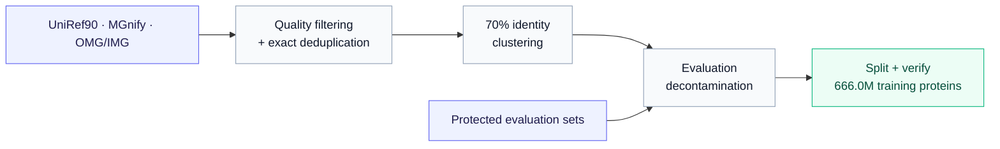
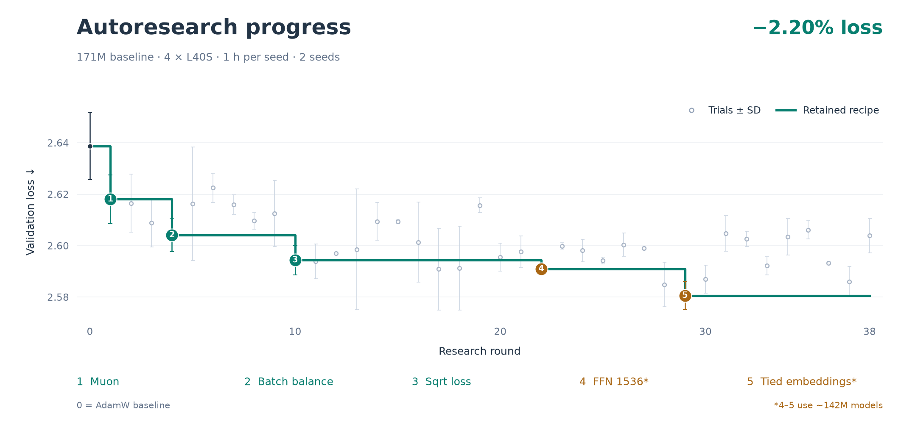
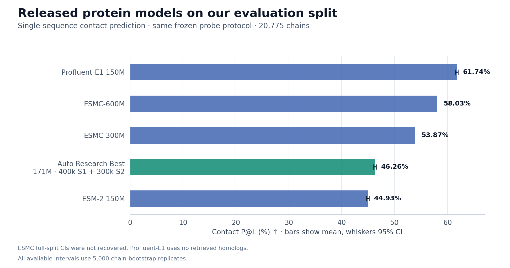

# NanoProteinLM

Inspired by [nanoGPT](https://github.com/karpathy/nanoGPT) and
[nanochat](https://github.com/karpathy/nanochat), NanoProteinLM makes protein
language-model training accessible, inspectable and easy to experiment with.
Our goal is to help researchers train better protein embeddings for downstream
biology tasks, through a small, open implementation and reproducible experiments.

**For protein researchers**, this repository provides a minimal reproduction of
ESMC-style model training: public data, readable PyTorch code, training recipes
and evaluations in one place. We aim to contribute an open-source foundation
that researchers can understand, reproduce and extend in support of open science.

**For agentic researchers**, it provides a controlled environment for iterative
autoresearch on the same scientific objective. Deterministic data selection, fixed seeds, explicit
compute budgets and frozen evaluation protocols make recipe changes measurable.
An agent can modify the training recipe, train, evaluate and improve it; the
choice of agent and search strategy remains yours.

<p align="center">
  <a href="#setting-up-data--environments">Setup</a> ·
  <a href="#training-and-evaluating">Training &amp; Evaluation</a> ·
  <span class="ai"><a href="#auto-research-protocols">Auto Research Protocols</a></span> ·
  <span class="ai"><a href="#auto-research-experiment">Experiments</a></span> ·
  <span class="ai"><a href="#verification-of-auto-research-discovery--test">Verification / Test</a></span> ·
  <a href="#citation">Citation</a>
</p>

<div class="ai">

Agent-edited documentation awaiting owner review appears in blue in the local VS Code Markdown preview; see [AI review](docs/AI_REVIEW.md).

</div>

<div class="ai">

## Auto Research at 171M

</div>

<div class="ai">


</div>

<div class="ai">

**Auto Research Best · September 13, 2026** reaches **36.567% P@L** versus **28.173%** for our ESMC-like 171M AdamW baseline after the same **100k updates**: **+8.394 percentage points**. MLM validation loss falls from **2.414734 to 2.375701**. Both runs use batch **2,048**, four H100s, and the same **204.8M distinct training records / 48.39B model tokens**. [Recipe differences](docs/BEST_RECIPE_VS_BASELINE.md) · [Verified run records](.dev/reports/nibi-paired-unique-b2048-100k-20260909/README.md).

</div>

<div class="ai">

The left panel includes all ten 10k-step evaluations; solid lines use the left P@L axis and dashed lines use the right validation-loss axis. P@L bands are 95% chain-bootstrap intervals over our **20,775-chain split**; validation uses **4,096 sequences**. The right panel uses **10,001 training-log records per recipe**, with raw traces and a 1,000-step trailing mean; warmup is shown in the inset. Training loss is the same rank-0 sequence-mean MLM diagnostic for both recipes. One training seed per recipe. [Figure data and methods](.dev/reports/readme-overview-20260913/README.md).

</div>

## Setting up data & environments

Prepare the environment and data once, then reuse them for training and evaluation.
The same setup supports ordinary research and the fixed autoresearch task.

**Scaling the training budget also requires scaling the prepared data.** Training
checks each source against global batch × steps and prevents source resampling
by default. See [data coverage and no-repeat training](docs/data-coverage.md) for
sample-budget preparation, exposure accounting and checkpoint continuation.

### Requirements

- **Environment:** Linux, a compatible NVIDIA driver and
  `uv >=0.11.31,<0.12`. Setup installs Python and dependencies from the repository lock.
- **Training:** the default speedrun uses **four H100 GPUs with FA3**.
  The one-hour autoresearch profile uses **four L40S GPUs with FA2**.
  See [USAGE.md](docs/USAGE.md#training) for other configurations.
- **Data preparation:** no GPU required; allow space for both downloaded Parquet
  files and their prepared token stores—**allow 20 GB for the default 30-shard
  data setup**, plus separate space for the environment and training checkpoints.

### Data preparation

We curate a public protein corpus following the ESMC data recipe, with explicit
filtering and evaluation decontamination before training.



<table align="center">
  <tr>
    <th align="center">Source</th>
    <th align="center"><a href="https://doi.org/10.1093/bioinformatics/btu739">UniRef90</a></th>
    <th align="center"><a href="https://doi.org/10.1093/nar/gkac1080">MGnify</a></th>
    <th align="center"><a href="https://doi.org/10.1101/2024.08.14.607850">OMG/IMG</a></th>
    <th align="center">Total</th>
  </tr>
  <tr>
    <td align="center">Training proteins</td>
    <td align="center">74.2M</td>
    <td align="center">328.9M</td>
    <td align="center">262.8M</td>
    <td align="center"><strong>666.0M</strong></td>
  </tr>
</table>

Following the [ESMC data recipe](https://doi.org/10.64898/2026.06.03.729735),
we combine pinned UniRef90 and MGnify releases with public OMG/IMG proteins.
Sequences are normalized to uppercase, stripped of whitespace and terminal stop
characters, and filtered to remove proteins shorter than 60 amino acids or with
more than 20% non-canonical residues. MGnify-derived records in OMG are excluded
from the IMG arm to avoid sampling the same source twice.

We collapse exact sequence duplicates and cluster each source with MMseqs2
Linclust at **70% sequence identity and 80% coverage** of the shorter sequence.
To protect evaluation, we exclude exact matches and homologs of a frozen union
of **317,000 evaluation proteins**. The homology filter requires at least 30%
identity, 80% coverage of both sequences and an E-value of at most 0.001.
Shared representatives are assigned to one source in UniRef90 → MGnify → OMG/IMG
order, so they cannot be overweighted through cross-source duplicates.

After the storage-length filter, we reserve **4,096 validation proteins per
source** and write the remaining **666.0M training proteins** to deterministic
Parquet shards. An independent verifier checks sequence and shard hashes,
duplicate removal, evaluation exclusions and train/validation separation before
publication. The release contains **565 training Parquet shards**—92 UniRef90,
229 MGnify and 244 OMG/IMG—plus **3 validation shards** containing all 12,288
held-out proteins.

> [!NOTE]
> **Gap from ESMC:** public OMG/IMG substitutes for the paper's July 2023 JGI
> snapshot, leaving roughly **1.68B fewer 70%-identity representatives** in that
> source arm; a public JGI-scale replacement remains future work.

[DATA.md](docs/DATA.md) · [🤗 Processed data](https://huggingface.co/datasets/LuminScience/LuminBench-Nano-ESMC/tree/bd38448d50d8f426d7b9bd4410b53159ea001259) · [🤗 Raw dataset](https://huggingface.co/datasets/LuminScience/LuminBench-Nano-ESMC-RAW)

### Install the environment and data

```bash
git clone https://github.com/Lumin-Science/Nano-ProteinLM.git
cd Nano-ProteinLM
bash runs/setup.sh
```
The default downloads **30/565 training shards (29.98M proteins; 5.62 GB compressed, including MLM validation)**: 13 UniRef90, 3 MGnify and 14 OMG/IMG shards. For a larger training set:

```bash
bash runs/setup.sh --training-shards $number_of_shards
# Use 30 for one-hour research trials, 209 for larger-data scale-up tests.
```
The frozen benchmark's data selection is defined in [171m-validation-loss.md](tasks/171m-validation-loss.md).

Data and outputs default to `data/` and `outputs/`. To use another path, copy
[.env.example](.env.example) to `.env` and set `DATA_ROOT` and `OUTPUT_ROOT`:

```text
$DATA_ROOT/                     # Default: data/
  cache/                       # Downloaded Parquet shards and contact archive
  training/                    # Prepared token stores, MLM validation and receipts
  evaluation/contact/          # Frozen P@L chains and probe splits
  evaluation/source/           # Frozen contact evaluator
$OUTPUT_ROOT/<run-name>/        # Default: outputs/<run-name>/
  checkpoint-final.pt          # Final model and optimizer state for resuming
  config.yaml, metrics.jsonl   # Resolved recipe and training log
  evaluation/                  # MLM loss, P@L and evaluation records
```

## Training and evaluating

Start with a short training trial, scale up a recipe, then measure both language
modeling and structural information in its checkpoint. The scripts call standard
Python APIs so you can adapt the commands to your own research.

### Train the ESMC-Style Protein Language Model

> [!NOTE]
> **Our default setting is a 171M variant, designed for small-budget training experiments.** Its baseline backbone follows the paper's 170M scaling model: 24 layers, width 768, and approximately 170.7M parameters ([ESMC Appendix A.1.4.1](https://www.biorxiv.org/content/10.64898/2026.06.03.729735v1.full.pdf#page=29)).
> For the original ESMC **300M** and **600M** architectures, see the [esmc-300m.yaml](configs/esmc/esmc-300m.yaml) and [esmc-600m.yaml](configs/esmc/esmc-600m.yaml)

```bash
bash runs/speedrun.sh
```
This launches **100,000 Stage-1 steps on four GPUs**, global batch **1,024**,
context **512**, **BF16/FA3**, base learning rate **5e-4**, weight decay **0.01**
and **1,000 warmup steps**. A 16-hour training guard stops an overlong run.
Checkpoints, the resolved recipe and training records are saved under
`$OUTPUT_ROOT/default-100k/`, including the full final optimizer state. See
[checkpoint-resume.md](docs/checkpoint-resume.md) for continuation. Repeats require a fresh run name.

For 171M training, choose [default.yaml](configs/default.yaml) or
[esmc-171m.yaml](configs/esmc/esmc-171m.yaml). The scripts call the standard
training API; see [USAGE.md](docs/USAGE.md#training) for other budgets, hardware
and recipe changes.

### Evaluate a checkpoint

- **MLM validation loss ↓:** mean per-protein masked-token loss on held-out data; the reward for the [validation-loss task](tasks/171m-validation-loss.md).
- **Contact P@L ↑:** precision among the top L predicted long-range contacts, where L is chain length, averaged over 20,775 chains; the reward for the [P@L task](tasks/171m-p-at-l.md).

After setup, both metrics are ready to run. Load your paths and score a checkpoint:

```bash
set -a
if [ -f .env ]; then source .env; fi
source .env.example
set +a
uv run --frozen python -m nanoprotein.evaluate \
  --checkpoint "$OUTPUT_ROOT/default-100k/checkpoint-final.pt" \
  --data-root "$DATA_ROOT/training" --output-root "$OUTPUT_ROOT/default-100k/evaluation" \
  --validation-batches 1024 --validation-batch-size 4 --validation-context 512 \
  --run-contact --contact-chains 20775 --contact-bootstrap 5000 \
  --contact-root "$DATA_ROOT/evaluation/contact" --external-src "$DATA_ROOT/evaluation/source"
```

This reports MLM loss on 4,096 held-out sequences and P@L over the full contact
population. Evaluation is a separate run; a 100-step training trial does not
shorten the evaluation protocol. See [EVALUATION.md](docs/EVALUATION.md#evaluation-execution)
for commands, released ESMC comparisons, probe definitions, confidence intervals
and additional downstream tasks.

<div class="ai">

## Auto Research Protocols

</div>

Use NanoProteinLM as a research environment for improving training recipes under
controlled budgets. Task definitions describe what is measured and held fixed;
[autoresearch/program.md](autoresearch/program.md) guides the research loop.
Tell your coding agent:

> Read `autoresearch/program.md` and start autoresearch for `tasks/171m-validation-loss.md`.

For the same task with contact P@L as the reward, use:

> Read `autoresearch/program.md` and start autoresearch for `tasks/171m-p-at-l.md`.

The program covers iteration and keep/discard decisions. The selected task holds
the scientific protocol and commands; the agent reviews its boundaries.

### Protocol

Search trains each recipe for **one hour on four L40S GPUs per seed**, using **two matched seeds**. Choose mean MLM validation loss (lower is better) or mean contact P@L (higher is better) as the task's reward; the other metric remains a diagnostic. Both tasks use the same measurements. Data and evaluation stay fixed, and model size must remain within ±5% of the original 171M baseline. The task script runs one measurement; it does not implement the research loop.

The benchmark owner manually checks progress with **24.20B model tokens per seed on four H100s**, comparing mean MLM loss and P@L. Full rules and research commands are in [171m-validation-loss.md](tasks/171m-validation-loss.md) and [171m-p-at-l.md](tasks/171m-p-at-l.md).

<div class="ai">

## Auto Research Experiment

</div>

<div class="ai">

A completed 38-round search found the cumulative recipe changes below. The figure shows their effect on the fixed-budget validation objective.

</div>

<div class="ai">



</div>

<div class="ai">

| Recipe | Validation loss ↓ | P@L (%) ↑ |
|---|---:|---:|
| Baseline | 2.63868 ± 0.01303 | 9.648 ± 0.598 |
| 1: + Muon | 2.61807 ± 0.00945 | 9.795 ± 0.189 |
| 2: + batch balance | 2.60415 ± 0.00650 | 9.370 ± 0.270 |
| 3: + sqrt loss | 2.59437 ± 0.00578 | **10.533 ± 0.366** |
| 4: + FFN 1536* | 2.59095 ± 0.00132 | 9.829 ± 0.286 |
| 5: + tied embeddings* | **2.58057 ± 0.00544** | 9.527 ± 0.720 |

</div>

<div class="ai">

Two-seed mean ± sample SD; one hour on four L40S GPUs per seed. [Full experiment record](.dev/reports/program2/README.md) · [Auto Research methods](docs/AUTORESEARCH.md).

</div>

<div class="ai">

*Changes 4–5 use approximately 142M parameters and predate the ±5% size rule. The fixed-size verification below skips change 4 and applies tied embeddings directly to Setting 3.

</div>

<div class="ai">

## Verification of Auto Research Discovery / Test

</div>

<div class="ai">

| Recipe | Validation loss ↓ | P@L ↑ | P@L 95% CI | Training time |
|---|---:|---:|---:|---:|
| Baseline: ESMC-like AdamW | 2.47436 | 26.505% | 26.295–26.719% | 12h 01m |
| 1: + Muon recipe | 2.43781 | 30.165% | 29.936–30.394% | 12h 58m |
| 2: + batch balance | 2.43872 | 30.715% | 30.487–30.948% | 12h 34m |
| **3: + sqrt loss (default)** | **2.41872** | **32.682%** | **32.447–32.920%** | **12h 35m** |
| 5: + tied embeddings | 2.42304 | 31.884% | 31.651–32.123% | 12h 33m |

</div>

<div class="ai">

Each recipe trains for **100k Stage 1 steps on four H100s**, batch **1,024**, LR **5e-4**, weight decay **0.01** and **1,000 warmup steps**. The Muon recipe includes RMSNorm, residual routing, depth-scaled initialization and RoPE 10k; later rows add changes cumulatively. One seed per recipe; CIs bootstrap 20,775 contact chains, and training times exclude evaluation. [Recipe details](docs/BEST_RECIPE_VS_BASELINE.md) · [Run records](.dev/reports/fir-r02-rope10k-100k-20260906/README.md).

</div>

<div class="ai">

## Final model and released protein-model references

</div>

<div class="ai">

Our **171M Auto Research Best** model completed **400k Stage 1 + 300k Stage 2 updates** at batch **2,048**, reaching **46.264% P@L** and **2.248124 validation loss**. All 30 Stage 2 evaluations and the final full model/optimizer checkpoint passed verification. [Final run record](.dev/reports/nibi-setting3-stage2-b2048-300k-20260911/README.md) · [Training recipes](.dev/configs/nibi/).

</div>

<div class="ai">



</div>

<div class="ai">

| Model | Our split P@L ↑ | Our split 95% CI | Estimated FLOPs¹ | Training tokens (S1 + S2 / total)¹ |
|---|---:|---:|---:|---:|
| Profluent-E1 150M | 61.743% | 61.480–61.999% | — | 4.000T total |
| ESMC-600M | 58.031% | — | 2.491e+22 | 4.194T + 2.097T |
| ESMC-300M | 53.867% | — | 1.480e+22 | 4.194T + 2.097T |
| **Auto Research Best · 171M** | **46.264%** | **46.016–46.523%** | 2.334e+21 | 0.419T + 1.258T |
| ESM-2 150M | 44.927% | 44.682–45.177% | — | 1.000T total |

</div>

<div class="ai">

All P@L values above use **our 20,775-chain split** and the same frozen fitted-probe protocol. **Profluent-E1 uses single-sequence inference without retrieved homologs.** The two 150M references have new full-split evaluations and 5,000-resample chain-bootstrap intervals; ESMC full-split intervals were not recovered. [New reference evaluations and audit records](.dev/reports/released-150m-contact-20260913/README.md).

</div>

<div class="ai">

¹ ESMC and our model use nominal **batch × maximum context × steps** token budgets and the [ESMC paper](https://doi.org/10.64898/2026.06.03.729735) FLOP formula. ESM-2’s approximately **1T total tokens** follow [its author’s training description](https://cs.nyu.edu/media/publications/ZemingLin-phd.pdf); Profluent-E1’s **4T** follow [its paper](https://storage.googleapis.com/e1-paper-a26c3c79/profluent-e1.pdf). Their two-stage breakdowns and comparable FLOP estimates are omitted. Our actual logged model tokens are **193.501B in Stage 1 + 181.404B in Stage 2**, with a **6ND estimate of 3.837e20 FLOPs**. [Sources and calculation details](.dev/reports/readme-overview-20260913/README.md).

</div>

## Citation

If you use NanoProteinLM, please cite this repository and the original
[ESMC paper](https://doi.org/10.64898/2026.06.03.729735):

```bibtex
@software{lumin_science_nano_esmc_2026,
  author = {Muchen Li},
  title = {NanoProteinLM: Minimal ESMC-Style Protein Language-Model Training},
  year = {2026},
  url = {https://github.com/Lumin-Science/Nano-ProteinLM}
}

@article{candido2026language,
  author = {Candido, Salvatore and Hayes, Thomas and Rao, Roshan and others},
  title = {Language Modeling Materializes a World Model of Protein Biology},
  journal = {bioRxiv},
  year = {2026},
  doi = {10.64898/2026.06.03.729735}
}
```
