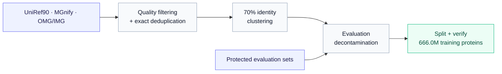

# LuminBench Nano-ESMC

Nano-ESMC provides ESMC-style protein language-model training with public,
decontaminated data and fixed evaluations. Use it to reproduce and modify
protein LM pretraining, or benchmark agentic autoresearch under controlled
training budgets. Contributions of training recipes, evaluation tasks and
hardware reproductions are welcome.

## Data

Following the [ESMC data recipe](https://doi.org/10.64898/2026.06.03.729735),
we quality-filter, deduplicate and cluster public UniRef90, MGnify and OMG/IMG
sequences at 70% identity. We remove evaluation matches and homologs before
splitting and verifying the release, yielding **666.0M training proteins**.



| Source | [UniRef90](https://doi.org/10.1093/bioinformatics/btu739) | [MGnify](https://doi.org/10.1093/nar/gkac1080) | [OMG/IMG](https://doi.org/10.1101/2024.08.14.607850) | **Total** |
|---|---:|---:|---:|---:|
| Training records (M) | 74.2 | 328.9 | 262.8 | **666.0** |

> [!NOTE]
> **Gap from ESMC:** public OMG/IMG substitutes for the paper's July 2023 JGI
> snapshot, leaving roughly **1.68B fewer 70%-identity representatives** in that
> source arm; a public JGI-scale replacement remains future work.

See the [construction details](docs/DATA.md), the [processed training release](https://huggingface.co/datasets/LuminScience/LuminBench-Nano-ESMC/tree/bd38448d50d8f426d7b9bd4410b53159ea001259) and the [raw clustering outputs before decontamination](https://huggingface.co/datasets/LuminScience/LuminBench-Nano-ESMC-RAW), both hosted by LuminScience on Hugging Face.

## Usage

### Requirements

- Linux, a compatible NVIDIA driver and `uv >=0.11.31,<0.12`; Python and
  dependencies are installed from the repository lock.
- Recommended Minimal Setting: Four L40S-class GPUs for the one-hour research profile;

```bash
git clone https://github.com/Lumin-Science/LuminBench-Nano-ESMC.git
cd LuminBench-Nano-ESMC
```

### Training a 170M Model

First configure the two roots and prepare the data using [Setup](docs/USAGE.md#setup).

Train the recommended **Setting 3** recipe with the **171M backbone** for
**100,000 Stage-1 steps**, using **four H100s**, global batch **1,024** and
**BF16/FA3**:

```bash
set -a
source .env
set +a
uv run --frozen python -m torch.distributed.run --standalone --nproc-per-node=4 \
  -m nano_protein.train --config configs/default.yaml \
  --max-steps 100000 --walltime-seconds 57600 \
  --data-root "$DATA_ROOT/training" --output-root "$OUTPUT_ROOT/setting3-100k"
```

Training saves checkpoints and the resolved recipe under
`$OUTPUT_ROOT/setting3-100k/`. Use a fresh output directory for repeats;
the 16-hour guard allows the step budget to finish. See [other recipes](configs/README.md)
and [execution details](docs/USAGE.md).

### Evaluation

- **MLM validation loss ↓:** mean per-protein masked-token loss on held-out data;
  the autoresearch selection metric.
- **Contact P@L ↑:** precision among the top L predicted long-range contacts,
  where L is chain length, averaged over 20,775 chains; tests structural information.

To score a saved checkpoint, use the [evaluation commands and protocol](docs/EVALUATION.md#evaluation-execution).
The same document contains the [released ESMC comparison](docs/EVALUATION.md#released-esmc-checkpoint-pl),
probe definitions, confidence intervals and additional downstream tasks.

## AutoResearch

### Protocol

Search trains each recipe for **one hour on four L40S GPUs per seed**, using
**two matched seeds**. Its score is mean MLM validation loss, with lower values
preferred. Data and evaluation stay fixed, and model size must remain within
±5% of the original 171M baseline. The agent chooses its search and acceptance strategy.

The benchmark owner manually checks progress with **24.20B model tokens per seed
on four H100s**, comparing mean MLM loss and P@L. Full rules and research commands
are in [task/171m-validation-loss.md](task/171m-validation-loss.md).

### Experiments

The validation-loss campaign tested **38 candidate rounds** across two seeds and kept
**five cumulative changes**, reducing mean validation loss by **2.20%**.
The figure marks those changes; error bars show ±1 sample SD.


| Research metric | Baseline | 1: + Muon | 2: + batch balance | 3: + sqrt loss | 4: + FFN 1536* | 5: + tied embeddings* |
|---|---:|---:|---:|---:|---:|---:|
| Validation loss ↓ | 2.63868 ± 0.01303 | 2.61807 ± 0.00945 | 2.60415 ± 0.00650 | 2.59437 ± 0.00578 | 2.59095 ± 0.00132 | **2.58057 ± 0.00544** |
| P@L (%) ↑ | 9.648 ± 0.598 | 9.795 ± 0.189 | 9.370 ± 0.270 | **10.533 ± 0.366** | 9.829 ± 0.286 | 9.527 ± 0.720 |

Values are mean ± sample SD across seeds 42 and 43; P@L uses percent and SD uses
percentage points. Each run used one hour on four L40S GPUs, batch 256 and 32
MLM validation sequences. See the [run log](reports/program2/README.md) and
[additional experiments](docs/AUTORESEARCH.md).

*Changes 4 and 5 used a narrower, roughly 142M model and predate the ±5% size
rule. The fixed-size tests below skip change 4 and add tied embeddings directly
to change 3, retaining FFN width 2,048.

## Test Leaderboard

Matched runs use **100,000 Stage-1 steps on four H100s**, batch **1,024**, base
LR **5e-4**, base WD **0.01** and **1,000 warmup steps**. Each recipe has one
training seed and uses the same 4,096 MLM validation sequences and 20,775 contact
chains. These are historical step-budget results, separate from the two-seed
Test of Progress protocol above.

| Recipe | Validation loss ↓ | P@L ↑ | P@L 95% CI | Training time |
|---|---:|---:|---:|---:|
| Baseline: ESMC-like AdamW | 2.47436 | 26.505% | 26.295–26.719% | 12h 01m |
| 1: + Muon (R02 recipe)† | 2.43781 | 30.165% | 29.936–30.394% | 12h 58m |
| 2: + batch balance | 2.43872 | 30.715% | 30.487–30.948% | 12h 34m |
| **3: + sqrt loss** | **2.41872** | **32.682%** | **32.447–32.920%** | **12h 35m** |
| 5: + tied embeddings | 2.42304 | 31.884% | 31.651–32.123% | 12h 33m |

†Setting 1 uses the full R02 recipe: Muon plus RMSNorm, residual routing and
depth-scaled initialization, with RoPE 10k. Settings 2, 3 and 5 inherit it.
Intervals are 95% chain-bootstrap CIs, not training-seed uncertainty; times
exclude evaluation.

**Setting 3 is best on both metrics:** validation loss is **2.25% lower** and
P@L is **6.18 percentage points higher** than the AdamW baseline.
See [recipe differences with figures and examples](docs/BEST_RECIPE_VS_BASELINE.md),
[full results](reports/fir-r02-rope10k-100k-20260906/README.md) and the
[archived leaderboard](docs/archive/TEST_LEADERBOARD_20260908.md).

## Citation

If you use Nano-ESMC, please cite this repository and the original
[ESMC paper](https://doi.org/10.64898/2026.06.03.729735):

```bibtex
@software{lumin_science_nano_esmc_2026,
  author = {Muchen Li},
  title = {Nano-Protein-LM: A Minimal Reproduction of ESMC Language-Model Training},
  year = {2026},
  url = {https://github.com/Lumin-Science/LuminBench-Nano-ESMC}
}

@article{candido2026language,
  author = {Candido, Salvatore and Hayes, Thomas and Rao, Roshan and others},
  title = {Language Modeling Materializes a World Model of Protein Biology},
  journal = {bioRxiv},
  year = {2026},
  doi = {10.64898/2026.06.03.729735}
}
```
