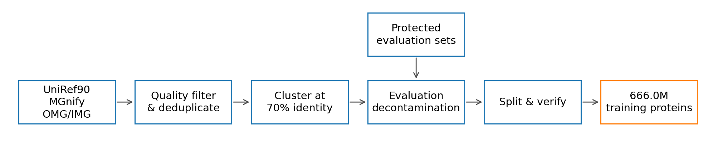

# NanoProteinLM
> [!NOTE]
> We are actively looking for contributors and collaborators for this project.

Inspired by [nanochat](https://github.com/karpathy/nanochat), NanoProteinLM makes protein language-model training accessible, inspectable and easy to experiment with.
Our goal is to help researchers train better protein embeddings for downstream biology tasks, through a small, open implementation and reproducible experiments.

**For protein researchers**, this repository provides a minimal reproduction of ESMC-style model training: public data, readable PyTorch code, training recipes and evaluations in one place. We aim to contribute an open-source foundation that researchers can understand, reproduce and extend in support of open science.

**For agentic researchers**, it provides a controlled environment for iterative autoresearch on the same scientific objective. Deterministic data selection, fixed seeds, explicit compute budgets and frozen evaluation protocols make recipe changes measurable. An agent can modify the training recipe, train, evaluate and improve it; the choice of agent and search strategy remains yours.

[Leaderboard](#final-evaluation-leaderboard) · [AutoResearch protocol](#autoresearch-protocol) · [Sequential search](docs/AUTORESEARCH_BASELINE.md) · [Protein models](#training-and-evaluating) · [Dataset](#data-preparation)

## Discovering better protein-model training recipes

GPT-6 and human experimentation produced two recipes built on the ESMC 171M reference through sequential AutoResearch. [Round 1](docs/leaderboard/nanop-best-171m-round1.md) combines Muon, RMSNorm, learned residual routing, depth-scaled initialization, batch balancing and sqrt-weighted training loss. [Round 2](docs/leaderboard/nanop-best-171m-round2.md) adds separate Q/K/V Muon updates. Both retain the reference tokenizer, context length and transformer dimensions.

### Final-evaluation leaderboard

Each recipe trains from scratch to **24,200,224,761 non-padding tokens**, with global batch **1,024**, training seed **42**, and 1,000 warmup steps followed by constant learning rate. Evaluation reports **P@L on 26,062 chains with five probe fits**, **MLM loss on those same chains with five masks**, and **MLM loss on 12,288 validation proteins with five masks**. Every table entry is a mean ± sample standard deviation.

<!-- CURRENT_FINAL_RESULTS_START -->
| Recipe | P@L ↑, 26,062 chains | MLM NLL ↓, 26,062 chains | MLM NLL ↓, 12,288 proteins |
|---|---:|---:|---:|
| ESMC 171M reference | 26.140% ± 0.049 pp | 2.458089 ± 0.000651 | 2.459364 ± 0.001016 |
| nanop-best-171m-round1 | 32.450% ± 0.113 pp | 2.371350 ± 0.001292 | 2.411270 ± 0.001380 |
| nanop-best-171m-round2 | 33.679% ± 0.049 pp | 2.363115 ± 0.001122 | 2.403480 ± 0.001271 |

P@L SD measures variation across five probe fits; MLM SD measures variation across five fixed masks. All three models use one training seed. These SDs do not measure training-seed uncertainty. The training-overlap audit has not established homology exclusion for 5,287 contact chains; [evaluation details](docs/EVALUATION.md#validation-set) document known exact matches in the available training prefix.
<!-- CURRENT_FINAL_RESULTS_END -->

Search-budget measurements use the same fixed **8,192 chains** for MLM and P@L. Each recipe trains for **1,200 seconds on four H100s** at global batch 256, with seeds 42, 43 and 44. MLM remains the search selection objective.

<!-- CURRENT_SEARCH_RESULTS_START -->
| Recipe | MLM NLL ↓, 8,192 chains | P@L ↑, 8,192 chains |
|---|---:|---:|
| ESMC 171M reference | 2.765341 ± 0.001651 | 9.804% ± 0.249 pp |
| nanop-best-171m-round1 | 2.713510 ± 0.002109 | 11.298% ± 0.288 pp |
| nanop-best-171m-round2 | 2.713035 ± 0.000218 | 11.460% ± 0.443 pp |

Search values are mean ± sample SD across three independent training seeds (42, 43, 44), with one fixed mask and one fixed probe per checkpoint. P@L SD is in percentage points.
<!-- CURRENT_SEARCH_RESULTS_END -->

[Full leaderboard and measurement details](docs/LEADERBOARD.md) · [Evaluation definitions and training-overlap audit](docs/EVALUATION.md)

## Setting up data & environments

Prepare the environment and data once, then reuse them for training and evaluation.
The same setup supports ordinary research and the fixed autoresearch task.

**Scaling the training budget also requires scaling the prepared data.** Training checks each source against global batch × steps and prevents source resampling by default. See [data sizing](docs/DATA.md#sizing-a-training-download) for sample-budget preparation and [training commands](docs/USAGE.md#training) for checkpoint continuation.

### Requirements

- **Environment:** Linux, a compatible NVIDIA driver and
  `uv >=0.11.31,<0.12`. Setup installs Python and dependencies from the repository lock.
- **Training:** Use GPUs with more than 40 GB of memory and adjust the recipe for your hardware. The default speedrun uses **four H100 GPUs with FA3**. An AutoResearch round provides **20 minutes on four H100 GPUs with FA3** or **one hour on four L40S GPUs with FA2**. See [USAGE.md](docs/USAGE.md#training) for other configurations.
- **Data preparation:** Allow space for both downloaded Parquet
  files and their prepared token stores—**allow 20 GB for the default 30-shard
  data setup**, plus separate space for the environment and training checkpoints.

### Data preparation
> [!NOTE]
> **Data may change:** we could not find a public version of the July 2023 JGI snapshot, so we substitute OMG/IMG; our corpus has [about 30% of ESMC’s reported 70%-identity clusters](docs/DATA.md#main-corpus-gap-relative-to-esmc), supports our current training budgets, and may expand as more data becomes available.

We curate a public protein corpus following the ESMC data recipe, with filtering and evaluation decontamination before training.



<table align="center">
  <tr>
    <th align="center">Source</th>
    <th align="center"><a href="https://doi.org/10.1093/bioinformatics/btu739">UniRef90</a></th>
    <th align="center"><a href="https://doi.org/10.1093/nar/gkac1080">MGnify</a></th>
    <th align="center"><a href="https://doi.org/10.1101/2024.08.14.607850">OMG/IMG</a></th>
    <th align="center">Total</th>
  </tr>
  <tr>
    <td align="center">Training proteins</td>
    <td align="center">74.2M</td>
    <td align="center">328.9M</td>
    <td align="center">262.8M</td>
    <td align="center"><strong>666.0M</strong></td>
  </tr>
</table>

Following the [ESMC data recipe](https://doi.org/10.64898/2026.06.03.729735),
we combine pinned UniRef90 and MGnify releases with public OMG/IMG proteins.
Sequences are normalized to uppercase, stripped of whitespace and terminal stop
characters, and filtered to remove proteins shorter than 60 amino acids or with
more than 20% non-canonical residues. MGnify-derived records in OMG are excluded
from the IMG arm to avoid sampling the same source twice.

We remove exact duplicates, cluster each source at **70% sequence identity**, and exclude matches and homologs of **317,000 protected evaluation proteins**. After cross-source deduplication and length filtering, we reserve **12,288 validation proteins** and release **666.0M training proteins** in **565 training shards plus 3 validation shards**, with independent checks of hashes, duplicates and evaluation exclusions. [Filtering and verification details](docs/DATA.md).

We open-sourced both the [🤗 Processed data](https://huggingface.co/datasets/LuminScience/LuminBench-Nano-ESMC/tree/bd38448d50d8f426d7b9bd4410b53159ea001259) and the [🤗 Raw dataset](https://huggingface.co/datasets/LuminScience/LuminBench-Nano-ESMC-RAW) with all the cluster information. For more detailed information about data construction please refer to [DATA.md](docs/DATA.md).

### Install the environment and data

Setup downloads the pinned v3 contact archive automatically and prepares the fixed MLM masks. Offline archives are supported; see [evaluation setup](docs/EVALUATION.md#data-layout-and-preparation).

```bash
git clone https://github.com/Lumin-Science/Nano-ProteinLM.git
cd Nano-ProteinLM
bash scripts/setup.sh
```

The default downloads **30/565 training shards (29.98M proteins; 5.62 GB compressed, including MLM validation)**: 13 UniRef90, 3 MGnify and 14 OMG/IMG shards. For a larger training set:

```bash
# In a fresh DATA_ROOT: 100k steps × batch 1,024, with 1% sampling headroom.
bash scripts/setup.sh --training-samples 103424000
```

The [AutoResearch protocol](docs/AUTORESEARCH.md#design-space) permits data selection and source-mixture changes within the provided training corpus. Size the download for the run before training; [DATA.md](docs/DATA.md#sizing-a-training-download) explains source coverage and the default no-resampling policy.

Data and outputs default to `data/` and `outputs/`. To use another path, copy
[.env.example](.env.example) to `.env` and set `DATA_ROOT` and `OUTPUT_ROOT`:

```text
$DATA_ROOT/                     # Default: data/
  cache/                       # Downloaded Parquet shards and contact archive
  training/                    # Prepared token stores, MLM validation and receipts
  evaluation/contact-v3/       # 26,062 evaluation + 20 probe chains, fixed search IDs
  evaluation/prepared-v3/      # Eleven verified MLM mask caches
  evaluation/source/           # Frozen contact evaluator
$OUTPUT_ROOT/<run-name>/        # Default: outputs/<run-name>/
  checkpoint-final.pt          # Final model and optimizer state for resuming
  config.yaml, metrics.jsonl   # Resolved recipe and training log
  evaluation/                  # MLM loss, P@L and evaluation records
```

## Training and evaluating

Start with a short training trial, scale up a recipe, then measure both language
modeling and structural information in its checkpoint. The scripts call standard
Python APIs so you can adapt the commands to your own research.

### Train the ESMC-Style Protein Language Model

> [!NOTE]
> **Our default setting is a 171M variant, designed for small-budget training experiments.** Its baseline backbone follows the paper's 170M scaling model: 24 layers, width 768, and approximately 170.7M parameters ([ESMC Appendix A.1.4.1](https://www.biorxiv.org/content/10.64898/2026.06.03.729735v1.full.pdf#page=29)).

```bash
bash scripts/speedrun.sh
```

This trains [nanop-best-171m-round2](configs/test-100k/nanop-best-171m-round2.yaml) for **100,000 Stage-1 steps on four GPUs**, global batch **1,024**, context **512**, **BF16/FA3**, base learning rate **5e-4**, weight decay **0.01** and **1,000 warmup steps**. A 16-hour training guard stops an overlong run. Checkpoints, the resolved recipe and training records are saved under `$OUTPUT_ROOT/default-100k/`, including the full final optimizer state. See [training and continuation](docs/USAGE.md#training) for the resume option. Repeats require a fresh run name.

Recipes live in two folders: [configs/autoresearch/](configs/autoresearch/) for the search setting (global batch 256) and [configs/test-100k/](configs/test-100k/) for final evaluation (global batch 1,024). Each holds the plain `esmc-171m` reference and `nanop-best-171m-round1` and `round2`; see [configs/README.md](configs/README.md). The scripts call the standard training API; see [USAGE.md](docs/USAGE.md#training) for other budgets, hardware and recipe changes.

### Evaluate a checkpoint

- **MLM validation loss ↓:** mean per-protein masked-token loss on the declared evaluation population; the reward for the [validation-loss task](tasks/171m-validation-loss.md).
- **Contact P@L ↑:** mean precision among each chain's top L predicted long-range contacts; reported alongside the default MLM selection score.

After training finishes, evaluate a completed run with:

```bash
bash scripts/speedrun.sh --evaluate default-100k
```

This loads your paths and reports three means and sample SDs: P@L on all 26,062 non-probe chains with five probe fits, MLM on those chains with five fixed masks, and MLM on the original 12,288 validation proteins with five fixed masks. The default search profile instead evaluates both MLM and P@L on the same frozen 8,192 chains, with selection by MLM. [EVALUATION.md](docs/EVALUATION.md) defines the data setup, repeat semantics and training-overlap qualification.

## AutoResearch protocol

Use NanoProteinLM to compare AutoResearch methods under a fixed number of search rounds and a fixed compute budget per round. The protocol specifies the objective, permitted changes, search measurements and final evaluation budget. Each method chooses its own proposal strategy and improvement criteria within those limits.

| Protocol item | Requirement |
|---|---|
| Objective | Find better training recipes for protein embedding models. Declare the primary comparison metric before search. |
| Design space | **Fixed:** use only the provided training corpus; keep the tokenizer, context 512, global batch 256, 500-step linear warmup followed by constant LR, evaluation and compute settings unchanged. Keep trainable parameters within **±5% of the original 171M model**, with no pretrained weights or training on held-out data. **Mutable:** data selection and source mixture within that corpus, architecture, training loss, optimizer, learning rate, weight decay and training implementation. |
| Search budget | **72 rounds**, each providing **20 minutes on 4×H100** or **1 hour on 4×L40S** for one training run. These are roughly equivalent search budgets: **24 node-hours / 96 H100 GPU-hours**, or **72 node-hours / 288 L40S GPU-hours**, in total. Fix one hardware profile across methods in a comparison. Two baseline runs of the starting recipe (seeds 42 and 43) are free; repeated seeds consume additional rounds. Setup, final checkpoint saving and evaluation are timed separately. |
| Hill-climbing evaluation | MLM and P@L on the same fixed **8,192 chains**; **MLM NLL selects** and P@L is reported alongside it. One fixed mask and probe per checkpoint. |
| Final evaluation | Train the selected recipe and the [reference](configs/test-100k/esmc-171m.yaml) to **24,200,224,761 non-padding tokens each** at **global batch 1,024**, with 1,000 warmup steps, constant LR afterwards, the recipe's own LR and WD, and **one common training seed**. Hardware is not fixed; the reference takes about **12 hours on 4×H100**. Report three mean/SD metrics: **26,062-chain P@L × five probes**, **26,062-chain MLM × five masks**, and **12,288-protein MLM × five masks**. |

### Prepare an AutoResearch workspace

Benchmark agents start from the `autoresearch-v1` release tag, a single root commit with the plain ESMC implementation and no research history. On Linux with four matching H100 or four matching L40S GPUs, prepare the workspace with steps 1 and 2 of [Launch AutoResearch](#launch-autoresearch). [Preparation and information-access rules](docs/AUTORESEARCH.md#preparation) explain the release tag and the prohibition on looking up prior findings.

[Full AutoResearch protocol](docs/AUTORESEARCH.md)

## AutoResearch baseline: sequential agentic search

Here we provide a baseline of autoresearch, see [AUTORESEARCH_BASELINE.md](docs/AUTORESEARCH_BASELINE.md) for more details, including its pipeline, two acceptance programs, acceptance decisions and commands.

### Launch AutoResearch

By default, our sequential search runs the [reward-gate program](autoresearch/karpathy_ar_reward_gate.md) on the [validation-loss task](tasks/171m-validation-loss.md). Run these steps on your GPU compute node, never on a login node. The node needs git, tmux, Node.js for `npx`, and uv `>=0.11.31,<0.12`.

**1. Clone the release.** Clone the repository at the `autoresearch-v1` tag, keeping only that commit, so the workspace has no branch history; then remove the remote.

```bash
git clone --depth 1 --single-branch --no-tags --branch autoresearch-v1 \
  https://github.com/Lumin-Science/Nano-ProteinLM.git nano-protein-autoresearch
cd nano-protein-autoresearch
git remote remove origin
```

**2. Install the environment and data.** `scripts/setup.sh` installs the locked Python environment, then downloads and verifies 30 training shards and the pinned contact scoring source, downloads the pinned expanded v3 archive and prepares masks in `data/` (about 20 GB). Runs are written to `outputs/`.

```bash
bash scripts/setup.sh
```

**3. Install the loop skill.** [`ar-loop-n-sleep`](https://github.com/Lumin-Science/Nano-AutoResearch-Skills) lets the agent sleep while training runs and wake the same tmux pane at the next useful check. Name your agent with `-a`, for example `codex` or `claude-code`.

```bash
npx skills add Lumin-Science/Nano-AutoResearch-Skills --skill ar-loop-n-sleep -g -a codex
npx skills list -g  # confirm that ar-loop-n-sleep is listed
```

**4. Start the agent in tmux** from the workspace, in its mode for long unattended runs. For Codex:

```bash
tmux new-session -s nanoprotein-ar
codex --approve-for-me
```

**5. Give the agent its task and program.**

```text
Use the ar-loop-n-sleep skill. Read tasks/171m-validation-loss.md and autoresearch/karpathy_ar_reward_gate.md. Use the allocated four GPUs. Run sequential AutoResearch for the full 72-round allowance, following the program, then stop without another wakeup.
```

To let the agent decide what to keep, name [`autoresearch/karpathy_ar_agent_gate.md`](autoresearch/karpathy_ar_agent_gate.md). For a short qualification run, ask for the two baseline runs and one candidate instead of the full allowance. Detach with `Ctrl-b d` and return with `tmux attach -t nanoprotein-ar`. This flow runs our baseline method; a benchmark comparison between methods should use an organizer-prepared workspace and a fresh agent session, as the [protocol](docs/AUTORESEARCH.md#preparation) requires.

See [the protocol](docs/AUTORESEARCH.md) for the design space and budgets, [the leaderboard](docs/LEADERBOARD.md) for measured results, and [the sequential-search method](docs/AUTORESEARCH_BASELINE.md) for acceptance rules and run records.

## Citation

If you use NanoProteinLM, please cite this repository and the original
[ESMC paper](https://doi.org/10.64898/2026.06.03.729735):

```bibtex
@software{lumin_science_nano_esmc_2026,
  author = {Muchen Li},
  title = {NanoProteinLM: Minimal ESMC-Style Protein Language-Model Training},
  year = {2026},
  url = {https://github.com/Lumin-Science/Nano-ProteinLM}
}

@article{candido2026language,
  author = {Candido, Salvatore and Hayes, Thomas and Rao, Roshan and others},
  title = {Language Modeling Materializes a World Model of Protein Biology},
  journal = {bioRxiv},
  year = {2026},
  doi = {10.64898/2026.06.03.729735}
}
```
