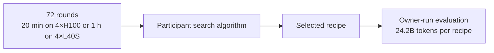

# AutoResearch benchmark protocol

The benchmark compares algorithms that discover protein-model training recipes. Publish the objective, permitted design space, search allowance, final evaluation budget and infrastructure-failure policy before any method starts. Every method receives the same starting release and data access.



## Preparation

Benchmark attempts start from the `autoresearch-v0` release tag: a single root commit containing the plain ESMC implementation, with no research history. Allocate four matching H100 GPUs or four matching L40S GPUs on Linux with a working CUDA driver. A search round provides 20 minutes on H100 with FlashAttention-3 or one hour on L40S with FlashAttention-2; these budgets are roughly equivalent. Declare one hardware profile before search and fix the GPU model and backend across every method in a comparison.

The organizer prepares the workspace on the allocated node before giving it to an agent. Clone only the release commit into a new directory outside existing Git checkouts, remove the remote and run setup:

```bash
git clone --depth 1 --single-branch --no-tags --branch autoresearch-v0 \
  https://github.com/Lumin-Science/Nano-ProteinLM.git nano-protein-autoresearch
cd nano-protein-autoresearch
git remote remove origin
bash scripts/setup.sh
```

`--depth 1 --single-branch --no-tags` downloads only the tagged commit, so the workspace has no `main` branch, other tags or research history. The tag pins the same starting point for every participant; record `git rev-parse HEAD` with the organizer records. Removing the remote prevents fetching other branches by accident. The clone starts on a detached HEAD at the release commit; a search method creates its own branch before committing. Do not reuse an existing research clone, which retains old Git objects.

`scripts/setup.sh` needs uv `>=0.11.31,<0.12`; it installs the locked Python 3.11 environment, downloads 30 training shards and all MLM validation and contact assets, and verifies their checksums. Allow roughly 20 GB for data plus space for dependencies, checkpoints and run outputs. Use `--training-shards N` or `--training-samples N` to change the corpus size, and provision enough data for the selected source mixture and budget. Data and outputs default to `data/` and `outputs/` inside the workspace. Each task run checks the four GPUs and records them in its `ENVIRONMENT.json`.

```bash
# After preparation, one invocation consumes one search round:
bash tasks/171m-validation-loss_ar.sh configs/autoresearch/esmc-171m.yaml trial-001 42
```

Start the agent in this directory with a fresh conversation, the selected task and its own AutoResearch method. The task information-access rules prohibit inspecting other branches or searching for this repository and its previous findings online. The organizer enforces that policy, keeps other research workspaces inaccessible and uses a trusted evaluator; a Git branch and written rules alone cannot block online access.

## Information-access rules

Start from the `autoresearch-v0` release in a fresh workspace and a fresh agent context. Use only this starting code, the supplied data and observations produced within your allocated search budget. Keep the release commit (`git rev-parse HEAD` before search) with the run ledger.

Do not inspect, check out, fetch or restore `main`, other repository branches, tags, earlier commits, reflogs, Git objects, backups or other research workspaces. Local commits created during your own search are allowed. Do not add a remote to recover excluded material.

Do not search online for `https://github.com/Lumin-Science/Nano-ProteinLM`, its source code, mirrors, forks, issues, pull requests, reports or previous experimental findings. Do not obtain those findings through another agent, person, cached page or saved conversation. The organizer may download the `autoresearch-v0` release and its pinned dependencies and datasets during preparation; this exception does not permit browsing the research repository during search.

General language/library documentation and scientific references are allowed only under the external-information policy declared by the organizer for every method. Record any accidental exposure to excluded material and notify the organizer before continuing. Do not use exposed findings to select a recipe. The organizer determines whether the attempt remains comparable.

## Immutable contract

Use only the provided training corpus and train from scratch. Keep the tokenizer, maximum context of 512 tokens, global batch of 256 sequences and schedule of 500 linear warmup steps followed by constant learning rate, with no decay, fixed. Actual trainable parameters must remain within ±5% of 170,671,168; do not add unused parameters to meet this bound. Preserve evaluation data, sampling, masking, probe fitting, metric definitions, dependency pins and data-verification records. Do not train on held-out evaluation sequences or labels.

Architecture, training objective, optimizer, learning rate, weight decay, implementation, source mixture and data selection within the supplied corpus may change within that contract. Declare the task objective before search: MLM validation loss is the default reward; contact P@L is an optional task objective and is evaluated only for that task.

## Search allowance

| Item | Fixed setting |
|---|---|
| Rounds | 72 |
| Hardware per round | 4×H100 with FA3 or 4×L40S with FA2; fixed profile within a comparison |
| Training time per round | 1,200 seconds on H100 or 3,600 seconds on L40S |
| Global batch and schedule | 256 sequences; 500 linear warmup steps, then constant learning rate |
| Total training allowance | 24 node-hours / 96 H100 GPU-hours, or 72 node-hours / 288 L40S GPU-hours |
| Scored checkpoint | Final checkpoint at the training-time limit |
| Validation | All 12,288 validation proteins; context 512 |
| Contact evaluation | P@L task only: all 20,775 frozen chains; 5,000 bootstrap replicates |

A round is one training run and its evaluation. Each seed repeat or participant-run reference measurement consumes another round. A method decides how to propose candidates, assign training seeds, reuse observations and choose its final recipe. No acceptance threshold, number of seeds per candidate or search order is prescribed here.

The training clock includes batch loading, computation and synchronization. Setup, final checkpoint saving and evaluation are outside that clock; record their duration separately. Prepare inputs before timing and use the same storage arrangement across methods; the task command copies the prepared training data to node-local storage before the clock starts. Keep failed attempts and consumed compute in the ledger; apply only the replacement policy published before the comparison.

Record the code snapshot, resolved configuration, training seed, data receipts, actual optimizer steps, non-padding model tokens, source exposure, elapsed time and both metrics for each round. Include time-limit overrun from the final optimizer update. The measurement scripts provide execution commands; the organizer verifies compliance and the complete round ledger.

## Final evaluation

Freeze the selected recipe before final evaluation. The owner trains the submitted recipe and the reference, [configs/test-100k/esmc-171m.yaml](../configs/test-100k/esmc-171m.yaml), from scratch to 24,200,224,761 non-padding model tokens each, using one common training seed: 42 unless another seed is declared before the comparison. Final training uses global batch 1,024 and 1,000 linear warmup steps followed by constant learning rate, with no decay; learning rate, weight decay and every other setting come from the submitted recipe. Hardware is not fixed because the token target defines the budget; the reference takes about 12 hours on four H100 GPUs. Count BOS/EOS and exclude padding. Stop at the first optimizer update reaching the token target and report actual tokens and overrun. This compute is separate from the search allowance.

Score each final checkpoint using the same full MLM validation and contact evaluation used during search. Report loss, P@L and its chain-bootstrap 95% interval. One training seed does not estimate training-seed variability. These evaluation assets are available during search, so final evaluation tests transfer to a longer training budget rather than performance on a blind holdout.
