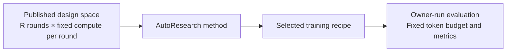

# Benchmarking Agentic AutoResearch Systems

NanoProteinLM benchmarks an agent's ability to discover better protein-model training recipes.

This page details the [AutoResearch protocol in the README](../README.md#autoresearch-protocol). A benchmark specifies the permitted design space, a fixed number of search rounds, the compute available in each round and the final evaluation budget. Publish these settings before search and use them for every method being compared. Each method chooses how to propose recipes, use previous results and select its final recipe within those limits.



The protocol applies to any AutoResearch algorithm. Our implementation of Karpathy-style sequential search, including its pipeline, training-seed policy and improvement criteria, is described in [AUTORESEARCH_BASELINE.md](AUTORESEARCH_BASELINE.md).

## Preparation

Benchmark attempts start from the `autoresearch-v0` release tag: a single root commit containing the plain ESMC implementation, with no research history. Allocate four matching H100 GPUs or four matching L40S GPUs on Linux with a working CUDA driver. A search round provides 20 minutes on H100 with FlashAttention-3 or one hour on L40S with FlashAttention-2; these budgets are roughly equivalent. Declare one hardware profile before search and fix the GPU model and backend across every method in a comparison.

The organizer prepares the workspace on the allocated node before giving it to an agent. Clone only the release commit into a new directory outside existing Git checkouts, remove the remote and run setup:

```bash
git clone --depth 1 --single-branch --no-tags --branch autoresearch-v0 \
  https://github.com/Lumin-Science/Nano-ProteinLM.git nano-protein-autoresearch
cd nano-protein-autoresearch
git remote remove origin
bash runs/setup.sh
```

`--depth 1 --single-branch --no-tags` downloads only the tagged commit, so the workspace has no `main` branch, other tags or research history. The tag pins the same starting point for every participant; record `git rev-parse HEAD` with the organizer records. Removing the remote prevents fetching other branches by accident. The clone starts on a detached HEAD at the release commit; a search method creates its own branch before committing. While the repository is private, use credentials with read access or the SSH URL `git@github.com:Lumin-Science/Nano-ProteinLM.git`. Do not reuse an existing research clone, which retains old Git objects.

`runs/setup.sh` needs uv `>=0.11.31,<0.12`; it installs the locked Python 3.11 environment, downloads 30 training shards and all MLM validation and contact assets, and verifies their checksums. Allow roughly 20 GB for data plus space for dependencies, checkpoints and run outputs. Use `--training-shards N` or `--training-samples N` to change the corpus size, and provision enough data for the selected source mixture and budget. Data and outputs default to `data/` and `outputs/` inside the workspace. Each task run checks the four GPUs and records them in its `ENVIRONMENT.json`.

```bash
# After preparation, one invocation consumes one search round:
bash tasks/171m-validation-loss_ar.sh configs/autoresearch/esmc-171m.yaml trial-001 42
```

Start the agent in this directory with a fresh conversation, the selected task and its own AutoResearch method. The task information-access rules prohibit inspecting other branches or searching for this repository and its previous findings online. The organizer enforces that policy, keeps other research workspaces inaccessible and uses a trusted evaluator; a Git branch and written rules alone cannot block online access.

## Design Space

**Immutable settings**:

- **Model and training settings:** use only the provided training corpus, without adding datasets. Keep the tokenizer, Stage-1 context of 512 tokens, global batch of 256 sequences and schedule of 500 linear warmup steps followed by constant learning rate, with no decay. Actual trainable parameters must stay within ±5% of the original 171M model, with no unused parameters added to satisfy the bound. Train from scratch without pretrained models.
- **Evaluation and execution:** preserve the hardware, round allowance and per-round training budget. Keep the evaluation code, data, masking, contact-probe procedure and metric definitions unchanged; do not train on held-out evaluation data. Preserve the published dependencies and source-data verification records.

**Design space**:
* Everything outside the immutable contract is open to research, including data selection and source mixture within the provided corpus, model architecture, training loss, optimizer, learning rate, weight decay and training implementation. [DATA.md](DATA.md) describes the available corpus, and [EVALUATION.md](EVALUATION.md) specifies the scientific measurements.

## Search Budget

A budgeted round consists of one training run and its evaluation. Each method receives **72 rounds**, with **20 minutes on 4×H100** or **1 hour on 4×L40S** per round. These are roughly equivalent search budgets. The totals are **24 node-hours / 96 H100 GPU-hours**, or **72 node-hours / 288 L40S GPU-hours**. Fix one hardware profile across methods in a comparison. Setup, checkpoint saving and evaluation add to elapsed runtime and are reported separately.

| Budget item | Protocol setting |
|---|---|
| Round allowance | **72** |
| Hardware per round | **4×H100 with FA3** or **4×L40S with FA2**; fixed profile across methods in a comparison |
| Training time per round | **20 minutes / 4/3 H100 GPU-hours**, or **1 hour / 4 L40S GPU-hours** |
| Total search training allowance | **24 node-hours / 96 H100 GPU-hours**, or **72 node-hours / 288 L40S GPU-hours** |
| Global batch | **256 sequences**, for example 64 per GPU on four GPUs |
| Learning-rate schedule | 500 linear warmup steps, then constant peak learning rate with no decay |
| Measurement after each round | Final checkpoint; all 12,288 MLM validation proteins and all 20,775 contact chains |
| Outside the training clock | Environment/data setup, final checkpoint saving and evaluation; report their time separately |

Methods may spend rounds exploring new recipes or repeating earlier recipes. Every training run, including a seed repeat or an agent-run reference measurement, consumes a round. Retain failed attempts and their consumed compute; declare any infrastructure-failure replacement policy before the benchmark. A method's internal iteration may contain several budgeted rounds.

The training clock includes batch loading and synchronization. Prepare the inputs before timing a run and keep data placement consistent across methods. Record the code revision, resolved recipe, data receipts, seed, actual steps and non-padding model tokens for each run, together with its metrics and elapsed training time.

Search results use the fixed evaluation described below. Proposal generation, repeated-seed comparisons, candidate retention and stopping within the round allowance are choices made by the AutoResearch method.

## Hill-climbing evaluation

The default hill-climbing reward is **MLM validation loss**, which we use for a more stable search signal. It is the mean per-protein masked-token negative log-likelihood on held-out sequences; lower is better. Each round evaluates the final checkpoint from its 20-minute H100 run or one-hour L40S run. The AutoResearch method decides how to use these measurements to propose and retain recipes.

| Measurement | Search setting |
|---|---|
| Default reward | **MLM validation loss ↓** |
| Validation data | **All 12,288 held-out validation proteins**, context 512, with crops and masks fixed per protein |
| Contact diagnostic | **P@L over all 20,775 frozen chains**, with a chain-bootstrap 95% interval |
| Scored checkpoint | Final checkpoint at the round's training-time limit |

Context 512 is the maximum input length in tokens. The evaluator scores every protein in the three validation shards once, and each protein's crop and mask positions derive from its SHA-256, so the score does not depend on batch size. Earlier results used sampled 4,096- or 32-protein evaluations and keep those labels; [EVALUATION.md](EVALUATION.md#validation-set) describes the validation set.

Contact P@L measures precision among the top L predicted long-range contacts, where L is the evaluated chain length, averaged over the frozen chains. Higher is better. Report it alongside validation loss as a diagnostic. A method may repeat training runs within its search allowance; each repeat consumes another round.

## Final evaluation

After search, each method submits its selected recipe for owner-run final evaluation. Freeze the recipe before this test. Train it and the reference, [configs/test-100k/esmc-171m.yaml](../configs/test-100k/esmc-171m.yaml), from scratch to **24,200,224,761 non-padding model tokens each**, using **one common training seed**: 42 unless another seed is declared before the comparison. Final training uses **global batch 1,024** and **1,000 linear warmup steps followed by constant learning rate, with no decay**, so the checkpoint can continue into Stage 2 training. Learning rate, weight decay and every other setting come from the submitted recipe. Both recipes use the provided corpus and retain their selected data mixtures.

| Measurement | Final evaluation setting |
|---|---|
| Training budget | **24,200,224,761 non-padding model tokens per recipe**, including BOS/EOS |
| Batch and schedule | **Global batch 1,024**; 1,000 linear warmup steps, then constant learning rate; learning rate and weight decay from the recipe |
| Training seeds | **1 per recipe**, 42 unless declared otherwise, matched between the selected recipe and reference |
| Hardware | Not fixed, because the token target defines the budget; the reference takes about 12 hours on four H100 GPUs |
| MLM validation | **All 12,288 validation proteins**, context 512 |
| Contact P@L | **All 20,775 frozen chains** |
| Scored checkpoint | Final checkpoint at the token target |
| Reported results | MLM validation loss and P@L, with a chain-bootstrap 95% interval for P@L |

Final evaluation reports both metrics at the larger training budget. Contact evaluation fits one probe per checkpoint using the fixed probe split and uses 5,000 chain-bootstrap replicates. Its interval describes variation over evaluated chains. With one training seed, across-seed variability is not estimated.

The final training budget is separate from the 72-round search allowance. Prepare the required portion of the provided corpus before training and record each recipe's data selection, source exposure and any reuse. Keep the evaluation data and code fixed across recipes.

The reference takes roughly **12 hours on four H100 GPUs**, or about **48 H100 GPU-hours**. Actual time depends on the recipe and hardware; the token target determines completion. Score the checkpoint at the first optimizer update reaching that target and report its actual token count and overrun.

### Final-evaluation command

Prepare enough of the provided corpus for the recipe's source mixture at this token target; `bash runs/setup.sh --training-samples 103424000` in a fresh `DATA_ROOT` covers the default mixture at 100,000 updates of batch 1,024 ([data sizing](DATA.md#sizing-a-training-download)). Run the procedure once per recipe with a fresh run name and the same seed. The example uses the round-2 recipe on four H100 GPUs. On other GPUs, use `--attention-backend flash` and raise the 16-hour `--walltime-seconds` guard as needed. If a recipe needs a different micro-batch size for memory, keep the global batch at 1,024 and record the layout.

```bash
set -a
if [ -f .env ]; then source .env; fi
source .env.example
set +a
recipe=configs/test-100k/nanop-best-171m-round2.yaml
run_dir="$OUTPUT_ROOT/final-nanop-best-171m-round2-seed42"
mkdir -p "$OUTPUT_ROOT"
mkdir "$run_dir"
uv run --frozen python -m nanoprotein.check_environment \
  --require-gpus 4 --attention-backend flash3 \
  --output "$run_dir/ENVIRONMENT.json"
uv run --frozen python -m torch.distributed.run --standalone --nproc-per-node=4 \
  -m nanoprotein.train --config "$recipe" --seed 42 \
  --data-root "$DATA_ROOT/training" --output-root "$run_dir" \
  --max-steps none --max-model-tokens 24200224761 --schedule-steps 100000 \
  --walltime-seconds 57600 --attention-backend flash3 --warmup-steps 1000 \
  --micro-batch-size 64 --gradient-accumulation 4 \
  --checkpoint-interval 0 --periodic-evaluation-interval 0
uv run --frozen python -m nanoprotein.evaluate \
  --checkpoint "$run_dir/checkpoint-final.pt" --data-root "$DATA_ROOT/training" \
  --output-root "$run_dir/evaluation" \
  --validation-context 512 \
  --run-contact --contact-chains 20775 --contact-bootstrap 5000 \
  --contact-root "$DATA_ROOT/evaluation/contact" --external-src "$DATA_ROOT/evaluation/source"
```

Require `stop_reason=max_model_tokens` and `model_token_budget_reached=true` in `TRAINING_COMPLETE.json`. The count includes BOS/EOS and excludes padding. An early wall-time stop is incomplete: continue it to the token target with `--resume` before scoring ([training and continuation](USAGE.md#training)). Report the actual tokens and overrun, the validation loss and P@L from `evaluation/EVALUATION.json`, and the contact-chain bootstrap interval.

This test measures whether search improvements carry over to longer training. It uses evaluation assets also available during search, so it does not establish performance on a blind holdout. Training a larger model requires its own agreed model size and comparison budget.

[LEADERBOARD.md](LEADERBOARD.md) collects recorded measurements with each study's hardware, seeds and evaluation sample counts. [AUTORESEARCH_BASELINE.md](AUTORESEARCH_BASELINE.md) documents our sequential-search method and experiment history.
