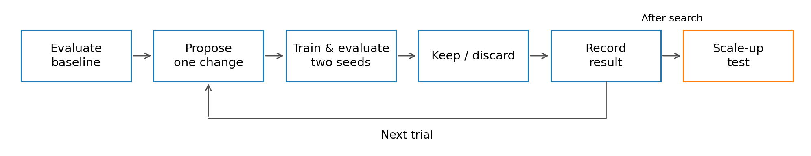
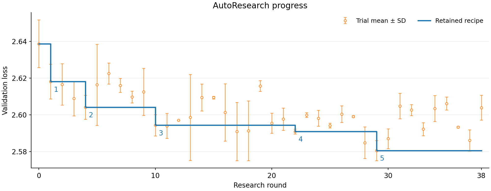

<div class="ai">

# Karpathy-style sequential AutoResearch

</div>

<div class="ai">

Our sequential-search method proposes one change, measures it, keeps or discards it and continues from the retained recipe. It comes in two programs that differ only in how they decide what to keep: [karpathy_ar_reward_gate.md](../autoresearch/karpathy_ar_reward_gate.md) applies a fixed two-seed reward rule, and [karpathy_ar_agent_gate.md](../autoresearch/karpathy_ar_agent_gate.md) leaves the decision to the agent's reasoning. Running both on the same task and budget compares the two acceptance policies. The [AutoResearch protocol](AUTORESEARCH.md) fixes the scientific boundaries and budgets. Two rounds of this method, together with human effort, produced [nanop-best-171m-round2](leaderboard/nanop-best-171m-round2.md).

</div>

<div class="ai">

## Running the example loop

</div>

<div class="ai">

Prepare a fresh workspace from the `autoresearch-v0` release using [the preparation instructions](AUTORESEARCH.md#preparation). The release includes both programs. Run the steps below on the allocated compute node; never run training on a login node.

</div>

<div class="ai">

### Install the loop skill

</div>

<div class="ai">

[`ar-loop-n-sleep`](https://github.com/Lumin-Science/Nano-AutoResearch-Skills) lets Codex sleep while training or evaluation runs and wake the same tmux pane at the next useful check, instead of spending model turns on polling. It keeps the original prompt in `.ar/PROMPT.md` and one row per check in `.ar/events.tsv`. The node needs Node.js for `npx`, tmux, Python 3 and the Codex CLI.

</div>

<div class="ai">

```bash
# Install the skill globally (-g) for Codex (-a codex):
npx skills add Lumin-Science/Nano-AutoResearch-Skills --skill ar-loop-n-sleep -g -a codex
# Confirm that ar-loop-n-sleep is listed for Codex:
npx skills list -g
```

</div>

<div class="ai">

Omit `-g` to install the skill only for the current project, and run `npx skills update ar-loop-n-sleep` to update it later. `npx skills add Lumin-Science/Nano-AutoResearch-Skills --list` shows the collection's other skills.

</div>

<div class="ai">

### Start Codex

</div>

<div class="ai">

Start Codex inside tmux in the prepared workspace, so the skill can wake the same pane. `--approve-for-me` routes execution approvals, including GPU access outside the workspace sandbox, through Codex's automatic review.

</div>

<div class="ai">

```bash
tmux new-session -s nanoprotein-ar
codex --approve-for-me
```

</div>

<div class="ai">

Give Codex the task, method, resources and stopping condition together:

</div>

<div class="ai">

```text
Use $ar-loop-n-sleep. Read tasks/171m-validation-loss.md and autoresearch/karpathy_ar_reward_gate.md. Use the allocated four H100 GPUs and verify the current allocation. Run the baseline and one candidate following the program's keep rule, with the complete task evaluation for each run. Explain the keep/discard decision, then stop without another wakeup.
```

</div>

<div class="ai">

This qualification tests launch, sleeping, continuation, evaluation and a candidate decision in three or four rounds under the reward gate. Name `autoresearch/karpathy_ar_agent_gate.md` instead to let the agent decide; its qualification takes two rounds unless the agent adds a seed. A full campaign may use the 72-round allowance. For contact P@L, select `tasks/171m-p-at-l.md`.

</div>

<div class="ai">

| Method setting | Reward gate | Agent gate |
|---|---|---|
| Seeds | 42 for every run; 43 when seed 42 beats the incumbent's mean | 42 by default; more seeds when the agent decides |
| Candidate cost | One round if screened out, otherwise two | One round per run the agent chooses |
| Acceptance | Two-seed mean gain larger than the larger of the two seed SDs | The agent's reasoning about the final evaluation, recorded with its evidence |
| Task measurement | 20 minutes on four H100 GPUs with FA3; 4/3 H100 GPU-hours per round | Same |
| Search evaluation | All 12,288 validation proteins and all 20,775 contact chains | Same |

</div>

<div class="ai">

Under the reward gate, the baseline takes two rounds and each candidate one or two, so 72 rounds cover 35–70 candidates. Under the agent gate, the count depends on how many rounds the agent spends on repeats and refinements. Each program lists the records to keep for every run.

</div>

<div class="ai">

## Two rounds under the previous search setting

</div>

<div class="ai">

Both rounds ran before the current search setting, so their numbers are reported in a different setting from the current configs and the [leaderboard](LEADERBOARD.md). Each candidate trained for one hour on four L40S GPUs per seed, with seeds 42 and 43, the seven-shard corpus, 554 warmup steps and 32 MLM validation proteins. Round 1 used global batch 256 and started from plain ESMC at LR 3.27e-4 and WD 0.0184; round 2 used global batch 1,024. Compare numbers only within a round.

</div>

<div class="ai">

### Previous two-seed pipeline

</div>

<div class="ai">



</div>

<div class="ai">

Both rounds ran this loop. The agent measured the starting recipe, proposed one change, trained and evaluated it with seeds 42 and 43, kept or discarded it, recorded the result, and proposed the next change from the retained recipe. After search, a human-run 100k-step scale-up tested the retained changes. Round 1 launched each seed with its [one-hour launcher](archive/runs/README.md); round 2's task command trained both seeds and wrote their mean, per-seed values and sample SD to `summary.json`.

</div>

<div class="ai">

| Pipeline setting | Rounds 1 and 2 |
|---|---|
| Training seeds per candidate | **42 and 43**, both trained from scratch |
| Training per seed | **1 hour on 4 L40S GPUs**, FlashAttention-2 |
| Schedule | **554 warmup steps**, then constant peak learning rate |
| Global batch | 256 in round 1; 1,024 in round 2 |
| Cost per candidate | **2 training runs = 8 L40S GPU-hours**, excluding setup and evaluation |
| Data | Seven-shard corpus |
| MLM evaluation | **32 fixed sequences**, context 512 |
| Contact evaluation | All **20,775 chains**, one probe per checkpoint, 5,000 chain-bootstrap replicates |
| Candidate score | Mean of the objective over the two seeds, with per-seed values and sample SD |

</div>

<div class="ai">

Round 1 kept a candidate when its mean validation-loss reduction exceeded that candidate's own two-seed sample SD, following its [archived instructions](archive/program2.md). Round 2 followed the [two-seed loop program](archive/program-round2.md), which kept a candidate only when `candidate.ci95_low > incumbent.mean` and `candidate.mean > incumbent.ci95_high`. Each interval was `mean ± t(0.975, 1) × s / sqrt(2)` over the two seeds, with the reward oriented so that higher is better; ties were discarded.

</div>

<div class="ai">

Each campaign ran in its own worktree on a branch named `ar-YYMMDD-<name>`. It appended one row per trial to `results.tsv` and the hypothesis, evidence and decision to `research.log`, and saved every trial's diff, commands and outputs. The [current programs](#running-the-example-loop) keep this loop: the reward gate screens each candidate with one seed before spending a second, and the agent gate leaves the keep decision to the agent.

</div>

<div class="ai">

### Round 1: validation loss

</div>

<div class="ai">

Round 1 optimized MLM validation loss from the plain ESMC recipe. It evaluated a baseline and 38 candidate recipes, each with seeds 42 and 43: **78 runs, or 312 L40S GPU-hours**, excluding setup and evaluation. It kept a candidate when its mean validation-loss reduction exceeded that candidate's own two-seed sample SD.

</div>

<div class="ai">



</div>

<div class="ai">

Numbers 1–5 mark the accepted changes: Muon, batch balance, sqrt loss, narrower FFNs and tied embeddings. R30–R38 were discarded, leaving R29 as the final retained recipe. Values are mean ± sample SD over seeds 42 and 43, from the [method statistics](../.dev/reports/program2/methods.tsv); see the [full campaign record](../.dev/reports/program2/README.md#numbered-improvements).

</div>

<div class="ai">

| Round-1 retained recipe | Search validation loss ↓ | Approximate parameters |
|---|---:|---:|
| AdamW baseline | 2.638680 ± 0.013025 | 171M |
| 1: Muon | 2.618073 ± 0.009455 | 171M |
| 2: + batch balance | 2.604151 ± 0.006502 | 171M |
| 3: + sqrt loss | 2.594372 ± 0.005778 | 171M |
| 4: + narrower FFN | 2.590952 ± 0.001323 | 142M |
| 5: + tied embeddings | 2.580568 ± 0.005442 | 142M |

</div>

<div class="ai">

Changes 4–5 use roughly 142M parameters and predate the current ±5% size bound; their original rules remain in the [archived instructions](archive/program2.md). A human-run 100k-step H100 scale-up then kept the Muon package, batch balance and sqrt loss as [nanop-best-171m-round1](leaderboard/nanop-best-171m-round1.md). It skipped the FFN reduction, and tied embeddings regressed. The scale-up's Muon package also includes RMSNorm, residual routing and depth-scaled initialization, so its rows are not single-component ablations of the search rows; the [round-1 page](leaderboard/nanop-best-171m-round1.md#1-the-complete-comparison) gives the comparison.

</div>

<div class="ai">

#### Round-1 changes in brief

</div>

<div class="ai">

**1. Muon recipe.** Transformer matrices use Muon while embeddings and the MLM head retain AdamW, following the optimizer partition described in the [Muon implementation](https://github.com/KellerJordan/Muon). The tested package also changes transformer normalization to parameter-free RMSNorm, mixes the current hidden stream with the original embeddings at each layer, and scales residual-projection initialization with depth. [RMSNorm (Zhang and Sennrich, 2019)](https://arxiv.org/abs/1910.07467) motivates normalization by root mean square without mean subtraction. The experiment measures the combined package, so it cannot assign the gain to Muon alone. See [the full component and optimizer settings](leaderboard/nanop-best-171m-round1.md#2-exactly-what-differs-from-the-baseline).

</div>

<div class="ai">

**2. Batch balance.** Proteins have different lengths, so equal protein counts can leave GPUs with unequal token workloads. Redistributing already-masked examples balances non-padding token counts while preserving the sampled examples, labels and number of examples per rank. This can reduce time spent waiting at gradient synchronization; [PyTorch's DDP discussion of skewed processing speeds](https://docs.pytorch.org/tutorials/intermediate/ddp_tutorial.html#skewed-processing-speeds) describes the underlying workload-balancing problem. Token count is a proxy for work, not an exact FLOP estimate. See [the partitioning procedure and loss normalization](leaderboard/nanop-best-171m-round1.md#3-batch-balance-equalize-work-across-gpus).

</div>

<div class="ai">

**3. Sqrt loss.** Weight each protein's mean masked-token loss by the square root of its number of masked targets, then normalize by the sum of those weights. Proteins with more targets contribute more than under equal-protein weighting, but less than under equal-target weighting. [BERT (Devlin et al., 2019)](https://arxiv.org/abs/1810.04805) introduced the masked-language-model objective that this weighting modifies. Validation retains equal-protein weighting, so the evaluation metric stays fixed. See [the formula, worked example and distributed normalization](leaderboard/nanop-best-171m-round1.md#4-sqrt-loss-change-protein-weighting-not-the-validation-metric).

</div>

<div class="ai">

### Round 2: contact P@L

</div>

<div class="ai">

Round 2 optimized contact P@L, starting from nanop-best-171m-round1. The [search audit](../.dev/reports/cck-contact-ablations-100k-20260919/STATUS.md) records 38 audited candidates through trial 039 and two accepted additions: trial 011 added query centering with RMS restoration in the final eight layers, and trial 031 added separate Q/K/V Muon updates. Trial 040's training finished, but its audit and ledger entry were incomplete, so trial 031 remained the incumbent.

</div>

<div class="ai">

| Search result | Mean contact P@L | Recorded status |
|---|---:|---|
| nanop-best-171m-round1 (start) | 10.977610% | Baseline |
| Trial 011 | 11.447751% | Accepted |
| Trial 031 | 11.826297% | Accepted incumbent |
| Trial 040 | 11.760089% | Worker results only; not accepted in the audited ledger |

</div>

<div class="ai">

A 100k-step three-arm study then removed each addition from the trial-031 recipe. The owner kept separate Q/K/V updates without query centering, giving [nanop-best-171m-round2](leaderboard/nanop-best-171m-round2.md); that page reports the study.

</div>

<div class="ai">

**4. Separate Q/K/V Muon updates.** Muon orthogonalizes each weight-matrix update, so a fused QKV matrix is treated as one matrix. Round 2 gives Muon three views of that matrix, so the query, key and value updates are orthogonalized and scaled separately without changing the model or its parameters. See [the round-2 page](leaderboard/nanop-best-171m-round2.md#separate-qkv-muon-updates).

</div>

<div class="ai">

## Evidence and plot regeneration

</div>

<div class="ai">

The [78-run TSV through R38](../.dev/reports/program2/runs-through-r38.tsv), [per-method statistics through R29](../.dev/reports/program2/methods.tsv) and [original import and audit](../.dev/reports/program2/README.md) preserve round 1; the [scale-up run records](../.dev/reports/fir-r02-rope10k-100k-20260906/README.md) preserve its H100 comparison. The [search audit](../.dev/reports/cck-contact-ablations-100k-20260919/STATUS.md) and [promotion decision](../.dev/reports/cck-contact-ablations-100k-20260919/DEFAULT_PROMOTION.md) preserve round 2. The [batch-2,048 comparison](../.dev/reports/readme-figures-20260914/README.md) of round 1 against AdamW is a separate experiment with its own records.

</div>

<div class="ai">

To regenerate the round-1 curve from the repository root without changing the training environment:

</div>

<div class="ai">

```bash
python3 -m venv /tmp/nano-esmc-plot
/tmp/nano-esmc-plot/bin/python -m pip install 'matplotlib==3.11.1'
/tmp/nano-esmc-plot/bin/python .dev/scripts/plot_autoresearch_history.py
```

</div>

<div class="ai">

The script validates seed means, sample SDs and historical keep/discard decisions, then writes PNG and SVG files to `.dev/reports/program2/`. It reads `.dev/reports/program2/runs-through-r38.tsv` by default; pass `--input path/to/results.tsv` for another supported per-run or per-method log. The figure above uses the separately styled [README figure and source record](../.dev/reports/readme-figures-20260914/README.md).

</div>
