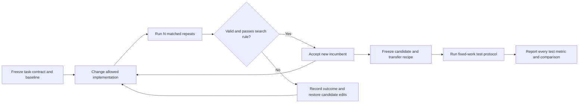

# AutoResearch task contract, version 1

An AutoResearch task asks a scientific or engineering question, gives an agent
a working baseline and a bounded implementation space, and distinguishes a
cheap **search score** from the **test metrics** used to judge the result.
The contract is fixed before candidate experiments. The agent optimizes the
implementation; it does not redefine the experiment after seeing a score.

Use **search score** instead of reward in task descriptions. Keep the raw
metric name and direction: validation loss is minimized, speedup is maximized.
An agent API that requires a higher-is-better reward can use `-validation_loss`,
but must retain the raw loss in reports. This is not the training objective:
a protein candidate may change its backward loss while evaluation stays fixed.

## The five required sections

| Section | Required content | Question it answers |
|---|---|---|
| 1. Research question | Desired practical outcome, intervention, target workload and comparator | What would we learn or improve? |
| 2. Established codebase | Working baseline, data/fixtures, implementation entry points, evaluator and known limitations | What can the agent rely on today? |
| 3. Research protocol | Budget **per repeat**, hardware, score extraction and direction, repetition unit, aggregation, uncertainty, validity gates and keep rule | How do we select the next candidate? |
| 4. Boundaries | Editable paths, protected paths, allowed configuration keys, frozen invariants and permitted output locations | What may change without changing the task? |
| 5. Test protocol | Frozen candidate, independent execution, fixed work budget, evaluation settings, test metrics, reference comparisons and success rule | Does the selected change deliver the intended benefit? |

The machine-readable form is [task.schema.json](../tasks/task.schema.json).
[protein-embedding.yaml](../tasks/protein-embedding.yaml) is the concrete protein
contract. [OpenMM examples](../tasks/examples/) demonstrate the same structure
for two systems-optimization tasks. These files describe experiments; they are
**not training YAMLs or a new scheduler**, and existing runners do not consume
them automatically. The `implementation` field records enforcement gaps.
Use [program.md](../program.md) as the readable protein program.

## Repeats, aggregation and decisions

**N must name an experimental unit.** For stochastic model training it is N
independent from-scratch training seeds. For OpenMM it is N paired baseline /
candidate measurements in fresh processes on each simulation system. GPU ranks,
validation batches, bootstrap resamples and simulation frames are not additional
independent training runs. Predeclare the repeat count/identities; a baseline
and a candidate must use the same evaluation contract and matched repeats.

Specify aggregation at every level. The protein score is the arithmetic mean
of N per-seed validation losses. OpenMM first takes the median of paired timing
ratios within each system, then the geometric mean across systems. A common
schema should preserve these definitions rather than silently replace OpenMM's
robust estimator with a mean over training seeds.

For a mean-based score, let `d = +1` when maximizing and `d = -1` when minimizing.
Then `improvement = d × (candidate_mean - incumbent_mean)`. The protein task
retains its existing strict rule `improvement > candidate_sample_sd`, with
`ddof=1`; N defaults to 2, with seeds 42 and 43. A positive mean change alone is
insufficient under this contract. This heuristic is not a confidence interval,
a significance test, or a multiple-comparison correction. A different task
may declare a different rule before its campaign begins.

Separate three concepts in records:

- **Validity:** the run obeyed the boundary, completed its budget/evaluation,
  produced finite metrics and passed correctness gates.
- **Evaluator finding:** for example, OpenMM's speedup interval lies above 1.
- **Promotion decision:** whether the candidate improves on the current
  incumbent enough to keep it. Being faster than the original baseline alone
  does not prove an improvement on an already faster incumbent.

Keep every repeat, failure and discarded candidate. A deterministic code bug or
non-finite result is not a bad seed to omit. An infrastructure interruption may
be retried with the same recipe and seed; retain the interrupted attempt and
its reason. Do not rerun merely to replace an unfavorable completed value.
Changes to N, the rule or the budget create a new protocol version/comparison;
old records retain their original definitions.

## Budgets must specify both the amount and the meter

| Budget | Mandatory definition | Example |
|---|---|---|
| Wall time | Start/end events, synchronization, included work, excluded setup/evaluation, boundary overrun | Protein search: synchronized training loop for 3,600 seconds on four L40S GPUs |
| Tokens | Tokenizer, padding/special-token policy, global count, terminal update rule and overrun bound | Protein test: 24,200,224,761 non-padding model tokens, including BOS/EOS |
| Fixed work | Work units, baseline calibration, identical candidate/reference work counts | OpenMM: frozen per-system moving simulation steps after warmup |

Declare a whole-campaign resource limit separately from the per-repeat budget.
One hour per seed is not a one-hour search; N=2 requires two training hours per
method, plus evaluation. No campaign is launched or given an unlimited budget
by publishing a task contract.

## Boundaries are paths plus invariants

Use repository-relative paths and explicit allow/protect lists. `/**` means all
descendants. Protected paths take precedence; unlisted paths are protected by
default. A writable results directory permits new immutable artifacts, not
rewriting past evidence. Pin the repository revision, resolved paths, effective
configurations, external evaluator and data/fixture digests at campaign start.
Symlinks or imported helper code do not make protected material editable.

A path allowlist alone is insufficient. If the training loop is editable, its
clock, data source, token meter, validation calls and receipt writing still
cannot change. If model code is shared with evaluation, it cannot identify
evaluation examples or substitute stored outputs. List these semantic limits
and audit them against the pinned reference; do not claim that a JSON Schema
provides a security sandbox or runtime enforcement.

Task owners can revise the benchmark between campaigns. Pin a new contract and
re-establish comparable baselines whenever the score, boundaries, frozen inputs
or evaluation change. Contract maintenance is separate from candidate research.

## Test metrics and limits of the claim

Freeze the candidate commit and any transfer rule before running tests. For the
protein test, report both lower MLM loss and higher contact P@L; do not hide a
regression in a weighted aggregate. Compare with the original baseline and the
previous cumulative recipe separately. Report mixed outcomes and ties as such.

The v1 protein test specifies N=2 matched from-scratch seeds, mean ± sample SD
for both metrics, and per-seed chain-bootstrap P@L intervals. It calls a transfer
successful relative to a named comparator only when **both means improve**.
Report paired per-seed deltas; the direction rule alone does not establish
statistical significance. The historical 100k leaderboard has N=1 and remains
labeled that way. Bootstrap uncertainty over chains is not uncertainty over
training seeds; averaging CI endpoints does not produce an across-seed CI.

“Test” names the final confirmation stage, not automatically a previously unseen
dataset. Protein research already reports P@L on the same chains and uses the
same held-out MLM reservoir as the larger evaluation. It is therefore a
**budget-transfer test on reused evaluation assets**, not a blind holdout.
OpenMM's final suite adds systems, but repeats the three search systems too.
Record overlap and keep frozen probe-fit, probe-selection and evaluation roles
distinct. If final results guide another change, label it as a new research
iteration rather than an untouched test. Broad claims about protein embeddings
require downstream evidence beyond an attention-based contact probe; P-CORE
remains a separate diagnostic suite.

## Instantiating the standard in the two projects

| Field | Protein embeddings | OpenMM nonbonded / PME |
|---|---|---|
| Research question | Improve training recipes for useful protein representations | Accelerate a force-computation module without changing the physical problem |
| Search score | Mean sequence-mean MLM NLL, minimize | Geometric-mean task speedup, maximize |
| Repeat unit | Independent training seed; default N=2 | Paired process timing per system; minimum N=5 |
| Search budget | 1 hour of training per seed, then evaluation | Correctness gates, then equal calibrated moving-step counts |
| Boundaries | Training implementation and candidate configs; parameter count within ±5% | Selected module only; physics, reference, partner module and evaluator frozen |
| Test budget | 24.20B model tokens per seed, then full evaluation | Frozen moving-step counts on the seven-system final suite |
| Test metrics | MLM loss and P@L | End-to-end speedup and ns/day; task speedup also reported |
| Important limitation | Current trainer has step/time stops; token stop still needs an adapter | Existing “repeat evidence improves incumbent” clause has no numeric threshold |

The OpenMM examples are based on remote main at
[`67b2c0f`](https://github.com/Lumin-Science/LuminBench-OpenMM-Acceleration/tree/67b2c0f45758d0a6c85b2cfea97876176c199f94),
including its two current task programs and evaluator. They preserve the
three-system score, correctness gates and bootstrap rule. They explicitly mark
the unspecified incumbent-promotion threshold and final-regression policy;
neither is invented as an existing requirement. A new fully automated OpenMM
campaign should settle those fields first. The examples do not modify or
launch that repository.

## Minimum experiment record

Save task ID/version and contract digest, campaign ID, phase, method/run IDs,
source commit/patch, baseline and incumbent references, repeat identity, complete
config, hardware/environment, data/fixture/evaluator digests, observed budget,
completion/validity status, raw metrics, uncertainty definition, and decision
with its reason. Keep immutable checkpoint/build identities and links to raw
measurements. A readable report and compact TSV can summarize these records;
neither replaces them.

Validate the structure with a Draft 2020-12 JSON Schema validator, after loading
YAML as JSON-compatible data. Schema validation checks shape, not numerical
correctness, path enforcement, scientific validity or launch readiness. Resolve
all declared `implementation.gaps` before treating a phase as automated.
