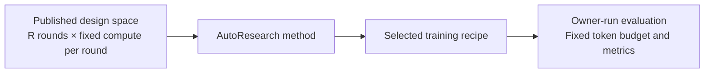

# Benchmarking Agentic AutoResearch Systems

NanoProteinLM benchmarks an agent's ability to discover better protein-model training recipes.

This page details the [Auto Research Protocols in the README](../README.md#auto-research-protocols). A benchmark specifies the permitted design space, a fixed number of search rounds, the compute available in each round and the final evaluation budget. Publish these settings before search and use them for every method being compared. Each method chooses how to propose recipes, use previous results and select its final recipe within those limits.

The protocol applies to any AutoResearch algorithm. Our implementation of Karpathy-style sequential search, including its pipeline, training-seed policy and improvement criteria, is described in [AUTORESEARCH_BASELINE.md](AUTORESEARCH_BASELINE.md).

## Design Space

**Immutable settings**:

- **Model and training settings:** use only the provided training corpus, without adding datasets. Keep the tokenizer, Stage-1 context of 512 tokens and linear-warmup/constant-LR schedule fixed. Actual trainable parameters must stay within ±5% of the original 171M model, with no unused parameters added to satisfy the bound. Train from scratch without pretrained models.
- **Evaluation and execution:** preserve the hardware, round allowance and per-round training budget. Keep the evaluation code, data, masking, contact-probe procedure and metric definitions unchanged; do not train on held-out evaluation data. Preserve the published dependencies and source-data verification records.

**Design space**:
* Everything outside the immutable contract is open to research, including data selection and source mixture within the provided corpus, model architecture, training loss, optimizer settings, batch size and training implementation. [DATA.md](DATA.md) describes the available corpus, and [EVALUATION.md](EVALUATION.md) specifies the scientific measurements.

## Search Budget

A budgeted round consists of one training run and its evaluation. Each method receives **72 rounds of 20 minutes on four H100 GPUs**, totaling **24 hours of training on one four-GPU node**, or **96 H100 GPU-hours**. Setup, checkpoint saving and evaluation add to elapsed runtime and are reported separately.

| Budget item | Protocol setting |
|---|---|
| Round allowance | **72** |
| Hardware per round | **4 H100 GPUs**, FlashAttention-3 |
| Training time per round | **20 minutes**, or **4/3 H100 GPU-hours** |
| Total search training allowance | **24 four-H100 node-hours = 96 H100 GPU-hours** |
| Measurement after each round | Final checkpoint; 32 MLM validation sequences and all 20,775 contact chains |
| Outside the training clock | Environment/data setup, final checkpoint saving and evaluation; report their time separately |

Methods may spend rounds exploring new recipes or repeating earlier recipes. Every training run, including a seed repeat or an agent-run reference measurement, consumes a round. Retain failed attempts and their consumed compute; declare any infrastructure-failure replacement policy before the benchmark. A method's internal iteration may contain several budgeted rounds.

The training clock includes batch loading and synchronization. Prepare the inputs before timing a run and keep data placement consistent across methods. Record the code revision, resolved recipe, data receipts, seed, actual steps and non-padding model tokens for each run, together with its metrics and elapsed training time.

Search results use the fixed evaluation described below. Proposal generation, repeated-seed comparisons, candidate retention and stopping within the round allowance are choices made by the AutoResearch method.

<aitofix resolved>use 24B model taokens is enough not necesaary to tell the exact number, and we are only going to train 1 seed. Also I think here it might be confusing to mix the search time reward with the final evaluation, so we should have sapaerate subsecion of ## hill-clibing evaluation and ## final evaluation. for hill-climbing we default at validation loss since it;s more stable. Fixed: Split search and final evaluation into separate sections, set validation loss as the default search reward, and described the final budget as 24B tokens with one training seed.</aitofix>

## Hill-climbing evaluation

The default hill-climbing reward is **MLM validation loss**, which we use for a more stable search signal. It is the mean per-protein masked-token negative log-likelihood on held-out sequences; lower is better. Each round evaluates the final checkpoint from its 20-minute training run. The AutoResearch method decides how to use these measurements to propose and retain recipes.

| Measurement | Search setting |
|---|---|
| Default reward | **MLM validation loss ↓** |
| Validation data | **32 fixed sequences**, context 512, with fixed masking |
| Contact diagnostic | **P@L over all 20,775 frozen chains**, with a chain-bootstrap 95% interval |
| Scored checkpoint | Final checkpoint at the round's training-time limit |

Contact P@L measures precision among the top L predicted long-range contacts, where L is the evaluated chain length, averaged over the frozen chains. Higher is better. Report it alongside validation loss as a diagnostic. A method may repeat training runs within its search allowance; each repeat consumes another round.

## Final evaluation

After search, each method submits its selected recipe for owner-run evaluation. Freeze the recipe before this test. Train it and the reference from scratch for **24B model tokens each**, using **one common training seed** declared before the comparison. Both recipes use the provided corpus and retain their selected data mixtures.

| Measurement | Final evaluation setting |
|---|---|
| Training budget | **24B non-padding model tokens per recipe**, including BOS/EOS, on **4 H100 GPUs** |
| Training seeds | **1 per recipe**, matched between the selected recipe and reference |
| MLM validation | **4,096 fixed sequences**, context 512 |
| Contact P@L | **All 20,775 frozen chains** |
| Scored checkpoint | Final checkpoint at the token target |
| Reported results | MLM validation loss and P@L, with a chain-bootstrap 95% interval for P@L |

Final evaluation reports both metrics at the larger training budget. Contact evaluation fits one probe per checkpoint using the fixed probe split and uses 5,000 chain-bootstrap replicates. Its interval describes variation over evaluated chains. With one training seed, across-seed variability is not estimated.

The final training budget is separate from the 72-round search allowance. Prepare the required portion of the provided corpus before training and record each recipe's data selection, source exposure and any reuse. Keep the evaluation data and code fixed across recipes.

The reference takes roughly **12 hours on four H100s**, or about **48 H100 GPU-hours**, per recipe. Actual time depends on the recipe; the token target determines completion. Score the checkpoint at the first optimizer update reaching that target and report its actual token count and overrun. [EVALUATION.md](EVALUATION.md#manual-test-of-progress) provides the training command and completion checks.

This test measures whether search improvements carry over to longer training. It uses evaluation assets also available during search, so it does not establish performance on a blind holdout. Training a larger model requires its own agreed model size and comparison budget.

<aitofix resolved>Put the leaderboard results ot LEADERBOARD.md. Fixed: Moved the recorded measurement tables to LEADERBOARD.md and linked them from this guide and the README.</aitofix>

[LEADERBOARD.md](LEADERBOARD.md) collects recorded measurements with each study's hardware, seeds and evaluation sample counts. [AUTORESEARCH_BASELINE.md](AUTORESEARCH_BASELINE.md) documents our sequential-search method and experiment history.

