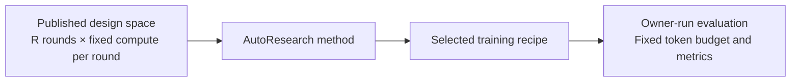

# Benchmarking Agentic AutoResearch Systems

NanoProteinLM benchmarks an agent's ability to discover better protein-model training recipes.

This page details the [Auto Research Protocols in the README](../README.md#auto-research-protocols). A benchmark specifies the permitted design space, a fixed number of search rounds, the compute available in each round and the final evaluation budget. Publish these settings before search and use them for every method being compared. Each method chooses how to propose recipes, use previous results and select its final recipe within those limits.



The protocol applies to any AutoResearch algorithm. Our implementation of Karpathy-style sequential search, including its pipeline, training-seed policy and improvement criteria, is described in [AUTORESEARCH_BASELINE.md](AUTORESEARCH_BASELINE.md).


<div class="ai">

## Preparation

</div>

<div class="ai">

Use the released `autoresearch` branch for benchmark attempts. It contains the plain ESMC implementation and one independent root commit. Allocate four matching H100 GPUs or four matching L40S GPUs on Linux with a working CUDA driver. A search round provides 20 minutes on H100 with FlashAttention-3 or one hour on L40S with FlashAttention-2; these budgets are roughly equivalent. Declare one hardware profile before search and fix the GPU model and backend across every method in a comparison.

</div>

<div class="ai">

The organizer prepares the workspace before giving it to an agent. From an existing checkout, run the command below on the allocated node. The destination must be new and outside all existing Git checkouts.

</div>

<div class="ai">

```bash
bash runs/setup_autoresearch.sh ../nano-protein-autoresearch
cd ../nano-protein-autoresearch
```

</div>

<div class="ai">

While the repository is private, use an authenticated organizer checkout and the command above. If Git access uses an SSH key, add `--repository git@github.com:Lumin-Science/Nano-ProteinLM.git`; the default URL uses HTTPS credentials. Once the repository is public, you can download the preparation script directly and run it with system Python 3.9 or newer. The script installs the locked Python 3.11 environment and installs a compatible uv locally if the system version is missing or too old.

</div>

<div class="ai">

```bash
curl -fL https://raw.githubusercontent.com/Lumin-Science/Nano-ProteinLM/autoresearch/.dev/scripts/prepare_autoresearch.py -o /tmp/nanoprotein-setup.py
python3 /tmp/nanoprotein-setup.py ~/nano-protein-autoresearch
cd ~/nano-protein-autoresearch
```

</div>

<div class="ai">

The script clones only `autoresearch`, verifies the release manifest and root commit, and removes the remote. It creates no local `main` branch and refuses to overwrite an existing directory. An ordinary checkout in a research clone retains old Git objects; use the fresh directory for the agent. The original research checkout stays with the organizer, outside agent access.

</div>

<div class="ai">

Preparation qualifies the four GPUs, installs the pinned dependencies, downloads 30 training shards and all MLM validation/contact assets, and verifies their checksums. Allow roughly 20 GB for data plus space for dependencies, checkpoints and run outputs. Use `--training-shards N` to change the initial corpus size; provision enough data for the selected source mixture and budget. Data and outputs default to `data/` and `outputs/` inside the new workspace.

</div>

<div class="ai">

Keep `.autoresearch/PROVISIONING.json`, `.autoresearch/ENVIRONMENT.json` and `RELEASE_MANIFEST.json` with the organizer records. Pass `--revision FULL_COMMIT_SHA` to require the same released commit for every participant. `--clone-only` defers environment and data setup; rerun with `--resume` on the GPU node to finish an unchanged workspace after deferred or interrupted preparation.

</div>

<div class="ai">

```bash
# After preparation, one invocation consumes one search round:
bash tasks/171m-validation-loss_ar.sh configs/default.yaml trial-001 42
```

</div>

<div class="ai">

Start the agent in this directory with a fresh conversation, the selected task and its own AutoResearch method. The task information-access rules prohibit inspecting other branches or searching for this repository and its previous findings online. The organizer enforces that policy, keeps other research workspaces inaccessible and uses a trusted evaluator; a Git branch and written rules alone cannot block online access.

</div>

## Design Space

**Immutable settings**:

- **Model and training settings:** use only the provided training corpus, without adding datasets. Keep the tokenizer, Stage-1 context of 512 tokens and linear-warmup/constant-LR schedule fixed. Actual trainable parameters must stay within ±5% of the original 171M model, with no unused parameters added to satisfy the bound. Train from scratch without pretrained models.
- **Evaluation and execution:** preserve the hardware, round allowance and per-round training budget. Keep the evaluation code, data, masking, contact-probe procedure and metric definitions unchanged; do not train on held-out evaluation data. Preserve the published dependencies and source-data verification records.

**Design space**:
* Everything outside the immutable contract is open to research, including data selection and source mixture within the provided corpus, model architecture, training loss, optimizer settings, batch size and training implementation. [DATA.md](DATA.md) describes the available corpus, and [EVALUATION.md](EVALUATION.md) specifies the scientific measurements.

## Search Budget

<div class="ai">

A budgeted round consists of one training run and its evaluation. Each method receives **72 rounds**, with **20 minutes on 4×H100** or **1 hour on 4×L40S** per round. These are roughly equivalent search budgets. The totals are **24 node-hours / 96 H100 GPU-hours**, or **72 node-hours / 288 L40S GPU-hours**. Fix one hardware profile across methods in a comparison. Setup, checkpoint saving and evaluation add to elapsed runtime and are reported separately.

</div>

<div class="ai">

| Budget item | Protocol setting |
|---|---|
| Round allowance | **72** |
| Hardware per round | **4×H100 with FA3** or **4×L40S with FA2**; fixed profile across methods in a comparison |
| Training time per round | **20 minutes / 4/3 H100 GPU-hours**, or **1 hour / 4 L40S GPU-hours** |
| Total search training allowance | **24 node-hours / 96 H100 GPU-hours**, or **72 node-hours / 288 L40S GPU-hours** |
| Learning-rate schedule | 554 linear warmup steps, then constant peak learning rate |
| Measurement after each round | Final checkpoint; 4,096 MLM validation sequences and all 20,775 contact chains |
| Outside the training clock | Environment/data setup, final checkpoint saving and evaluation; report their time separately |

</div>

Methods may spend rounds exploring new recipes or repeating earlier recipes. Every training run, including a seed repeat or an agent-run reference measurement, consumes a round. Retain failed attempts and their consumed compute; declare any infrastructure-failure replacement policy before the benchmark. A method's internal iteration may contain several budgeted rounds.

The training clock includes batch loading and synchronization. Prepare the inputs before timing a run and keep data placement consistent across methods. Record the code revision, resolved recipe, data receipts, seed, actual steps and non-padding model tokens for each run, together with its metrics and elapsed training time.

Search results use the fixed evaluation described below. Proposal generation, repeated-seed comparisons, candidate retention and stopping within the round allowance are choices made by the AutoResearch method.


## Hill-climbing evaluation

<div class="ai">

The default hill-climbing reward is **MLM validation loss**, which we use for a more stable search signal. It is the mean per-protein masked-token negative log-likelihood on held-out sequences; lower is better. Each round evaluates the final checkpoint from its 20-minute H100 run or one-hour L40S run. The AutoResearch method decides how to use these measurements to propose and retain recipes.

</div>


<div class="ai">

| Measurement | Search setting |
|---|---|
| Default reward | **MLM validation loss ↓** |
| Validation data | **4,096 fixed sequences**, context 512, with fixed sampling and masking |
| Contact diagnostic | **P@L over all 20,775 frozen chains**, with a chain-bootstrap 95% interval |
| Scored checkpoint | Final checkpoint at the round's training-time limit |

</div>

<div class="ai">

Context 512 is the maximum input length in tokens. The current task evaluates 1,024 batches of four proteins, matching the final evaluation's 4,096-protein sample. Historical short-run results used 32 proteins and retain that label. Compare recipes using the same sample count, sampling seed and masking; [EVALUATION.md](EVALUATION.md#validation-sample-size) explains the sample-size choice and its limits.

</div>

Contact P@L measures precision among the top L predicted long-range contacts, where L is the evaluated chain length, averaged over the frozen chains. Higher is better. Report it alongside validation loss as a diagnostic. A method may repeat training runs within its search allowance; each repeat consumes another round.

## Final evaluation

After search, each method submits its selected recipe for owner-run evaluation. Freeze the recipe before this test. Train it and the reference from scratch for **24B model tokens each**, using **one common training seed** declared before the comparison. Both recipes use the provided corpus and retain their selected data mixtures.

<div class="ai">

| Measurement | Final evaluation setting |
|---|---|
| Training budget | **24B non-padding model tokens per recipe**, including BOS/EOS, on **the same declared four-GPU hardware** |
| Training seeds | **1 per recipe**, matched between the selected recipe and reference |
| MLM validation | **4,096 fixed sequences**, context 512 |
| Contact P@L | **All 20,775 frozen chains** |
| Scored checkpoint | Final checkpoint at the token target |
| Reported results | MLM validation loss and P@L, with a chain-bootstrap 95% interval for P@L |

</div>

Final evaluation reports both metrics at the larger training budget. Contact evaluation fits one probe per checkpoint using the fixed probe split and uses 5,000 chain-bootstrap replicates. Its interval describes variation over evaluated chains. With one training seed, across-seed variability is not estimated.

The final training budget is separate from the 72-round search allowance. Prepare the required portion of the provided corpus before training and record each recipe's data selection, source exposure and any reuse. Keep the evaluation data and code fixed across recipes.

The reference takes roughly **12 hours on four H100s**, or about **48 H100 GPU-hours**, per recipe. Actual time depends on the recipe; the token target determines completion. Score the checkpoint at the first optimizer update reaching that target and report its actual token count and overrun. [EVALUATION.md](EVALUATION.md#manual-test-of-progress) provides the training command and completion checks.

This test measures whether search improvements carry over to longer training. It uses evaluation assets also available during search, so it does not establish performance on a blind holdout. Training a larger model requires its own agreed model size and comparison budget.

[LEADERBOARD.md](LEADERBOARD.md) collects recorded measurements with each study's hardware, seeds and evaluation sample counts. [AUTORESEARCH_BASELINE.md](AUTORESEARCH_BASELINE.md) documents our sequential-search method and experiment history.
