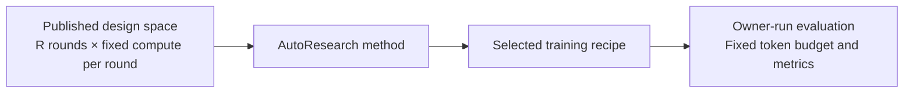

# Benchmarking Agentic AutoResearch Systems

NanoProteinLM benchmarks an agent's ability to discover better protein-model training recipes.

This page details the [Auto Research Protocols in the README](../README.md#auto-research-protocols). A benchmark specifies the permitted design space, a fixed number of search rounds, the compute available in each round and the final evaluation budget. Publish these settings before search and use them for every method being compared. Each method chooses how to propose recipes, use previous results and select its final recipe within those limits.

The protocol applies to any AutoResearch algorithm. Our implementation of Karpathy-style sequential search, including its pipeline, training-seed policy and improvement criteria, is described in [AUTORESEARCH_BASELINE.md](AUTORESEARCH_BASELINE.md).

## Design Space

<aitofix resolved>detailizing the design space and design boudries here, use itemlize to show examples. Fixed: Listed the task's fixed boundaries and examples of permitted architecture, loss, optimizer and implementation changes.</aitofix>

The immutable settings define the boundaries of the 171M benchmark.

<aitofix resolved>here just seperate by immutable settings and other, the only restriction on training data is that not introducing additional dataset, it can be just two item, model & training setting: data, tokenizer, context, lr scheduler, model size, no pretrained model. Evaluation and execution: keep training budget, do not touch evaluation code... e.t.c. Fixed: Reduced the contract to two items; training data must come from the provided corpus, while selection and source mixture are editable.</aitofix>

- **Model and training settings:** use only the provided training corpus, without adding datasets. Keep the tokenizer, Stage-1 context of 512 tokens and linear-warmup/constant-LR schedule fixed. Actual trainable parameters must stay within ±5% of the original 171M model, with no unused parameters added to satisfy the bound. Train from scratch without pretrained models.
- **Evaluation and execution:** preserve the hardware, round allowance and per-round training budget. Keep the evaluation code, data, masking, contact-probe procedure and metric definitions unchanged; do not train on held-out evaluation data. Preserve the published dependencies and source-data verification records.

<aitofix resolved>use a shortend paragraph instead of the below itemized stuffs. Fixed: Replaced the editable-setting list with one paragraph.</aitofix>

Everything outside the immutable contract is open to research, including data selection and source mixture within the provided corpus, model architecture, training loss, optimizer settings, batch size and training implementation. [DATA.md](DATA.md) describes the available corpus, and [EVALUATION.md](EVALUATION.md) specifies the scientific measurements.

## Search Budget

<aitofix resolved>have a table here showing the search time budget for different setup. Fixed: Following the clarification to use one setup, tabulated the fixed round allowance, per-round compute and total search budget independently of the search method.</aitofix>

<aitofix resolved>Here just to update let's all use H100 setting, and the total compute to consume are 1 day on a 4xH100 node. Fixed: Set 72 rounds of 20 minutes on four H100s, totaling 24 node-hours or 96 H100 GPU-hours of search training.</aitofix>

A budgeted round consists of one training run and its evaluation. Each method receives **72 rounds of 20 minutes on four H100 GPUs**, totaling **24 hours of training on one four-GPU node**, or **96 H100 GPU-hours**. Setup, checkpoint saving and evaluation add to elapsed runtime and are reported separately.

| Budget item | Protocol setting |
|---|---|
| Round allowance | **72** |
| Hardware per round | **4 H100 GPUs**, FlashAttention-3 |
| Training time per round | **20 minutes**, or **4/3 H100 GPU-hours** |
| Total search training allowance | **24 four-H100 node-hours = 96 H100 GPU-hours** |
| Measurement after each round | Final checkpoint; 32 MLM validation sequences and all 20,775 contact chains |
| Outside the training clock | Environment/data setup, final checkpoint saving and evaluation; report their time separately |

Methods may spend rounds exploring new recipes or repeating earlier recipes. Every training run, including a seed repeat or an agent-run reference measurement, consumes a round. Retain failed attempts and their consumed compute; declare any infrastructure-failure replacement policy before the benchmark. A method's internal iteration may contain several budgeted rounds.

The training clock includes batch loading and synchronization. Prepare the inputs before timing a run and keep data placement consistent across methods. Record the code revision, resolved recipe, data receipts, seed, actual steps and non-padding model tokens for each run, together with its metrics and elapsed training time.

Search results use the fixed evaluation described below. Proposal generation, repeated-seed comparisons, candidate retention and stopping within the round allowance are choices made by the AutoResearch method.

## Evaluation

<aitofix resolved>show here the scaled up setting of evaluation. Fixed: Added the token target, hardware, validation sizes and checkpoint rule beside the search settings; the benchmark declares its final evaluation seeds before search.</aitofix>

Choose the primary metric before search and keep it fixed. MLM validation loss is mean per-protein masked-token negative log-likelihood, with lower values better. Contact P@L measures precision among the top L predicted long-range contacts, where L is the evaluated chain length, averaged over the frozen chains; higher values are better. Every completed run reports both metrics. The benchmark uses the chosen metric to compare final recipes; each method defines how it uses search feedback.

| Measurement | During search | Scale-up test |
|---|---|---|
| Training budget | **20 minutes on 4 H100 GPUs per round** | **24,200,224,761 non-padding model tokens per training seed**, including BOS/EOS, on 4 H100s |
| Repeated training | Chosen by the method; each repeat uses a round | A common seed list and repeat count **N_eval**, published before search |
| MLM validation | **32 fixed sequences**, context 512 | **4,096 fixed sequences**, context 512 |
| Contact P@L | **All 20,775 frozen chains** | **All 20,775 frozen chains** |
| Scored checkpoint | Final checkpoint at the time limit | Final checkpoint at the token target |
| Reported uncertainty | P@L chain-bootstrap 95% interval for each checkpoint | Per-seed metrics, mean and sample SD across training seeds when N_eval ≥ 2; P@L chain-bootstrap interval per checkpoint |

Contact evaluation fits one probe per checkpoint using the fixed probe split and uses 5,000 chain-bootstrap replicates. Across-seed SD describes variation between training runs; the chain-bootstrap interval describes variation over evaluated chains. Report them separately. With a single final training seed, report its metrics and mark across-seed SD unavailable.

After search, each method submits its selected recipe for owner-run evaluation. Freeze the recipe before this evaluation. The owner trains it and the reference from scratch using the same permitted corpus, token target and final evaluation seeds, retaining each recipe's selected data mixture, then compares the primary metric and reports both metrics.

The final training allowance is **N_eval × 24,200,224,761 model tokens per recipe**, reported separately from the search allowance. Prepare the required portion of the provided corpus before training and record each recipe's data selection, source exposure and any reuse. Keep the evaluation fixed across recipes.

The reference scale-up budget takes roughly **12 hours on four H100s per seed**, or about **48 H100 GPU-hours**. Actual time depends on the recipe; the token target determines completion. Score the checkpoint at the first optimizer update reaching that target and report its actual token count and overrun. [EVALUATION.md](EVALUATION.md#manual-test-of-progress) provides a reference implementation and completion checks.

This scale-up test measures whether the search improvement carries over to longer training. It uses evaluation assets also available during search, so it does not establish performance on a blind holdout. Training a larger model requires its own agreed model size and comparison budget.

<aitofix resolved>Put the leaderboard results ot LEADERBOARD.md. Fixed: Moved the recorded measurement tables to LEADERBOARD.md and linked them from this guide and the README.</aitofix>

[LEADERBOARD.md](LEADERBOARD.md) collects recorded measurements with each study's hardware, seeds and evaluation sample counts. [AUTORESEARCH_BASELINE.md](AUTORESEARCH_BASELINE.md) documents our sequential-search method and experiment history.

