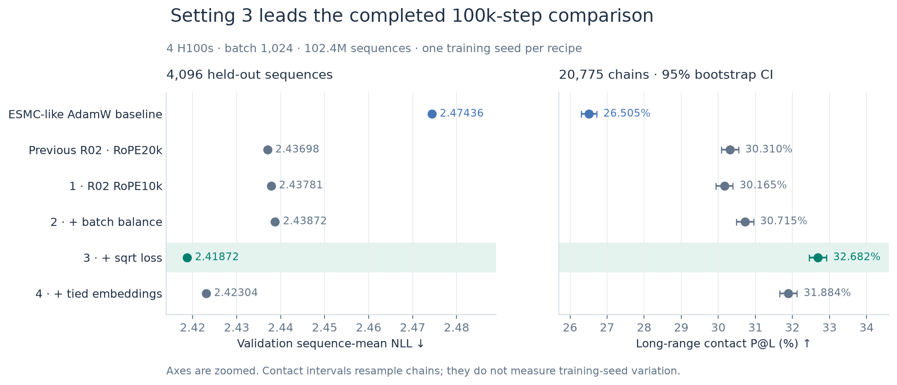
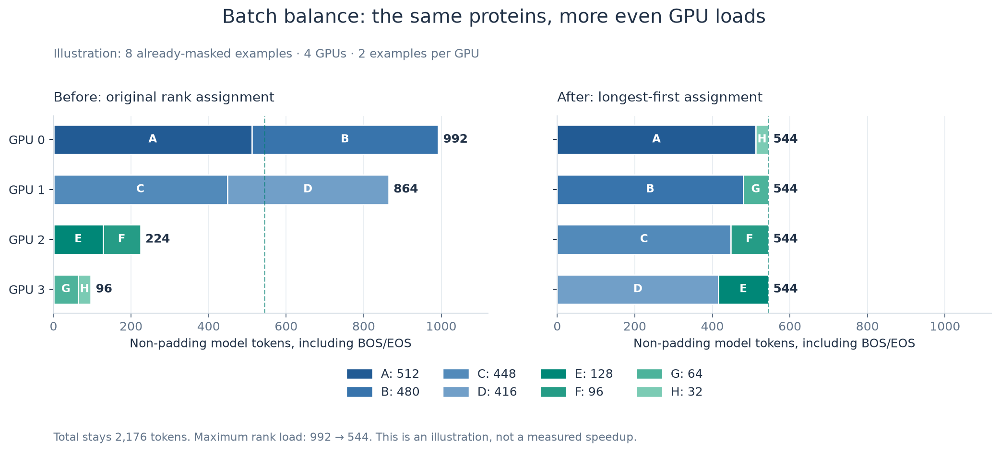
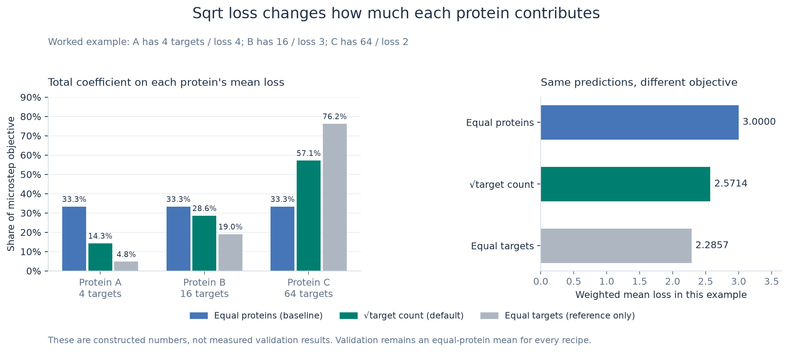

# Best 100k-step recipe versus the ESMC-like AdamW baseline

<div class="ai">

This page records the six-run H100 comparison completed before the September 21, 2026 default update. Its uses of "default" refer to that historical recipe, which did not use separate Q/K/V Muon updates. The current default adds those updates; see the [promotion decision and matched CCK evidence](../../.dev/reports/cck-contact-ablations-100k-20260919/DEFAULT_PROMOTION.md). The measurements below retain their original configurations and protocol.

</div>

**The default recipe is best in this completed six-run comparison.** It
reduces validation loss from **2.47436 to 2.41872** and increases long-range
contact P@L from **26.505% to 32.682%**. Training takes **12h 34m 40s**, compared
with **12h 00m 42s** for the baseline: 2.25% lower loss, 6.18 percentage points
higher P@L, and 4.71% longer training.

The complete change is **hybrid Muon/AdamW + parameter-free transformer
RMSNorm + learned residual/input routing + depth-scaled initialization + batch
balancing + sqrt-mask-count loss**. The optimizer also retains the Muon recipe's per-group
learning-rate and weight-decay multipliers. Muon, RMSNorm, balancing and sqrt
loss are therefore most of the story, but routing, initialization and the
optimizer-group settings also matter to reproducing this result.

<div class="ai">

This is our ESMC-like project baseline, not a released ESMC checkpoint or an exact reproduction of all paper settings. The models have approximately 171M parameters and target small-budget training, using the backbone from [ESMC Appendix A.1.4.1, Table S4](https://www.biorxiv.org/content/10.64898/2026.06.03.729735v1.full.pdf#page=29). For the original-size architectures, see the [300M/600M reference configs](../../configs/esmc/README.md). The eight-H100 batch-2,048 Nibi run is a separate experiment; the results below all use batch 1,024.

</div>

## 1. The complete comparison

| Recipe | Validation loss ↓ | P@L ↑ | P@L 95% CI | Training time |
|---|---:|---:|---:|---:|
| ESMC-like baseline — AdamW | 2.47436 | 26.505% | 26.295–26.719% | 12h 01m |
| Muon recipe — RoPE20k | 2.43698 | 30.310% | 30.079–30.547% | 12h 57m |
| Muon recipe — RoPE10k | 2.43781 | 30.165% | 29.936–30.394% | 12h 58m |
| + batch balance | 2.43872 | 30.715% | 30.487–30.948% | 12h 34m |
| **+ sqrt loss (default)** | **2.41872** | **32.682%** | **32.447–32.920%** | **12h 35m** |
| + tied embeddings | 2.42304 | 31.884% | 31.651–32.123% | 12h 33m |

<div class="ai">



</div>

*Figure 1. Measured results, with zoomed axes. Contact error bars are 95%
intervals from 5,000 bootstrap resamples of the same 20,775 chains. There is
one training seed per recipe; these intervals do not measure training-seed
variation. No validation-loss seed error bar is available. Times in the table
are approximate to the minute and exclude evaluation; linked run records
retain second-resolution durations.*

All runs share 100,000 Stage-1 optimizer steps, seed 20260824, context 512,
four H100 GPUs, and batch 1,024 = **64 proteins/GPU × 4 GPUs × 4 accumulation
microsteps**. Each processes exactly **102.4M sampled sequences** and
**24,200,224,761 non-padding model tokens**, including BOS/EOS. These are
training exposures, not counts of unique proteins. BF16 autocast, FP32 model
parameters, pinned FA3, gradient clipping at 1.0, the corpus, sampling mixture,
and evaluators are shared. Compilation and activation checkpointing are off.

The LR warms up for 1,000 steps, then stays constant for this Stage-1-only
comparison. The nominal LR is 5e-4 and nominal WD is 0.01. Evaluation always
uses **4,096 fixed sequences / 139,963 masked targets** for sequence-mean MLM
NLL and the same **20,775 contact chains**. The contact probe uses the same
16 fit chains, four regularization-selection chains and 16 inference shards.

<div class="ai">

Source: [audited full results](../../.dev/reports/fir-r02-rope10k-100k-20260906/results.json), [baseline records](../../.dev/reports/fir-171m-100k-20260906/README.md), and [evaluation protocol](../EVALUATION.md).

</div>

## 2. Exactly what differs from the baseline

| Component | AdamW baseline | Default recipe |
|---|---|---|
| Transformer matrix optimizer | AdamW | Muon for attention and FFN matrices |
| Embedding / MLM-head optimizer | AdamW | AdamW retained |
| Transformer normalization | Affine LayerNorm | Parameter-free RMSNorm |
| Stream entering each block | Current hidden stream | Learned mixture of current stream and original token embeddings |
| Attention-output / FFN-down initialization | Normal, standard deviation 0.02 | Normal, standard deviation `0.02 / sqrt(2 × 24)` ≈ 0.002887 |
| Cross-GPU batch assignment | Each rank keeps its sampled examples | Redistribute already-masked examples to balance token counts |
| Training loss | Equal mean weight per protein | Protein mean weighted by sqrt(masked-target count) |
| Validation loss | Equal mean weight per protein | Same evaluation |
| RoPE base | 10,000 | 10,000 |
| Transformer size | 24 layers, width 768, 12 heads | Same |
| FFN | SwiGLU, hidden width 2,048 | Same |
| Input/output embeddings | Untied | Untied |
| Trainable parameters | 170,671,168 | 170,559,856 |

The earlier Muon recipe used RoPE20k. The four cumulative variants reset it
to 10k. **RoPE is therefore not a best-versus-baseline difference.** R22's
FFN-narrowing change was deferred, and tied embeddings did not improve on
the default recipe. Neither belongs in the best recipe.

### Hybrid optimizer and its actual LR/WD settings

Muon owns two-dimensional parameters inside transformer blocks: the QKV and
attention-output matrices, and the FFN gate/up and down matrices. AdamW owns
the remaining parameters, including the embeddings and MLM head. One-dimensional
parameters and biases, including the learned routing scalars, have zero WD.

| Parameter group | Baseline peak LR / WD | Default configured peak LR / WD |
|---|---|---|
| Attention matrices | AdamW: `5e-4 / 0.01` | Muon: `4.5e-4 / 0.0075` |
| FFN matrices | AdamW: `5e-4 / 0.01` | Muon: `3.75e-4 / 0.0075` |
| Other decayed parameters | AdamW: `5e-4 / 0.01` | AdamW: `5e-4 / 0.01` |
| Non-decayed parameters | AdamW: `5e-4 / 0` | AdamW: `5e-4 / 0` |

Muon uses momentum 0.95, Nesterov enabled, five Newton–Schulz steps, and
`adjust_lr_fn: match_rms_adamw`. The Muon LRs above are the configured group
values **before** its internal matrix-shape adjustment. Explicit attention
and FFN multipliers of 0.9 and 0.75 override the generic `muon_lr_scale: 0.8`;
WD is multiplied by 0.75 for both Muon groups. AdamW keeps betas `(0.9, 0.95)`
and epsilon `1e-8`. Sharing a nominal LR and WD does not mean every tensor
uses the same effective optimizer hyperparameters.

### RMSNorm, routing and initialization

For a hidden vector `x`, the new transformer norm computes

$$
\operatorname{RMSNorm}(x)=\frac{x}{\sqrt{\operatorname{mean}(x^2)+\epsilon}}.
$$

It does not subtract the mean and has no learned scale or bias. It replaces
the attention-input, query, key, FFN-input and final transformer norms.
**The MLM prediction head still has LayerNorm.** Removing the transformer
norm parameters and adding 48 routing scalars accounts for the net reduction
of 111,312 parameters.

Before block `l`, the best recipe forms

$$
\widetilde h_l=a_l h_l+b_l h_{\mathrm{embed}}.
$$

There is one learned `a_l` and `b_l` per layer, shared across tokens and hidden
channels. Across the 24 layers, `a_l` initializes linearly from 1.15 to 1.05
and `b_l` from 0.20 to 0.05. These scalars are not normalized probabilities.
The original embedding stream is available at every depth; the baseline
simply passes its current stream into the next block. The existing within-block
residual scaling is retained in both recipes.

The default recipe also reinitializes only the attention-output and FFN-down projection
weights with `std = 0.02 / sqrt(48)`. Other linear and embedding weights retain
the normal 0.02 initialization. This changes the initial size of those residual
branch outputs. The present runs do not isolate its individual contribution
from Muon, RMSNorm or routing.

<div class="ai">

Implementation: [`ESMCRMSNorm`, model initialization and routing](../../src/nanoprotein/model.py), and [`muon_adamw_parameter_groups` / `build_optimizer`](../../src/nanoprotein/train.py).

</div>

## 3. Batch balance: equalize work across GPUs

### Why equal protein counts can still give unequal work

A 512-token context is a maximum; many proteins have fewer valid tokens.
Both recipes already use a packed transformer and variable-length FA3, so
padding is removed from transformer computation. As a result, 64 short
proteins can require less work than 64 long proteins. Distributed training
must synchronize gradients, so a rank with more work can delay the others.

Balancing targets **non-padding model-token count per rank**, including
BOS/EOS, while keeping the same number of examples on every rank. Length is
a proxy for work: dense projections scale approximately with token count,
while attention also depends on squared sequence lengths. The partitioner
does not solve for exact FLOPs or guarantee equal GPU execution time.

### The actual sequence of operations

For each accumulation microstep:

1. Each GPU samples 64 examples using its existing sampler and applies MLM
   masking locally, producing corrupted tokens, target labels and an attention mask.
2. All four ranks gather those three tensors for all **256 examples**.
3. Compute each example's valid-token length from its attention mask.
4. Sort examples longest first, breaking length ties by their original index.
5. Assign the next example to the least-loaded rank that has not yet reached
   64 examples. Load ties use assigned-example count, then rank index.
6. If this assignment increases the maximum rank token load, retain the
   original assignment instead. Otherwise each rank selects its assigned rows.
7. Run forward/backward with the already-existing corruption and labels.
   Repeat for the next microstep; update the optimizer after four microsteps.

No sequence is split, concatenated with another sequence, dropped, resampled,
or re-masked. The data mixture, crop, mask positions, labels, number of examples,
and total model tokens are preserved for that global microstep. This is not
balancing the dataset's source proportions or choosing a new batch.

<div class="ai">



</div>

*Figure 2. An intentionally uneven illustration with two examples per GPU;
production uses 64. A–H identify the same examples before and after assignment.
Lengths count valid model tokens, including BOS/EOS.*

| GPU | Original examples (token lengths) | Original load | Balanced examples | Balanced load |
|---|---|---:|---|---:|
| 0 | A: 512, B: 480 | 992 | A: 512, H: 32 | 544 |
| 1 | C: 448, D: 416 | 864 | B: 480, G: 64 | 544 |
| 2 | E: 128, F: 96 | 224 | C: 448, F: 96 | 544 |
| 3 | G: 64, H: 32 | 96 | D: 416, E: 128 | 544 |

The total remains 2,176 tokens. The largest token load falls 45.2% in this
constructed example; **that is not a measured training-speed improvement**.
All-gather communication, CPU partitioning, and imperfect cost prediction
limit real gains.

For an actual example, the batch-balanced variant's logged final microstep at optimizer step
100,000 had loads `[15716, 14180, 16416, 16199]`, redistributed to
`[15627, 15629, 15629, 15626]`. Both sum to 62,511 tokens. The full batch-balanced
run took **3.11% less training time** than the preceding Muon variant (12h 33m 42s versus
12h 57m 54s), including the balancing overhead.

### What this does and does not change mathematically

With 64 examples per rank, averaging each rank's equal-protein loss and then
averaging DDP gradients gives the mean gradient over all 256 examples.
Permuting whole examples between equal-sized ranks preserves that objective
in exact arithmetic. The balancing routine itself consumes no RNG draws.
Moving computations changes floating-point reduction and execution order,
so full training trajectories need not be bitwise identical. The observed
P@L gain is a result of these trained checkpoints, not a mathematical promise
of the load-balancing algorithm.

<div class="ai">

Implementation: [`balanced_partitions` and `rebalance_masked_batch`](../../src/nanoprotein/batch_balance.py). [Existing DDP checks](../../.dev/tests/test_batch_balance.py) exercise example/label preservation, equal row counts, unchanged RNG state and gradient equivalence to the unpartitioned reference.

</div>

## 4. Sqrt loss: change protein weighting, not the validation metric

Let `m_i` be the **actual number of selected MLM target residues** in protein
`i`, and let its mean target cross-entropy be

$$
\ell_i=\frac{1}{m_i}\sum_{t\in M_i}-\log p_\theta(x_{it}\mid\widetilde{x}_i).
$$

For proteins with at least one target, the baseline's microstep objective is

$$
L_{\mathrm{sequence}}=\frac{1}{B}\sum_{i=1}^{B}\ell_i.
$$

Every protein receives equal total weight, even if one supplies many more
supervised targets. The default recipe instead uses

$$
L_{\mathrm{sqrt}}=
\frac{\sum_i\sqrt{m_i}\,\ell_i}{\sum_i\sqrt{m_i}}
=\frac{\sum_i m_i^{-1/2}\sum_{t\in M_i}\mathrm{CE}_{it}}
       {\sum_i\sqrt{m_i}}.
$$

**The square root applies to the target count, not to the loss value.** It is
not a square root of cross-entropy, not loss clipping, and not weighting by
the protein's current prediction error. The original masking probability
(15% of eligible residues, with a target guaranteed when eligible residues
exist) is unchanged. A protein with zero targets receives zero sqrt weight;
the implementation guards the denominator so an all-empty microstep has
finite zero loss and gradient.

The design gives proteins with more targets more total weight, but less
aggressively than weighting every target equally. It also reduces how much
each individual target from a sparsely masked protein is amplified relative
to the equal-protein baseline. This describes the weighting rule; it is not
a proof that this weighting is statistically optimal for correlated residues.

### Worked example: 4, 16 and 64 masked targets

Suppose three proteins have target counts `[4, 16, 64]` and mean losses
`[4, 3, 2]`:

| Protein | Targets | Mean loss | Baseline share | Sqrt share | Equal-target share (reference) |
|---|---:|---:|---:|---:|---:|
| A | 4 | 4 | 33.33% | 14.29% | 4.76% |
| B | 16 | 3 | 33.33% | 28.57% | 19.05% |
| C | 64 | 2 | 33.33% | 57.14% | 76.19% |

The unnormalized sqrt weights are `[2, 4, 8]`, so their ratio is `1:2:4`,
compared with `1:1:1` for equal-protein weighting and `1:4:16` for equal-target
weighting. The resulting objectives are

$$
L_{\mathrm{sequence}}=(4+3+2)/3=3.0000,
$$
$$
L_{\mathrm{sqrt}}=(2\cdot4+4\cdot3+8\cdot2)/14=2.5714,
$$
$$
L_{\mathrm{target}}=(4\cdot4+16\cdot3+64\cdot2)/84=2.2857.
$$

<div class="ai">



</div>

*Figure 3. The predictions are identical in all three columns: only their
weighting changes. A smaller number here is not evidence of a better model.
Equal-target weighting is a reference for understanding the rule and was not
used by either of these two recipes.*

For a fixed microstep, the coefficient on an individual target is proportional
to `1/m_i` under the baseline, `1/sqrt(m_i)` under sqrt weighting, and a constant
under equal-target weighting. Thus protein C has 16 times as many targets as
A, but receives only four times A's total weight in the sqrt objective.

### Correct normalization across GPUs and accumulation microsteps

Each rank `r` computes a differentiable local numerator
`N_r = sum(sqrt(m_i) * ell_i)` and local weight sum `D_r = sum(sqrt(m_i))`.
An all-reduce gives the global denominator `D = sum_r D_r`. For `W` GPUs,
the local backward loss is **`W * N_r / D`**. DDP averages the rank gradients
by `W`, producing the gradient of the intended global weighted mean.

Normalizing separately on every GPU would give equal weight to each GPU's
local weighted mean, even when the GPUs have different weight sums. For a
two-GPU illustration with one protein per GPU, counts `[4, 64]` and losses
`[4, 2]`, the intended loss is `(2×4 + 8×2)/(2+8) = 2.4`; the mean of two
locally normalized losses would instead be `(4+2)/2 = 3.0`.

In this experiment, `W=4` and each rank has 64 proteins, so **normalization
spans 256 proteins per accumulation microstep**. Four such microstep gradients
are averaged before the optimizer update:

$$
L_{\mathrm{update}}=\frac14\sum_{k=1}^{4}
\frac{\sum_{i\in\mathcal B_k}\sqrt{m_i}\ell_i}
     {\sum_{i\in\mathcal B_k}\sqrt{m_i}}.
$$

This is generally different from normalizing once across all 1,024 proteins
in the optimizer update. That per-microstep behavior is part of the measured
recipe and should be retained when reproducing it.

Training's `objective_loss` reports the global sqrt-weighted objective averaged
over the four microsteps. Its ordinary `loss` field remains the **rank-0
sequence-mean diagnostic**, averaged over its four microsteps; it is not an
all-rank diagnostic reduction. Most importantly, the **held-out evaluator
still reports the same equal-protein `sequence_mean_nll` for every recipe**.
The leaderboard improvement therefore cannot be explained merely by changing
the definition of validation loss.

<div class="ai">

Implementation: [`training_losses` and the accumulation loop](../../src/nanoprotein/train.py). [Existing loss checks](../../.dev/tests/test_training_losses.py) compare loss values and gradients against an independent pooled reference, including unequal target counts across ranks and ranks with no targets.

</div>

## 5. What the incremental runs establish

| Change | Validation-loss change | P@L change | Training-time change |
|---|---:|---:|---:|
| Add batch balancing | +0.000911 | +0.5506 pp | −3.11% |
| Add sqrt loss | −0.019999 | +1.9673 pp | +0.13% |
| Add tied embeddings | +0.004323 | −0.7984 pp | −0.19% |

<div class="ai">

Batch balancing improved time and P@L here, while its validation loss was slightly higher. Sqrt weighting then improved both evaluation metrics with almost unchanged training time. Tying embeddings regressed both metrics. The paired-chain 95% CI for the P@L change is **+1.9056 to +2.0263 percentage points** for sqrt loss and **−0.8583 to −0.7368 points** for tying embeddings. See [all adjacent deltas and intervals](../../.dev/reports/fir-r02-rope10k-100k-20260906/ADJACENT_COMPARISONS.json).

</div>

These runs isolate the latter increments along this particular recipe path.
The baseline-to-R02 change bundles optimizer, normalization, routing,
initialization and group hyperparameters, so it does not isolate a Muon-only
or RMSNorm-only gain. One matched training seed and chain-bootstrap intervals
support comparisons of these checkpoints, not a claim about reproducible
effects over independent training seeds. Timing also comes from one run per
recipe on its assigned node.

## 6. Reproduction and figure sources

<div class="ai">

Use the [baseline preset](../../.dev/configs/archive/esmc-171m-default-h100-fa3-b1024-stage1-100k.yaml) and [default-recipe snapshot](../../.dev/configs/archive/program2_h100_100k/r10_sqrtloss.yaml). The exact executed configs are archived alongside their results: [baseline](../../.dev/reports/fir-171m-100k-20260906/default/config.yaml) and [default-recipe snapshot](../../.dev/reports/fir-r02-rope10k-100k-20260906/full/r10_sqrtloss/config.yaml). For the same frozen corpus and evaluation, follow the [GPU plan](../../.dev/reports/archive/h100-100k-training-plan.md) and [evaluation instructions](../EVALUATION.md).

</div>

Baseline/previous-R02 training source was `68f8cdc2cd8db6a0edacaea0cad687127632aa3f`;
the four cumulative Muon variants used `253c3ea442f2a1657eeb0f3ce2127ac0b1adfb25`. The best checkpoint
SHA-256 is `f28021f4c8069c344279172da5fe25c1afd36d07eddee111e5e17ce1eba0e29d`;
the baseline SHA-256 is `96783380e4ecebab468e429e76a2ffcbb2bcfb4d11d7ab960a86791e6e7bc477`.
Full checkpoints and raw evaluation shards remain outside Git; verified
receipts and per-chain scores are in the linked reports.

<div class="ai">

The [figure generator](../../.dev/scripts/plot_best_recipe_explainer.py) reads the audited result JSON and executes the repository's actual pure-Python partitioner for the balancing example. It generates PNG and SVG versions plus [numerical figure data](../figures/best-recipe/figure-data.json). Run it in an isolated plotting environment with Matplotlib installed:

</div>

```bash
python .dev/scripts/plot_best_recipe_explainer.py
```

<div class="ai">

Vector versions: [comparison](../figures/best-recipe/scaleup-results.svg), [batch balancing](../figures/best-recipe/batch-balance-example.svg), and [sqrt weighting](../figures/best-recipe/sqrt-loss-example.svg).

</div>